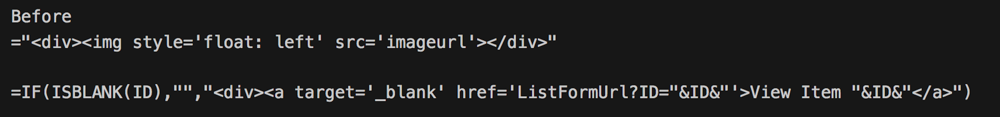
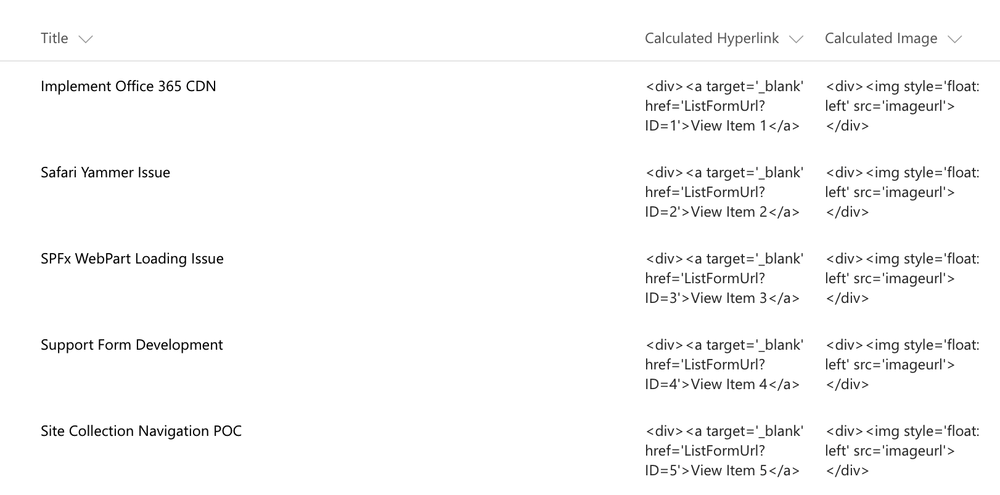
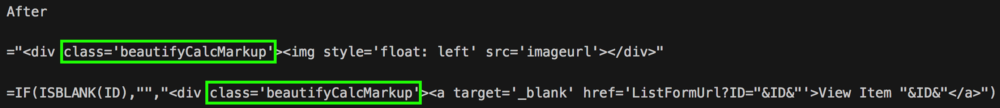
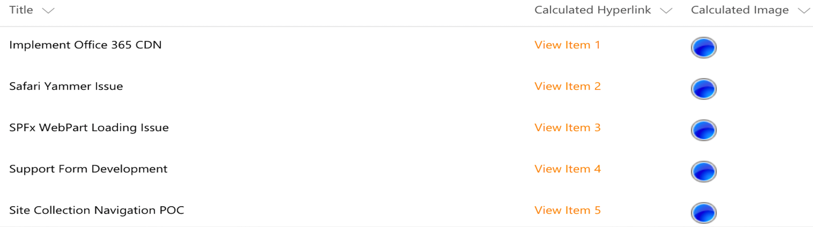

## jquery-application-beautify-calc-column
Microsoft has started blocking execution of custom markup in calculated fields in SharePoint Online from June 13, 2017 onwards.

[Reference](https://support.microsoft.com/en-us/help/4032106/handling-html-markup-in-sharepoint-calculated-fields)

This SPFx extension renders the markup based formulas used in the calculated column as HTML when the outer/parent HTML tag is configured with a class name "beautifyCalcMarkup".

## Use Cases  
1) SharePoint Calculated columns or fields used to create clickable links, these links can also be configured to open in a new tab.  
2) SharePoint Calculated columns or fields used to display Key Performance Indicator icons based on column values (Example : Priority)
3) SharePoint Calculated columns or fields used to display color coded text based on column values(Example : Task Status)







## Used SharePoint Framework Version 
SPFx Extensions Dev Preview

## Applies to

* [SharePoint Framework](http://dev.office.com/sharepoint/docs/spfx/sharepoint-framework-overview)
* [Office 365 developer tenant](http://dev.office.com/sharepoint/docs/spfx/set-up-your-developer-tenant)

Solution|Author(s)
--------|---------
jquery-application-beautify-calc-column|Joseph Velliah (SPRIDER, @sprider)

## Version history

Version|Date|Comments
-------|----|--------
1.0|July 06, 2017|Initial release

## Disclaimer
**THIS CODE IS PROVIDED *AS IS* WITHOUT WARRANTY OF ANY KIND, EITHER EXPRESS OR IMPLIED, INCLUDING ANY IMPLIED WARRANTIES OF FITNESS FOR A PARTICULAR PURPOSE, MERCHANTABILITY, OR NON-INFRINGEMENT.**

## Minimal Path to Awesome

- Clone this repository
- Move to folder where this readme exists
- In the command window run:
  - `npm install`
  - `gulp serve --nobrowser`
- Use following query parameter in the SharePoint site to get extension loaded without installing it to app catalog

## Debug URL for testing
Here's a debug URL for testing around this sample. 

```
?loadSPFX=true&debugManifestsFile=https://localhost:4321/temp/manifests.js&customActions={%8a98c75b-4cd6-4262-a431-c46724346293%22:{%22location%22:%22ClientSideExtension.ApplicationCustomizer%22}}
```
Full URL to request would be something like following:

```
https://SPOLPageURL?loadSPFX=true&debugManifestsFile=https://localhost:4321/temp/manifests.js&customActions={%8a98c75b-4cd6-4262-a431-c46724346293%22:{%22location%22:%22ClientSideExtension.ApplicationCustomizer%22}}
```
> Note: Make sure you are in modern page view/list/library.

## Features
This project contains SharePoint Framework extensions that illustrates the following features:
* Application Customizer 

> Notice. This sample is designed to be used in debug mode and does not contain automatic packaging setup for the "production" deployment.

### Building the code

```bash
git clone the repo
npm i
npm i -g gulp
gulp
```

This package produces the following:

* lib/* - intermediate-stage commonjs build artifacts
* dist/* - the bundled script, along with other resources
* deploy/* - all resources which should be uploaded to a CDN.

