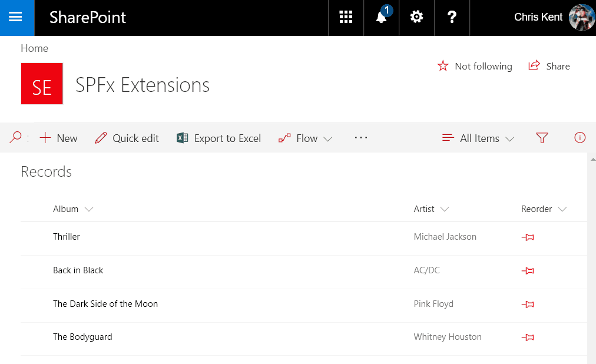
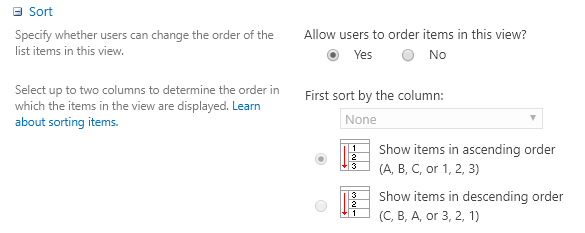
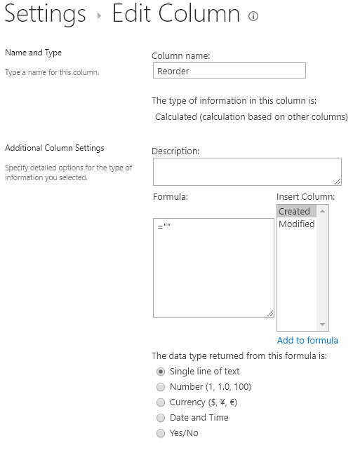
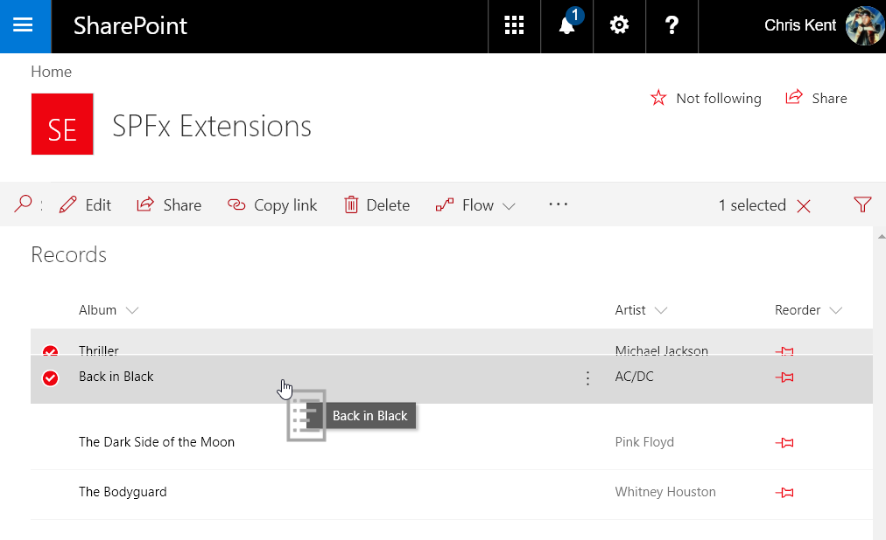
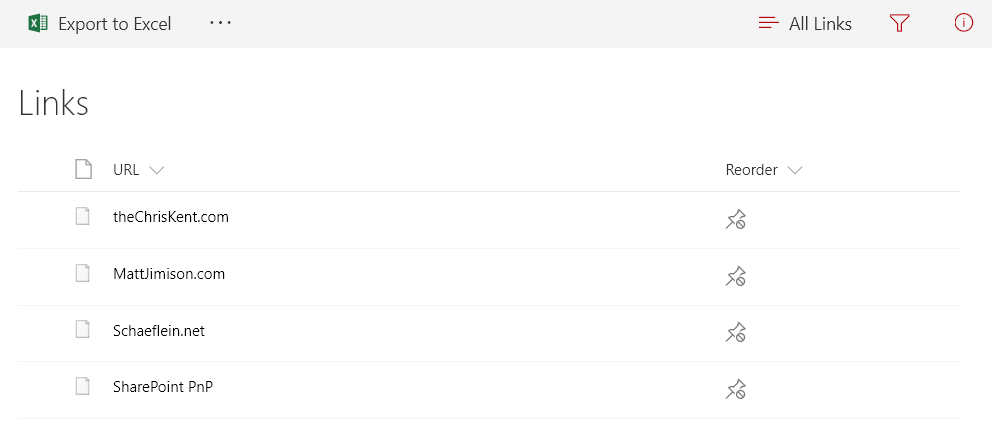
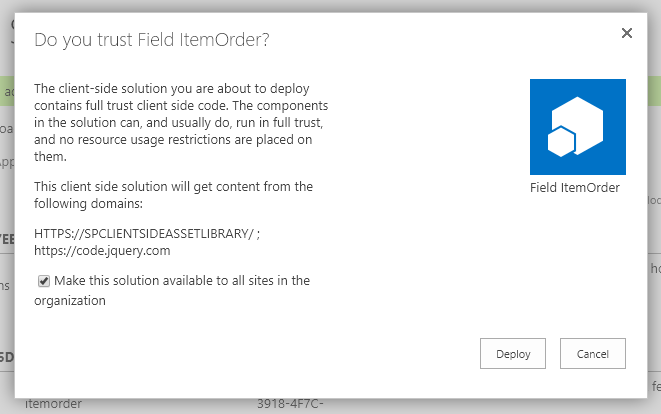

# SPFx Item Order

## Summary
Sample SharePoint Framework field customizer extension that enables reordering of list items through intuitive drag and drop directly in your list view. Demonstrates the use of jQuery and jQuery UI, custom property JSON, and PnPJS Batching.



## Used SharePoint Framework version 


## Applies to

* [SharePoint Framework Extensions](https://dev.office.com/sharepoint/docs/spfx/extensions/overview-extensions)
* [jQuery](http://jquery.com/)
* [jQuery UI](http://jqueryui.com/)
* [PnPJS](https://pnp.github.io/pnp/)

## Solution

Solution|Author(s)
--------|---------
jquery-field-itemorder | Chris Kent ([thechriskent.com](https://thechriskent.com), [@thechriskent](https://twitter.com/thechriskent))

## Version history

Version|Date|Comments
-------|----|--------
1.0|September 5, 2017|Initial release
1.1|September 28, 2017|Updated for SPFx Extensions GA 1.3.0
1.4|February 2, 2018|Updated for SPFx 1.4.0
1.5|October 10, 2019|Updated to SPFx 1.4.1 and enabled ordering across item paging

## Disclaimer
**THIS CODE IS PROVIDED *AS IS* WITHOUT WARRANTY OF ANY KIND, EITHER EXPRESS OR IMPLIED, INCLUDING ANY IMPLIED WARRANTIES OF FITNESS FOR A PARTICULAR PURPOSE, MERCHANTABILITY, OR NON-INFRINGEMENT.**

---

## Minimal path to awesome

- Clone this repository
- Update the `pageUrl` properties in the **config/serve.json** file
   - The `pageUrl` should be a list view in your tenant
   - This property is only used during development in conjunction with the `gulp serve` command
- In the command line navigate to **samples/jquery-field-itemorder** and run:
  - `npm install`
  - `gulp serve`
    - if you want to use the custom field then use the customField serveConfiguration using this command:
      - `gulp serve --config customField`
    - if you want to disable icon indicators the use the text serveConfiguration using this command:
      - `gulp serve --config text`
- In a web browser
  - Optionally, follow the steps below for a **Placeholder Field** (or choose some other field)
  - Ensure your list/view is orderable using the one of the options under **Making Your List Orderable**
  - Choose **Load Debug Scripts** when prompted
  - Reorder your items and feel the power flow through you

## Features
SPFx Item Order allows you to quickly reorder your list items through intuitive drag and drop directly in your list view.

This extension illustrates the following concepts:

- Loading **jQuery** and **jQuery UI** from a CDN
- Using **PnPJS**
- Using **jQuery UI** in a Field Customizer
- Updating multiple items in a single **Batch**
- Applying **CSS Animations** in SCSS
- Taking advantage of the under utilized `Order` field
- Configuration through properties
- Multiple **serveConfigurations**
- Conditionally altering behavior & display based on the **user's permission level**
- Theme syntax for applying official colors to custom CSS classes
- Optionally, **PnP PowerShell** for view adjustment _(see below)_

## Debug URLs for testing
Here's some example debug querystrings for testing this sample:

### Default

```
?loadSPFX=true&debugManifestsFile=https://localhost:4321/temp/manifests.js&fieldCustomizers={"Reorder":{"id":"e6bdc269-2080-47b8-b096-e7bf2a9263a9","properties":{}}}
```
* Overrides the **Reorder** field
* Utilizes the internal `Order` field

Your URL will look similar to the following (replace with your domain and site address):
```
https://yourtenant.sharepoint.com/sites/yoursite/lists/yourlist/AllItems.aspx?loadSPFX=true&debugManifestsFile=https://localhost:4321/temp/manifests.js&fieldCustomizers={"Reorder":{"id":"e6bdc269-2080-47b8-b096-e7bf2a9263a9","properties":{}}}
```

### Custom order field

```
?loadSPFX=true&debugManifestsFile=https://localhost:4321/temp/manifests.js&fieldCustomizers={"Reorder":{"id":"e6bdc269-2080-47b8-b096-e7bf2a9263a9","properties":{"OrderField":"CustomOrder"}}}
```
* Overrides the **Reorder** field
* Utilizes the **CustomOrder** field

Your URL will look similar to the following (replace with your domain and site address):
```
https://yourtenant.sharepoint.com/sites/yoursite/lists/yourlist/AllItems.aspx?loadSPFX=true&debugManifestsFile=https://localhost:4321/temp/manifests.js&fieldCustomizers={"Reorder":{"id":"e6bdc269-2080-47b8-b096-e7bf2a9263a9","properties":{"OrderField":"CustomOrder"}}}
```

### Use text indicators

```
?loadSPFX=true&debugManifestsFile=https://localhost:4321/temp/manifests.js&fieldCustomizers={"Reorder":{"id":"e6bdc269-2080-47b8-b096-e7bf2a9263a9","properties":{"ShowIcons":false}}}
```
* Uses text indicators rather than the UI Fabric icons
* Defaults to true (so only specify when you want to disable the icons)

Your URL will look similar to the following (replace with your domain and site address):
```
https://yourtenant.sharepoint.com/sites/yoursite/lists/yourlist/AllItems.aspx?loadSPFX=true&debugManifestsFile=https://localhost:4321/temp/manifests.js&fieldCustomizers={"Reorder":{"id":"e6bdc269-2080-47b8-b096-e7bf2a9263a9","properties":{"ShowIcons":false}}}
```

## Making your list orderable

In order to enable reordering, you'll need one of the following to be true:
* Your list is already orderable
* The view has been adjusted to use the internal `Order` field
* You've provided your own custom ordering field.

### Using an orderable list

Some lists are orderable by default. For instance, a **Links** list is marked as orderable and in the classic view a Reorder List Items button is displayed in the ribbon. By default, the views also use the _"Allow users to order items in this view"_ option as seen here on the view edit screen:



If your view has this option and it's set to _Yes_, then you're good to go! Otherwise, you'll need to pick one of the other 2 options below.

### Adjusting your view to use the Order field

Every list has the internal `Order` field but it is hidden by default and so it isn't available in the view editor. To sort your view by this field you can adjust the Query XML of the view using SharePoint Designer. An even easier option, however, is to use the included PowerShell script [ConvertView.ps1](,/assets/ConvertView.ps1) located in the assets folder.

#### Prerequisites

You'll need the [SharePoint PnP PowerShell Cmdlets for SharePoint Online](https://github.com/SharePoint/PnP-PowerShell). It's a very quick install and if you don't have it already, go get it! You'll end up using it for far more than just this sample.

#### Running the PowerShell script

Using a PowerShell console (you can even use the powershell terminal included in Visual Studio Code), navigate to the assets folder in this sample. Run the script like this:

```PowerShell
.\ConvertView.ps1 https://yourtenant.sharepoint.com/sites/yoursite -ListName "Your List" -ViewName "SomeView"
```

You'll be prompted for your credentials and then the original view will be removed and a duplicate will be added with the exception that it is now sorted by the internal `Order` field. Since this view can no longer be edited in the view editor (without running this script again), it's best to go ahead and get everything but the sort configured the way you want it.

#### Benefits of using the OOTB Order field

Using the OOTB `Order` field is the preferred option for the following reasons:
* It's already there! _(No additional fields required)_
* It auto increments as you add new items _(end users don't have to care)_
* This field customizer uses it by default _(this can be overridden - see below)_

### Custom ordering field

Finally, if you'd rather use a custom field for ordering you absolutely can. You'll just need to add an additional number column. Then in the **ClientSideComponentProperties** specify the `OrderField` property with the internal name of your column (see the Debug URLs above for an example).

> Note - This solution expects that your ordering column does not have duplicate values. It won't break anything, but the order won't be changed either.

## Placeholder field

This field customizer will work with any existing field. However, it will take over the display with an icon and won't show the original values. So, your best bet is to add an empty field like the following:

1. Add a new field to the list (either by going to list settings or by hitting the **+** and choosing **More**)
2. Set the field to type **Calculated**
3. Set the formula to **=""** with a data type of **single line of text**



This will ensure that you've got a field that won't show up on your new/edit forms and is readily available for your views.

## Reordering!



## View with inadequate permissions

Edit list permissions are required to be able to reorder the list items. Here's what it looks like for those that don't have at least that permission level:



## Deploying to your tenant
- In the command line navigate to **samples/jquery-field-itemorder** and run:
  - `gulp bundle --ship`
  - `gulp package-solution --ship`
- Open the **samples/jquery-field-itemorder/sharepoint** folder
  - Drag the **field-itemorder.sppkg** onto the **Apps for SharePoint** library of your app catalog
  - Check the box for tenant wide deployment and click **Deploy**:
  
- You'll need to add the Custom Action to your site(s) using one of the methods below.

### Adding the Field Customizer to your site

Even if you selected tenant wide deployment for the package, the extension will have to be associated to a field.

### Use the included PnP provisioning template

A PnP Remote Provisioning template has been provided ([ItemOrderField.xml](./assets/ItemOrderField.xml)) along with a PowerShell script to apply the template to your site ([ApplyTemplate.ps1](./assets/ApplyTemplate.ps1)). This is a straightforward way to get the extension on a site but requires some minor setup.

> You can also use this template as part of a [Site Design](https://docs.microsoft.com/en-us/sharepoint/dev/declarative-customization/site-design-pnp-provisioning).

Additionally, another template ([ItemOrderField_text.xml](./assets/ItemOrderField_text.xml)) is available to show how to set the custom properties (in this case, the ShowIcons property).

These templates will create a new calculated placeholder field. However, if you provide the details and ID of an existing field you can just add the `ClientSideComponentId` and `ClientSideComponentProperties` to modify the existing field.

#### Prerequisites

You'll need the [SharePoint PnP PowerShell Cmdlets for SharePoint Online](https://github.com/SharePoint/PnP-PowerShell). It's a very quick install and if you don't have it already, go get it! You'll end up using it for far more than just this sample.

#### Running the PowerShell script

Using a PowerShell console (you can even use the powershell terminal included in Visual Studio Code), navigate to the assets folder in this sample. Run the script like this:

```PowerShell
.\ApplyTemplate.ps1 https://yourtenant.sharepoint.com/sites/yoursite ItemOrderField.xml
```

You'll be prompted for your credentials and then the field will be added. You'll need to add the field to a list (if it wasn't already), to see the extension in action.

> Read More Here: [Introducing the PnP Provisioning Engine](https://github.com/SharePoint/PnP-Guidance/blob/551b9f6a66cf94058ba5497e310d519647afb20c/articles/Introducing-the-PnP-Provisioning-Engine.md)

## Known issues
- UI Fabric Icons are not currently displaying in SPFx Extensions: 
  - [Issue 1279](https://github.com/SharePoint/sp-dev-docs/issues/1279) - Solution has been found, but fix has not yet been implemented
  - This issue can be avoided by providing the `ShowIcons` property and setting it to false (see the _Use text indicators_ section above)


