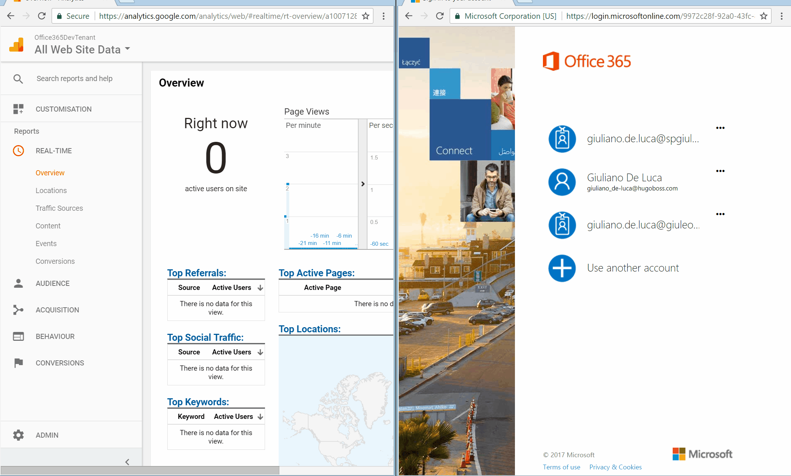

# Google Analytics Application Customizer

## Summary
In this sample is possible to see how to implement Google Analytics through SPFx Extensions Application Customizers

## Used SharePoint Framework Version 
SPFx Extensions Dev Preview

## Applies to

* [SharePoint Framework](https://dev.office.com/sharepoint)
* [Office 365 tenant](https://dev.office.com/sharepoint/docs/spfx/set-up-your-development-environment)

## Solution

Solution|Author(s)
--------|---------
js-application-analytics | Giuliano De Luca ([@giuleon](https://twitter.com/giuleon) , [www.delucagiuliano.com](http://www.delucagiuliano.com))

## Version history

Version|Date|Comments
-------|----|--------
1.0|June 09, 2017|Initial release

## Disclaimer
**THIS CODE IS PROVIDED *AS IS* WITHOUT WARRANTY OF ANY KIND, EITHER EXPRESS OR IMPLIED, INCLUDING ANY IMPLIED WARRANTIES OF FITNESS FOR A PARTICULAR PURPOSE, MERCHANTABILITY, OR NON-INFRINGEMENT.**

---

## Minimal Path to Awesome

- Clone this repository
- in the command line run:
  - `npm install`
  - `gulp serve`

## Features
This sample illustrates how to levereage the SharePoint Framework Extensions Applciation Customizer to analyze the usage through Google Analytics of a SharePoint site:

- Application Customizer
- Google Analytics

Don't forget to insert your Google Analytics tracking code something like that 'UA-100713841-5'

