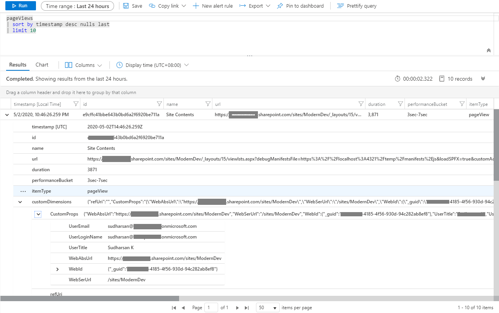
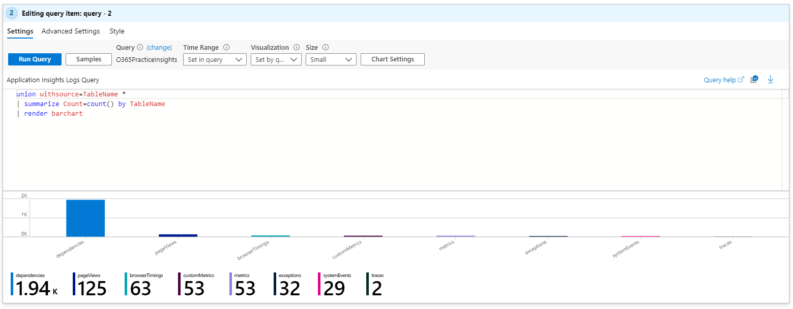
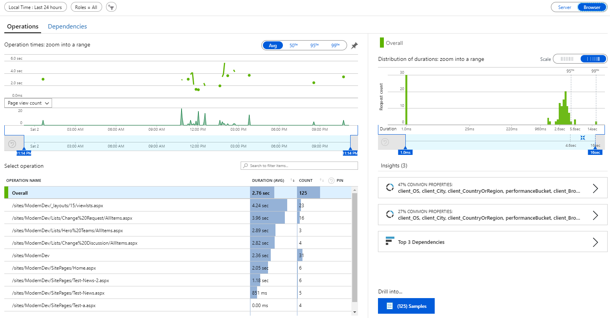
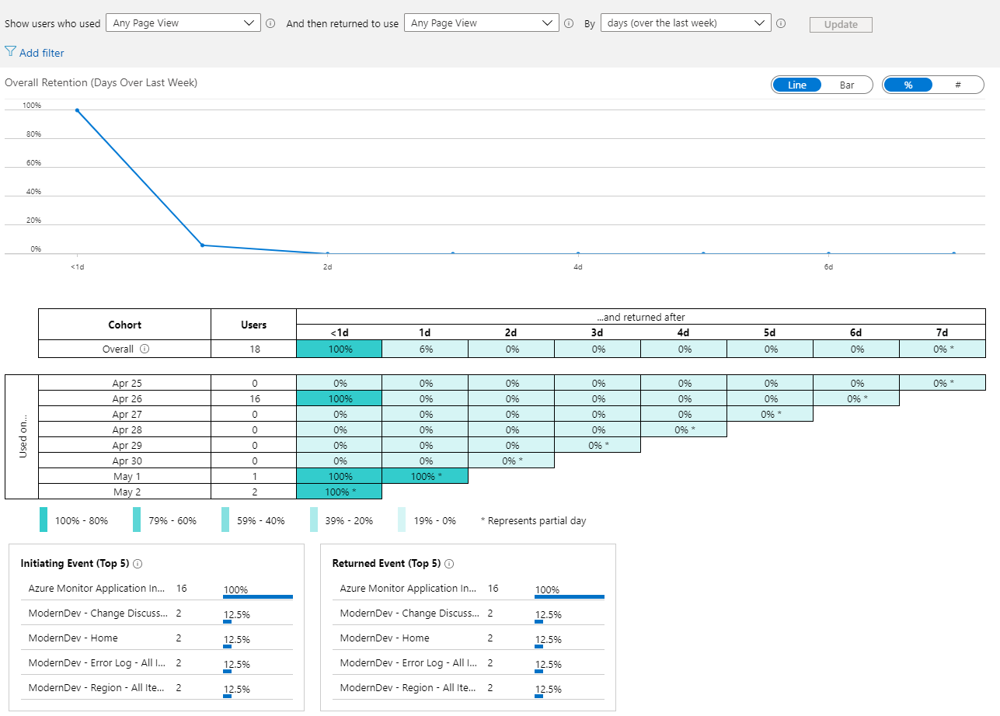
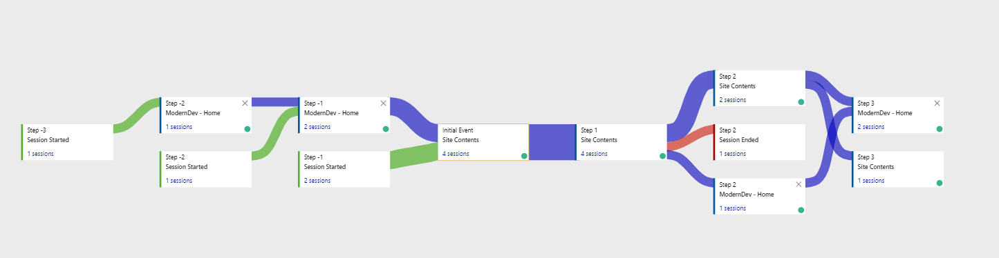
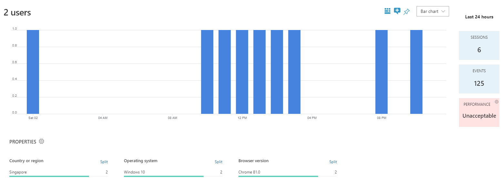

# JS Application AppInsights Advanced

## Summary
This application customizer will track the pageviews using Azure App Insights. The customizer will track the react routing which is used in **SPA**, in SharePoint Online it tracks the navigation between the news post which is not the actual post back. Also, added some custom properties about the site and the logged-in user details for report usage.

## Pre-requisites

**Azure Application Insights** has to be configured. Please follow the link [Create an Application Insights resource](https://docs.microsoft.com/en-us/azure/azure-monitor/app/create-new-resource) to create the Application Insights resource and grab the **Instrumentation Key** which is required for the extension to pass the tracking data.

## Properties

* **_appInsightsKey_**: Instrumentation Key to monitor the tracking data to be updated to Azure Application Insights.

### _Note_

* Used the React plugin provided by Microsoft. For more information click this [link](https://docs.microsoft.com/en-us/azure/azure-monitor/app/javascript)

## Preview

#### Log Details

#### Page View Analysis

#### Performance Chart

#### Retention

#### User Flows

#### Users Chart

## Used SharePoint Framework Version 

## Applies to

* [SharePoint Framework](https:/dev.office.com/sharepoint)
* [Office 365 tenant](https://dev.office.com/sharepoint/docs/spfx/set-up-your-development-environment)

## Prerequisites
 
**@microsoft/generator-sharepoint - 1.10.0**

## Solution

Solution|Author(s)
--------|---------
js-application-appinsights-advanced | Sudharsan K.([@sudharsank](https://twitter.com/sudharsank), [Know More](http://windowssharepointserver.blogspot.com/))

## Version history

Version|Date|Comments
-------|----|--------
1.0.0.0|May 02 2020|Initial release

## Disclaimer

**THIS CODE IS PROVIDED *AS IS* WITHOUT WARRANTY OF ANY KIND, EITHER EXPRESS OR IMPLIED, INCLUDING ANY IMPLIED WARRANTIES OF FITNESS FOR A PARTICULAR PURPOSE, MERCHANTABILITY, OR NON-INFRINGEMENT.**

## Minimal Path to Awesome

- Clone this repository
- in the command line run:
  - `npm install`
  - `gulp bundle --ship && gulp package-solution --ship`

#### Local Mode

This solution doesn't work on local mode.

