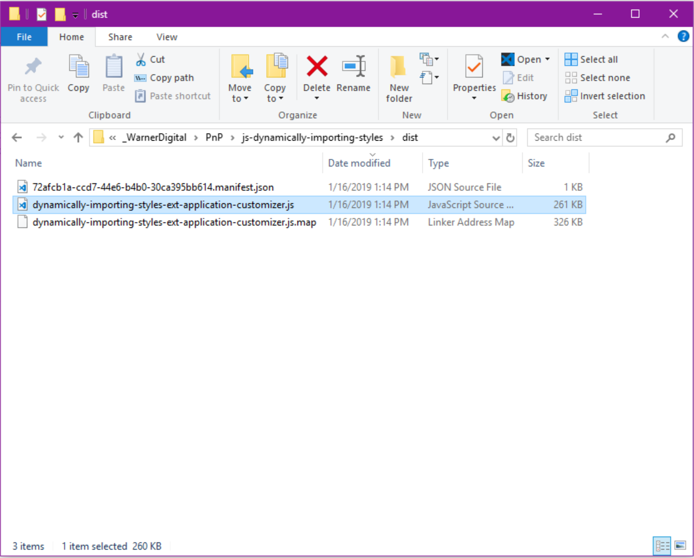
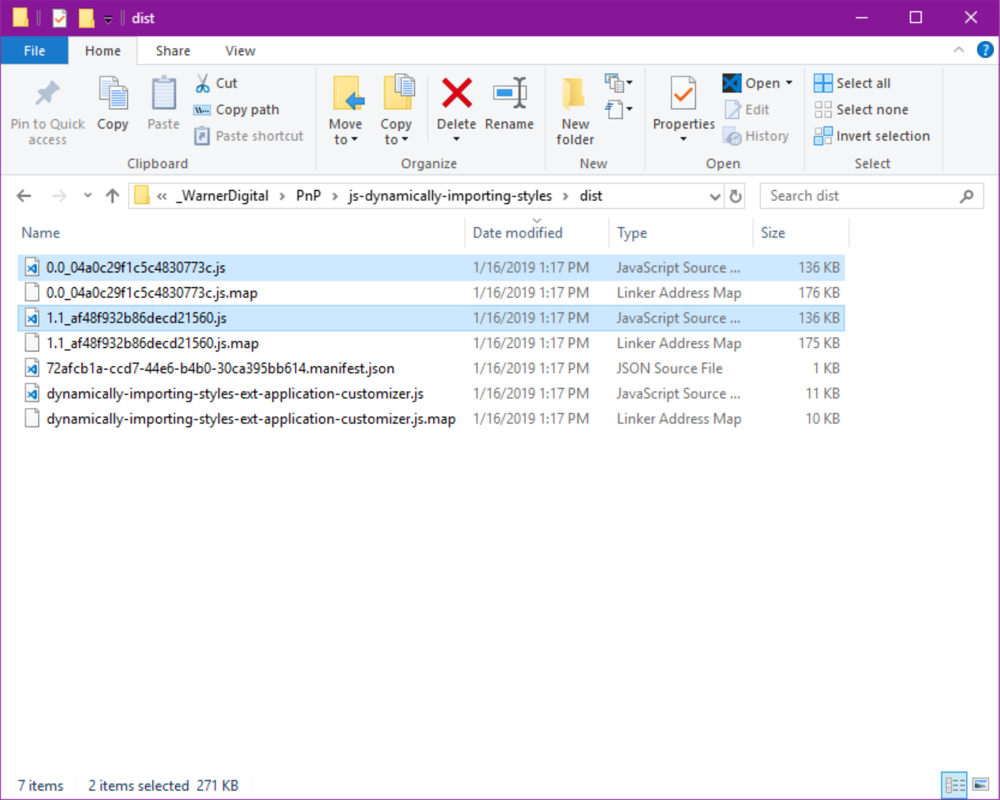
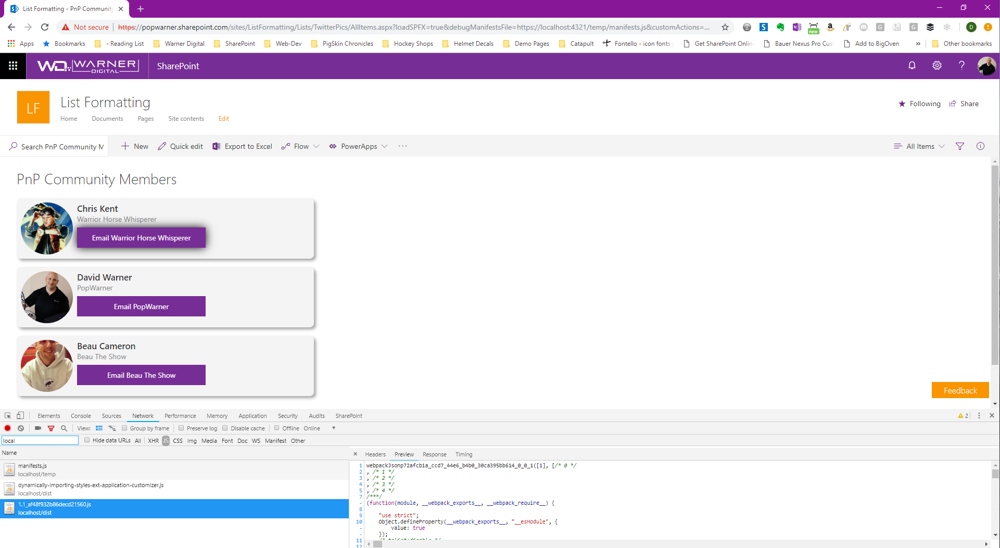

# Optimize CSS/SCSS Style Bundling and Dynamic Loading of Styles

## Summary
This example illustrates how style files can be dynamically bundled into multiple .js bundle files and then be individually imported at runtime. 

This provides the opportunity to create a collection of styles and optimize the SharePoint page by only loading the styles desired using the Extension properties.

**Pre Dynamic Bundle Optimization:** 
Without using the dynamic bundling strategy, all styles used in the solution will be included in the default SPFx bundled .js file. This can result in styles that might not be used loaded on the page.

**Post Dynamic Bundle Optimization:** 
Using the dynamic bundling strategy, each individually imported style file will be created in an individual .js file. This allows the individual bundled style files to be loaded at runtime using a SPFx Application Customizer Extension Property.

**Dynamically Loading of Individual Styles files at runtime:** 
Dynamically bundling and importing of the individual style bundle files will result in the SharePoint Page only loading what has been defined in the extension property.

## Used SharePoint Framework Version 

## Applies to

* [SharePoint Framework](https:/dev.office.com/sharepoint)
* [Office 365 tenant](https://dev.office.com/sharepoint/docs/spfx/set-up-your-development-environment)

## Solution

Solution|Author(s)
--------|---------
js-application-dynamically-importing-styles | David Warner II ([@DavidWarnerII](https://twitter.com/davidwarnerii) / [Warner Digital](http://warner.digital))

## Version history

Version|Date|Comments
-------|----|--------
1.0|January 21, 2019|Initial release

## Disclaimer
**THIS CODE IS PROVIDED *AS IS* WITHOUT WARRANTY OF ANY KIND, EITHER EXPRESS OR IMPLIED, INCLUDING ANY IMPLIED WARRANTIES OF FITNESS FOR A PARTICULAR PURPOSE, MERCHANTABILITY, OR NON-INFRINGEMENT.**

---

## Minimal Path to Awesome

- Clone this repository
- in the command line run:
  - `npm install`
  - `gulp serve`

## Features
This Web Part illustrates the following concepts on top of the SharePoint Framework:

- How to optimize and separate style and style .scss files into multiple bundled files
- How to load the bundled style files at runtime using a SharePoint Framework Extension Property.

## Additional Information:
- [Dynamic loading of packages in SharePoint Framework](https://docs.microsoft.com/en-us/sharepoint/dev/spfx/dynamic-loading)

- [Recommendations for working with CSS in SharePoint Framework solutions](https://docs.microsoft.com/en-us/sharepoint/dev/spfx/css-recommendations)

- Video Tutorial on importing styles, optimizing style bundles and dynamically importing the individual style bundles: http://warner.digital/spfx-dynamic-styles-part1/ 

- Patterns and Practices video demonstration: 
https://www.youtube.com/watch?v=kaZiQjDUaH8

