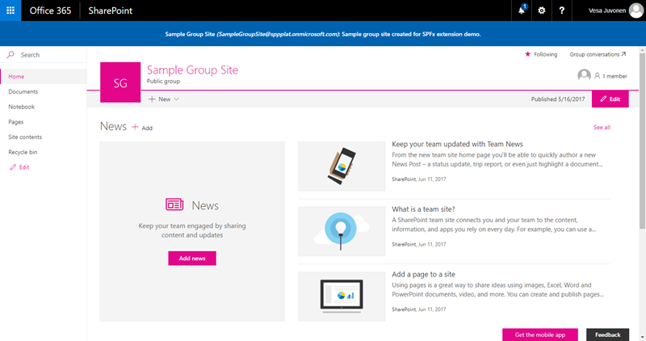

##Application Customizer GraphClient from Modern Teamsite

## Summary
Based on this example: https://dev.office.com/sharepoint/docs/spfx/extensions/get-started/using-page-placeholder-with-extensions
And some code ispiration from Mikael Svenson (@mikaelsvenson) http://www.techmikael.com/2017/06/accessing-microsoft-graph-resources.html

Simple example to call the Graph via the new GraphHttpClient (No ADAL) for get group title, mail and description. 

> Notice that this assumes that you are using "modern" collaboration site (group site) for testing.




## Used SharePoint Framework Version 


## Applies to

* [SharePoint Framework](https://dev.office.com/sharepoint)
* [Office 365 tenant](https://dev.office.com/sharepoint/docs/spfx/set-up-your-development-environment)

## Solution

Solution|Author(s)
--------|---------
graph-app-customizer | Simon Ågren ([dizparc AB.](@simondizparc)(https://github.com/simonagren))

## Version history

Version|Date|Comments
-------|----|--------
1.0|June 9, 2017|Initial release

## Disclaimer
**THIS CODE IS PROVIDED *AS IS* WITHOUT WARRANTY OF ANY KIND, EITHER EXPRESS OR IMPLIED, INCLUDING ANY IMPLIED WARRANTIES OF FITNESS FOR A PARTICULAR PURPOSE, MERCHANTABILITY, OR NON-INFRINGEMENT.**


## Notes
1. You need a developer tenant https://dev.office.com/devprogram
2. Create a modern teamsite/group via the SharePoint startpage.
3. Navigate to the document library.
4. In Code project, manifest.json, copy id and paste into step 5 querystring
5. Add following querystring:
?loadSPFX=true&debugManifestsFile=https://localhost:4321/temp/manifests.js&customActions={"<Your application ID>":{"location":"ClientSideExtension.ApplicationCustomizer"}}

Full Example url:
https://tenantname.sharepoint.com/sites/TestGroup/Shared%20documents/Forms/AllItems.aspx?loadSPFX=true&debugManifestsFile=https://localhost:4321/temp/manifests.js&customActions={"6ed4a222-c0c8-441e-ae2e-d2240084deff":{"location":"ClientSideExtension.ApplicationCustomizer"}}

### Building the code

```bash
git clone the repo
move to right folder
npm i
npm i -g gulp
gulp
```


