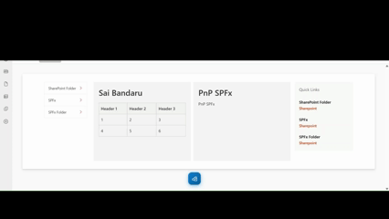

# LayoutCustomizer — SPFx Application Customizer

A SharePoint Framework (SPFx) Application Customizer that applies a responsive **3-column grid layout** to SharePoint Modern pages. Provides a Fluent-styled floating toolbar and modal panel for live column-width configuration, persisted via `localStorage`.

---

## Features

- Responsive 3-column layout applied to SharePoint Modern pages.
- Converts page sections into a flexible Left, Main, and Right grid layout.
- Floating toolbar for quick layout actions.
- Fluent-style configuration panel for adjusting column widths.
- Live layout preview when changing column values.
- Slider and numeric input support for precise column configuration.
- Optional right navigation panel that can be enabled or disabled.
- Layout configuration stored in browser localStorage (can be enhanced to store settings in the SharePoint page).
- Reset option to clear saved layout settings.
- Lightweight implementation using SPFx Application Customizer.

---

## Used SharePoint Framework Version

## Applies to

- [SharePoint Framework](https://aka.ms/spfx)
- [Microsoft 365 tenant](https://docs.microsoft.com/en-us/sharepoint/dev/spfx/set-up-your-developer-tenant)

> Get your own free development tenant by subscribing to [Microsoft 365 developer program](http://aka.ms/o365devprogram)

## Prerequisites

- Node.js v18.17.1 or compatible version
- SharePoint Online environment
- Site Collection Administrator permissions (for deployment)

## Solution

| Author(s) |
| --------- |
| [@saiiiiiii](https://github.com/saiiiiiii) |

## Version history

| Version | Date | Comments |
| ------- | ---- | -------- |
| 1.0.0 | March 2026 | Initial release |

## Disclaimer

**THIS CODE IS PROVIDED _AS IS_ WITHOUT WARRANTY OF ANY KIND, EITHER EXPRESS OR IMPLIED, INCLUDING ANY IMPLIED WARRANTIES OF FITNESS FOR A PARTICULAR PURPOSE, MERCHANTABILITY, OR NON-INFRINGEMENT.**

---

## Minimal Path to Awesome

- Clone this repository
- In the command-line run:
  - `npm install`
  - `gulp serve`
- To deploy:
  - `gulp bundle --ship`
  - `gulp package-solution --ship`
  - Upload the `.sppkg` file to your App Catalog
  - Install the app on your site

## References

- [Getting started with SharePoint Framework](https://docs.microsoft.com/en-us/sharepoint/dev/spfx/set-up-your-developer-tenant)
- [Microsoft 365 Patterns and Practices](https://aka.ms/m365pnp)
- [PnPjs Documentation](https://pnp.github.io/pnpjs/)

## Help

If you encounter any issues while using this sample, [create a new issue](https://github.com/saiiiiiii/js-application-layout-customizer/issues/new).

