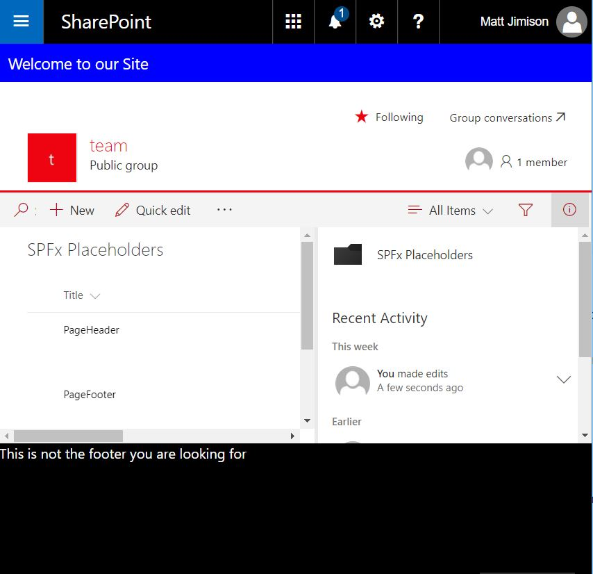

# List-Driven Placeholders

## Summary
This solution deploys a list that allows end users to manage content that will appear in placeholders, via a SharePoint Framework application customizer extension.



## Used SharePoint Framework Version 


## Applies to

* [SharePoint Framework](https://dev.office.com/sharepoint)
* [Office 365 tenant](https://dev.office.com/sharepoint/docs/spfx/set-up-your-development-environment)
* [PNP JS Core](https://github.com/SharePoint/PnP-JS-Core)

## Prerequisites
 
* Office 365 Developer tenant with a modern site collection

## Solution

Solution|Author(s)
--------|---------
js-application-listdrivenplaceholders | [Matt Jimison](https://mattjimison.com/), [@mjimison](https://twitter.com/mjimison)

## Version history

Version|Date|Comments
-------|----|--------
1.0|July 22, 2017|Initial release
2.0|Sept 05, 2017|Release Candidate update

## Disclaimer
**THIS CODE IS PROVIDED *AS IS* WITHOUT WARRANTY OF ANY KIND, EITHER EXPRESS OR IMPLIED, INCLUDING ANY IMPLIED WARRANTIES OF FITNESS FOR A PARTICULAR PURPOSE, MERCHANTABILITY, OR NON-INFRINGEMENT.**

---

## Minimal Path to Awesome

- Clone this repository
- In the command line, navigate to **samples/js-application-listdrivenplaceholders** and run:
  - `npm install`
  - Create the SharePoint list via 1 of 2 options 
    - (1) Deploy the package to create the SharePoint list
      - `gulp bundle`
      - `gulp package-solution`
      - Visit your developer tenant's app catalog, and upload the SPPKG package located in the sharepoint/solution folder into your "Apps for SharePoint" library
      - When prompted if you trust the solution, click "Deploy"
      - Create a new Modern Team Site by selecting the SharePoint app from the app launcher, and then click ‘Create site’
      - Navigate to your new site and select cog -> Add an App
      - Click 'placeholders-extension-client-side-solution' below in the ‘Apps you can add’ section
      - Select cog -> Site contents (if not redirected) and refresh the page periodically until the app is no longer grayed out, and shows as installed
    - (2) Create a new list manually
      - Create a new custom list with the name 'SPFxPlaceholders'
      - Change the title of the list to 'SPFx Placeholders'
      - Add a new column to the list with the title 'SPFxContent' and of type 'Multiple lines of text' and the additional column settings of 'Enhanced rich text'
  - Navigate to the new ‘SPFx Placeholders’ list
      - Create an entry with title 'Top', and add your desired content
      - Create an entry with title 'Bottom', and add your desired content
  - Debug the solution to view the placeholder content dynamically injected
    - In the command line, run:
    - `gulp serve --nobrowser`
    - Browse to your test site and add the below debug script url to a list view within your site (use a list view url to ensure all placeholders show up, as the current preview functionality will not correctly show all placeholders on all pages)

## Debug URL for testing
Here's a debug URL for testing around this sample.

```
?loadSPFX=true&debugManifestsFile=https://localhost:4321/temp/manifests.js&customActions={"b58ca197-a89a-47a9-b283-7c1df361eaf3":{"location":"ClientSideExtension.ApplicationCustomizer","properties":{}}}
```

Here's an example of what your URL will look like.

```
https://yourtenant.sharepoint.com/yourlist/AllItems.aspx?loadSPFX=true&debugManifestsFile=https://localhost:4321/temp/manifests.js&customActions={%22b58ca197-a89a-47a9-b283-7c1df361eaf3%22:{%22location%22:%22ClientSideExtension.ApplicationCustomizer%22,%22properties%22:{}}}
```

## Features
This solution declaratively deploys a new content type and list that allows an end user to easily add entries that correlate to the available placeholders the SharePoint Framework supports. The application customizer then loads this data (caching with localStorage when available) and injects the content into the page. This solution will allow you to add new placeholders into the 'SPFx Placeholders' list as they become available from Microsoft, without having to make any updates to the actual code.


