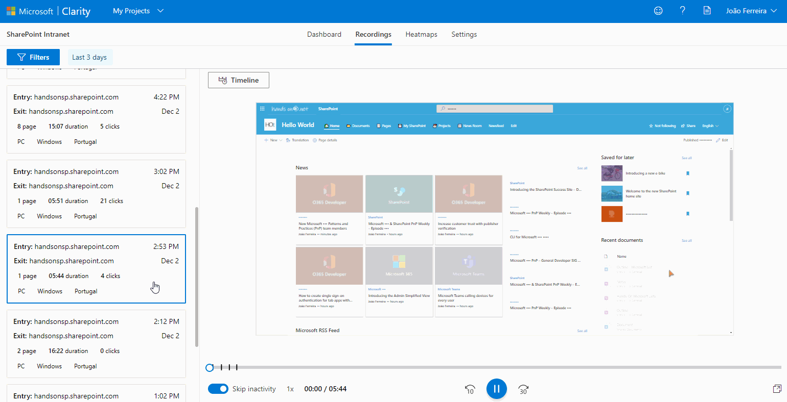

# Microsoft Clarity for modern SharePoint

## Summary

Creating engagement and measuring the success of any intranet is always a challenge, tools like Azure Application Insights and Google Analytics give you the usage metrics and now you can complement this information with Microsoft Clarity the new user behavior analytics tool.

Microsoft Clarity will gives you the recording of the sessions and heat maps of the user interaction with the site, this will help to find and fix the areas of your pages that are not working as you expect.

Have a look to article [How to add Microsoft Clarity to modern SharePoint](https://sharepoint.handsontek.net/2020/12/06/add-microsoft-clarity-modern-sharepoint/) to get detailed instructions on how to deploy this solution to SharePoint.

## Compatibility

 

-Incompatible-red.svg "SharePoint Server 2016 Feature Pack 2 requires SPFx 1.1")

## Applies to

- [SharePoint Framework](https://aka.ms/spfx)
- [Microsoft 365 tenant](https://docs.microsoft.com/en-us/sharepoint/dev/spfx/set-up-your-developer-tenant)

## Solution

Solution|Author(s)
--------|---------
Clarity | [João Ferreira](https://github.com/joaoferreira), [HANDS ON tek](https://sharepoint.handsontek.net), [@joao12ferreira](https://twitter.com/joao12ferreira)
Clarity | [Nishkalank Bezawada (MVP)](https://github.com/NishkalankBezawada), [Bravero AB](https://www.bravero.se/), [@im_nishkalank](https://x.com/im_nishkalank)

## Version history

Version|Date|Comments
-------|----|--------
1.0|November 23, 2021|Initial release
2.0|October 19, 2024|Upgraded to SPFx v1.20.0

## Minimal Path to Awesome

- Clone this repository
- Ensure that you are at the solution folder
- in the command-line run:
  - `npm install`
  - `gulp serve`

## References

- [How to add Microsoft Clarity to modern SharePoint](https://sharepoint.handsontek.net/2020/12/05/add-microsoft-cl…odern-sharepoint)
- [Getting started with SharePoint Framework](https://docs.microsoft.com/en-us/sharepoint/dev/spfx/set-up-your-developer-tenant)
- [Microsoft 365 Patterns and Practices](https://aka.ms/m365pnp) - Guidance, tooling, samples and open-source controls for your Microsoft 365 development

## Disclaimer
**THIS CODE IS PROVIDED *AS IS* WITHOUT WARRANTY OF ANY KIND, EITHER EXPRESS OR IMPLIED, INCLUDING ANY IMPLIED WARRANTIES OF FITNESS FOR A PARTICULAR PURPOSE, MERCHANTABILITY, OR NON-INFRINGEMENT.**

## Help

We do not support samples, but we this community is always willing to help, and we want to improve these samples. We use GitHub to track issues, which makes it easy for  community members to volunteer their time and help resolve issues.

You can try looking at [issues related to this sample](https://github.com/pnp/sp-dev-fx-extensions/issues?q=label%3Ajs-application-microsoft-clarity) to see if anybody else is having the same issues.

You can also try looking at [discussions related to this sample](https://github.com/pnp/sp-dev-fx-extensions/discussions?discussions_q=label%3Ajs-application-microsoft-clarity) and see what the community is saying.

If you encounter any issues while using this sample, [create a new issue](https://github.com/pnp/sp-dev-fx-extensions/issues/new?assignees=&labels=Needs%3A+Triage+%3Amag%3A%2Ctype%3Abug-suspected&template=bug-report.yml&sample=js-application-microsoft-clarity&authors=@joaoferreira&title=js-application-microsoft-clarity%20-%20).

For questions regarding this sample, [create a new question](https://github.com/pnp/sp-dev-fx-extensions/issues/new?assignees=&labels=Needs%3A+Triage+%3Amag%3A%2Ctype%3Abug-suspected&template=question.yml&sample=js-application-microsoft-clarity&authors=@joaoferreira&title=js-application-microsoft-clarity%20-%20).

Finally, if you have an idea for improvement, [make a suggestion](https://github.com/pnp/sp-dev-fx-extensions/issues/new?assignees=&labels=Needs%3A+Triage+%3Amag%3A%2Ctype%3Abug-suspected&template=suggestion.yml&sample=js-application-microsoft-clarity&authors=@joaoferreira&title=js-application-microsoft-clarity%20-%20).

