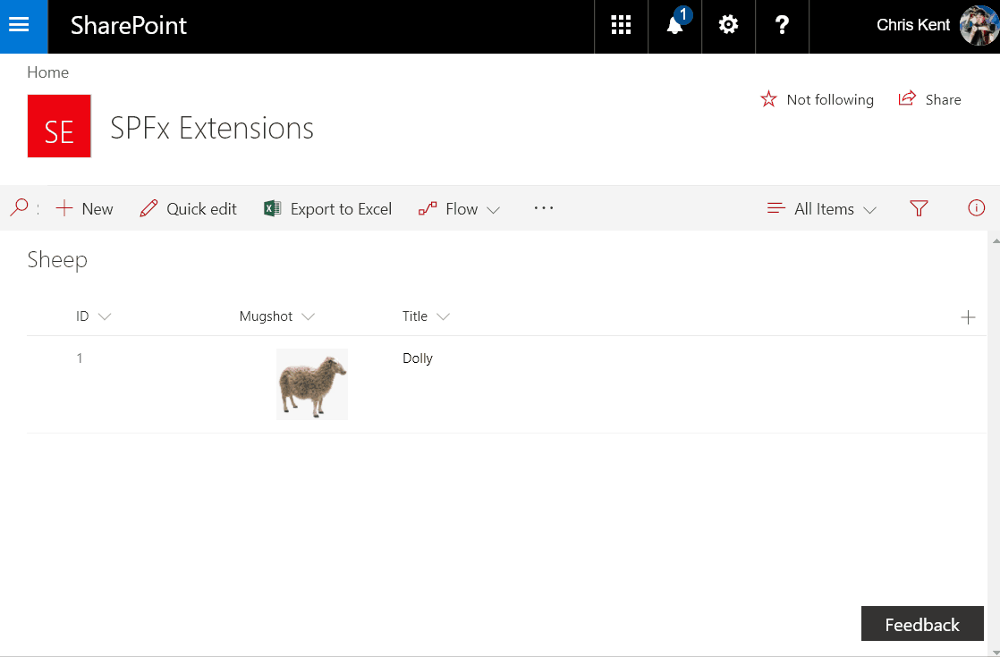
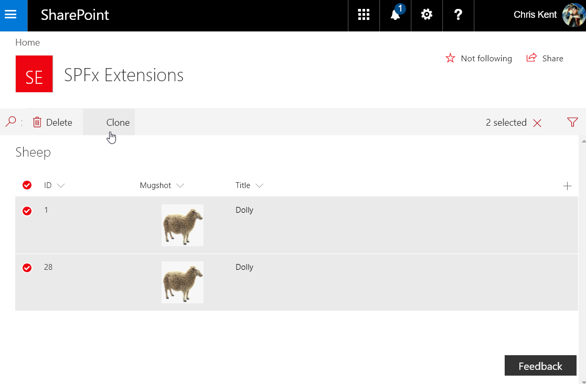
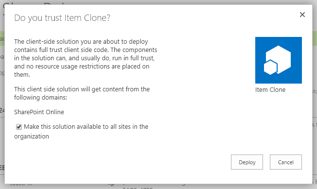

# SPFx Clone ListView Command Set

## Summary
Sample SharePoint Framework listview command set extension that allows users to clone one or more list items. Demonstrates conditional visibility, PnPJS requests, PnPJS Batching, and field specific formats for rest operations.



## Used SharePoint Framework version 


## Applies to

* [SharePoint Framework Extensions](https://dev.office.com/sharepoint/docs/spfx/extensions/overview-extensions)
* [PnPJS](https://pnp.github.io/pnp/)


## Solution

Solution|Author(s)
--------|---------
js-command-clone | Chris Kent ([thechriskent.com](https://thechriskent.com), [@thechriskent](https://twitter.com/thechriskent))

## Version history

Version|Date|Comments
-------|----|--------
1.0|August 30, 2017|Initial release
1.1|September 26, 2017|Updated for SPFx Extensions GA 1.3.0
1.4|January 20, 2018|Updated for SPFx 1.4.0
1.4.1|February 2, 2018|Migrated sp-pnp-js to PnPJS
||May 27, 2019|Added list filter option

## Disclaimer
**THIS CODE IS PROVIDED *AS IS* WITHOUT WARRANTY OF ANY KIND, EITHER EXPRESS OR IMPLIED, INCLUDING ANY IMPLIED WARRANTIES OF FITNESS FOR A PARTICULAR PURPOSE, MERCHANTABILITY, OR NON-INFRINGEMENT.**

---

## Minimal path to awesome

- Clone this repository
- Update the `pageUrl` properties in the **config/serve.json** file
  - The `pageUrl` should be a list view in your tenant
  - This property is only used during development in conjunction with the `gulp serve` command
- In the command line navigate to **samples/js-command-clone** and run:
  - `npm install`
  - `gulp serve`
- In the web browser:
  - Choose **Load Debug Scripts** when prompted
  - Select 1 or more items and choose **clone** from either the command bar or the context menu
  - Behold the marvels of science

## Features
SPFx Clone utilizes PnPJS to quickly copy multiple list items.

This extension illustrates the following concepts:

- Using **PnPJS**
- Conditionally showing commands based on the **number of selected rows**
- Conditionally showing commands based on the **user's permission level**
- Requesting **List Field** information
- **Batching Get requests** for list items
- **Field selection** and **Expanded fields** using PnP JS Core
- Adding multiple items in a single **Batch**
- Field specific formats for REST operations including
  - Person
  - Multi Persons
  - Lookups
  - Multi Lookups
  - Multi Choice
  - Projected Fields
  - Taxonomy Fields
  - Multi Taxonomy Fields
  - And all other standard fields


## Debug URL for testing
Here's a debug querystring for testing this sample:

```
?loadSPFX=true&debugManifestsFile=https://localhost:4321/temp/manifests.js&customActions={"bf6645bd-42e4-4a30-aad7-6ff12d61fa1f":{"location":"ClientSideExtension.ListViewCommandSet"}}
```

Your URL will look similar to the following (replace with your domain and site address):
```
https://yourtenant.sharepoint.com/sites/yoursite/Lists/yourlist/AllItems.aspx?loadSPFX=true&debugManifestsFile=https://localhost:4321/temp/manifests.js&customActions={"bf6645bd-42e4-4a30-aad7-6ff12d61fa1f":{"location":"ClientSideExtension.ListViewCommandSet"}}
```

## Let's Get Cloning!



## Deploying to your tenant
- In the command line navigate to **samples/js-command-clone** and run:
  - `gulp bundle --ship`
  - `gulp package-solution --ship`
- Open the **samples/js-command-clone/sharepoint** folder
  - Drag the **clone.sppkg** onto the **Apps for SharePoint** library of your app catalog
  - Check the box for tenant wide deployment and click **Deploy**:
  
- You'll need to add the Custom Action to your site(s) using one of the methods below

### Adding the custom action to your site

Even if you selected tenant wide deployment for the package, each site will need a Custom Action added to take advantage of the extension.

### Option 1: Use the included PnP provisioning template

A PnP Remote Provisioning template has been provided ([CloneAction.xml](./assets/CloneAction.xml)) along with a PowerShell script to apply the template to your site ([ApplyTemplate.ps1](./assets/ApplyTemplate.ps1)). This is a straightforward way to get the extension on a site but requires some minor setup.

> You can also use this template as part of a [Site Design](https://docs.microsoft.com/en-us/sharepoint/dev/declarative-customization/site-design-pnp-provisioning).

#### Prerequisites

You'll need the [SharePoint PnP PowerShell Cmdlets for SharePoint Online](https://github.com/SharePoint/PnP-PowerShell). It's a very quick install and if you don't have it already, go get it! You'll end up using it for far more than just this sample.

#### Running the PowerShell script

Using a PowerShell console (you can even use the powershell terminal included in Visual Studio Code), navigate to the assets folder in this sample. Run the script like this:

```PowerShell
.\ApplyTemplate.ps1 https://yourtenant.sharepoint.com/sites/yoursite CloneAction.xml
```

You'll be prompted for your credentials and then the action will be added (to every list). The only thing included in the template is the Custom Action.

> Read More Here: [Introducing the PnP Provisioning Engine](https://github.com/SharePoint/PnP-Guidance/blob/551b9f6a66cf94058ba5497e310d519647afb20c/articles/Introducing-the-PnP-Provisioning-Engine.md)

### Option 2: Use the SPFx Extensions CLI
You can use the [spfx-extensions-cli](https://www.npmjs.com/package/spfx-extensions-cli) to manage your extension custom actions across your sites.

Install the CLI if you haven't already:

`npm install spfx-extensions-cli -g`

Connect to your site (login when prompted):

`spfx-ext --connect "https://yourtenantsharepointcom/sites/yoursite"`

Add the extension (be sure to replace the listtitle parameter with the name of your list):

`spfx-ext add "Item Clone" ListViewCommandSet list bf6645bd-42e4-4a30-aad7-6ff12d61fa1f --listtitle "Sheep"`

## Known issues
- UI Fabric Icons are not currently displaying in SPFx Extensions: 
  - [Issue 1279](https://github.com/SharePoint/sp-dev-docs/issues/1279) - Solution has been found, but fix has not yet been implemented


