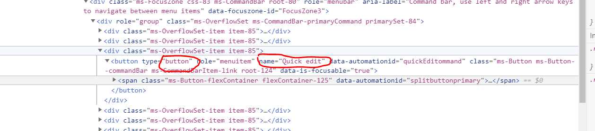

# js-command-hide-commands

## Summary

> **NOTE:** This sample makes use of HTML DOM manipulation. Please note that directly manipulating SharePoint pages is **unsupported** and may result in unexpected behavior.
>
> Microsoft may change the HTML layout, CSS class names, element IDs, or any other changes to SharePoint pages at any time.
>
> We recommend that you avoid using this solution in a production environment, and that you limit HTML manipulation to HTML that you *own* (e.g.: custom HTML  embedded in a page and/or custom web parts). If you experience any issues with your SharePoint environment, please de-activate this extension before opening a support ticket with Microsoft.

This command-set can be used to hide other 'out-of-the-box' commands on list views.

We were rolling out a solution that included several custom listview-commands and they were all getting displayed way off to the right of the command bar or worse yet, being buried in the ellipses.  This project was to update an existing document management system from classic SharePoint to the modern UI. There were 3 or 4 commands that we had created that related specifically to the document management system and as we rolled the new system out, we wanted to draw their users attention to the core features we had developed and not have users exploring all the cool features available in the modern UI (at least not just yet) 

All the out-of-the-box commands (Power Apps, Power Automated, synch) were taking up precious real estate on the command bar, and our commands were getting buried off to the right, or even worse, under the ellipses.  We were asked if we could 
we could just hide those other commands, and came up with this solution. In our site this is just a temporary 'feature' to be used as we roll out the site so that users can focus on the core actions we have developed. It is *NOT RECOMMENDED* that developers update the SharePoint UI using DOM manipulation, as this solution does.

It should be noted that if we could reorder the commands in the Command Bar to place our custom commands BEFORE the out of the box commands this extension would not have been required! 

## Used SharePoint Framework Version 

## Applies to

* [SharePoint Framework](https://dev.office.com/sharepoint)
* [Office 365 tenant](https://dev.office.com/sharepoint/docs/spfx/set-up-your-development-environment)

## Solution

Solution|Author(s)
--------|---------
js-command-hide-commands | Russell Gove

## Version history

Version|Date|Comments
-------|----|--------
1.0|April 27, 2020|Initial Release

## Disclaimer
**THIS CODE IS PROVIDED *AS IS* WITHOUT WARRANTY OF ANY KIND, EITHER EXPRESS OR IMPLIED, INCLUDING ANY IMPLIED WARRANTIES OF FITNESS FOR A PARTICULAR PURPOSE, MERCHANTABILITY, OR NON-INFRINGEMENT.**

---

## Minimal Path to Awesome

- Clone this repository
- in the command line run:
  - `npm install`
  - `gulp bundle --ship`
  - `gulp package-solution --ship`
  - install the app in an app catalog (tenant or site collection)
  - add the app to your site
  - add entries to the **Hidden Commands** list that was created when the app was installed to specify which buttons should be hidden in the ribbon, for which lists, and from whom`

The fields in the **Hidden Commands** list are as follows:

Column | Description
---|---
`List Title`|the title of the list in which you want to hide a command
`Is Enabled`|Yes or No, should this rule be enforced
`Exclude Permission`|the name of a `SPPermission` (i.e. `manageLists`). If the user has this permission on the list the rule will not apply. The permissions can be found here: https://docs.microsoft.com/en-us/previous-versions/office/developer/sharepoint-2010/ee556747(v=office.14)`
`CSS Selector`|the CSS Selector for the command (or actually any element) to be hidden in the list view (for example button[name="PowerApps"]	) will hide the Power Apps command.
`AllowMultipleMatches`|Determines if multiple items match the CSS Selector if the rule will apply to all matched. For the most part , leave it set to No.`

To determine the CSS Selector to be used, open the list or library in your browser of choice (i,e. Edge) and open the debugger tools (F12). Click on the Elements tab and click the icon to select an element. Select the element in the browser.

Here I have selected the 'Quick Edit' button:

So the CSS Selector to hide this  button would be `button[name="Quick edit"]`.

Note that the CSS Selector can be used to hide ANY element on the list views for the selected list/library (for fun we could hide every 5th row in the view for anyone who has `addListItems` permission :-)). The solution sets the style to display:none on any elements that match the CSS Selector. Other styles could be applied with a simple code modification, or the styles to be applied could be added in the **Hidden Commands** list.

This cannot be used to secure commands. The user still has access to the underlying commands, even if they are hidden on the command bar. In fact most/all commands are still available on the ECB.

While it is not recommended to manipulate the SharePoint UI using it's DOM, this extension does so in a 'Future-proof' way. When Flow was renamed to Automate, we did not need to rebuild any code to hide the new button, we just updated the CSS Selector in the **Hidden Commands** list to `hide button[name="Automate"]` instead of `button[name="Flow"]`.

## Features
Description of the extension with possible additional details than in short summary.
This extension illustrates the following concepts:

- Can hide commmands from specific lists or libraries
- Can hide commands from users who lack specific permissions.

