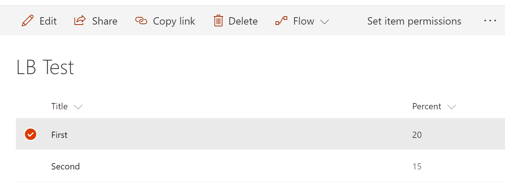

# Unique Item Permissions Command Set Customizer

## Summary
The sample illustrates creation of a shortcut command to redirect user to selected item's permission page.



## Used SharePoint Framework Version 
1.3

## Applies to

* [SharePoint Framework](http://dev.office.com/sharepoint/docs/spfx/sharepoint-framework-overview)

Solution|Author(s)
--------|---------
js-command-item-permissions | Alex Terentiev ([Sharepointalist Inc.](http://www.sharepointalist.com), [AJIXuMuK](https://github.com/AJIXuMuK))

## Version history

Version|Date|Comments
-------|----|--------
1.0|October 15, 2017|Initial release

## Disclaimer
**THIS CODE IS PROVIDED *AS IS* WITHOUT WARRANTY OF ANY KIND, EITHER EXPRESS OR IMPLIED, INCLUDING ANY IMPLIED WARRANTIES OF FITNESS FOR A PARTICULAR PURPOSE, MERCHANTABILITY, OR NON-INFRINGEMENT.**

## Features
This project contains SharePoint Framework extension that illustrates next features:
* command set customizer
* current user permissions check
* construction of url to work on specific item's permissions

## Building and debugging the code

```bash
git clone the repo
npm i
npm i -g gulp
gulp server --nobrowser
```

This package produces the following:

* lib/* - intermediate-stage commonjs build artifacts
* dist/* - the bundled script, along with other resources
* deploy/* - all resources which should be uploaded to a CDN.

On your SharePoint tenant:

* go to any modern page or modern list/document library and add next query string to the url:
```
?loadSPFX=true&debugManifestsFile=https://localhost:4321/temp/manifests.js&customActions={"fc875dc3-2180-4f1b-bc1c-a20d8ece961b":{"location":"ClientSideExtension.ListViewCommandSet"}}
```
