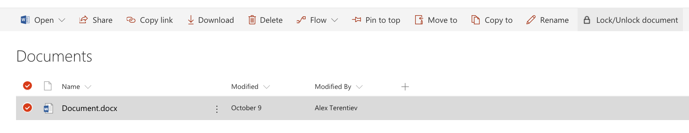

# Lock Item Command Set Customizer

## Summary
The sample illustrates the ability to lock/unlock selected item/document for the current user.
The lock is implemented as item's unique permissions set to Full Control for current user only.
The lock is available only for items that inherit permissions from the parent. Items with unique permissions can't be locked as we can't unlock them correctly later on.
All other permissions are deleted.
The Command is available only for users who have "Manage Permissions" permissions for the list/document library.



## Used SharePoint Framework Version 
1.4

## Applies to

* [SharePoint Framework](http://dev.office.com/sharepoint/docs/spfx/sharepoint-framework-overview)

Solution|Author(s)
--------|---------
js-command-lock-item | Alex Terentiev ([Sharepointalist Inc.](http://www.sharepointalist.com), [AJIXuMuK](https://github.com/AJIXuMuK))

## Version history

Version|Date|Comments
-------|----|--------
1.0|December 20, 2017|Initial release

## Disclaimer
**THIS CODE IS PROVIDED *AS IS* WITHOUT WARRANTY OF ANY KIND, EITHER EXPRESS OR IMPLIED, INCLUDING ANY IMPLIED WARRANTIES OF FITNESS FOR A PARTICULAR PURPOSE, MERCHANTABILITY, OR NON-INFRINGEMENT.**

## Features
This project contains SharePoint Framework extension that illustrates next features:
* command set customizer
* current user permissions check
* sp-pnp-js usage
* spHttpClient usage
* work with list item/document permissions (break role inheritance, reset role inheritance, add role assignment)

## Building and debugging the code

```bash
git clone the repo
npm i
npm i -g gulp
gulp serve --nobrowser
```

On your SharePoint tenant:

* go to any modern page or modern list/document library and add next query string to the url:
```
?loadSPFX=true&debugManifestsFile=https://localhost:4321/temp/manifests.js&customActions={"a528d81e-bf9b-4463-8cda-21d76ca99243":{"location":"ClientSideExtension.ListViewCommandSet"}}
```
