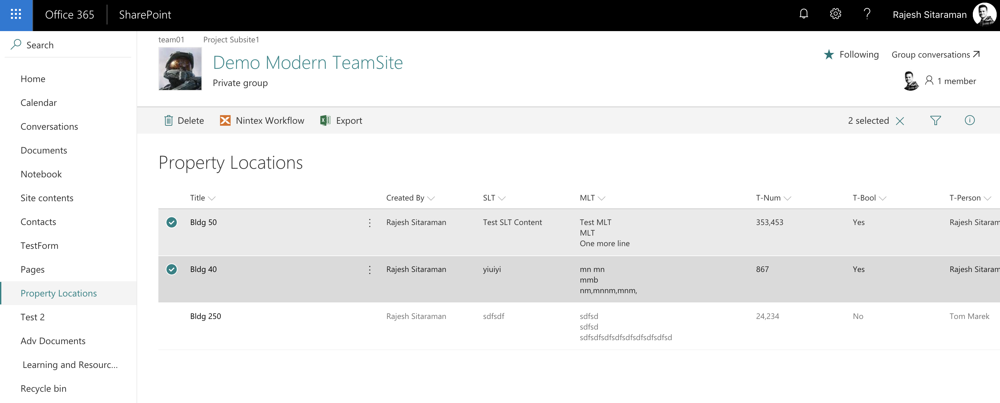

# SPFx Export Selected Items to Excel -  ListView Command Set

## Summary

Exports selected items to excel spreadsheet in xlsx format, with the columns from the current modern list view.

<a href="http://www.youtube.com/watch?feature=player_embedded&v=NInVJqAmbns" target="_blank"></a>

## Used SharePoint Framework version


## Applies to

* [SharePoint Framework Extensions](https://dev.office.com/sharepoint/docs/spfx/extensions/overview-extensions)
* [SheetJS xlsx](https://www.npmjs.com/package/xlsx)

## Solution

Solution|Author(s)
--------|---------
js-command-selecteditems-export | Rajesh Sitaraman ([rjesh.com](http://rjesh.com), [@rjesh](https://twitter.com/rjesh))

## Version history

Version|Date|Comments
-------|----|--------
1.0|Feb 16, 2018|Initial release

## Disclaimer

**THIS CODE IS PROVIDED *AS IS* WITHOUT WARRANTY OF ANY KIND, EITHER EXPRESS OR IMPLIED, INCLUDING ANY IMPLIED WARRANTIES OF FITNESS FOR A PARTICULAR PURPOSE, MERCHANTABILITY, OR NON-INFRINGEMENT.**

---

## Minimal path to awesome

* Clone this repository
* In the command line navigate to **js-command-selecteditems-export** and run:
* `npm i`
* `gulp serve --nobrowser`
* In a web browser
* Follow the steps below from **Debug URL for testing**
* Choose **Load Debug Scripts** when prompted 
* Add some sample list items _(Be sure at least 1 item)_
* Select the item, and export from toolbar
* Generates and downloads the xlsx file

## Features

SPFx Cmdex ExportItems utilizes SheetJS xlsx to create spreadsheet in xlsx format with the items selected from the view.

This extension illustrates the following concepts:

* Export selected items to excel
* Works across platforms
* No need for additional plugins
* No browser dependency
* No IQY files
* No additional signin required to render rows in spreadsheet
* Exports only columns you see in the view

## Debug URL for testing

Here's a debug querystring for testing this sample:

```html
?loadSpfx=true&debugManifestsFile=https://localhost:4321/temp/manifests.js&customActions={"aaa4141f-7829-4b98-af0f-a1e0e6f273fd":{"location":"ClientSideExtension.ListViewCommandSet.CommandBar"}}
```

Your URL will look similar to the following (replace with your domain and site address):

```html
https://yourtenant.sharepoint.com/sites/yoursite?loadSpfx=true&debugManifestsFile=https://localhost:4321/temp/manifests.js&customActions={"aaa4141f-7829-4b98-af0f-a1e0e6f273fd":{"location":"ClientSideExtension.ListViewCommandSet.CommandBar"}}
```

## Known issues

* Export previous view columns, even after the view is changed
* Its using legacyContext viewID property, which is not updated even after the view changed. Let's hope SPFX will be providing these options in future.