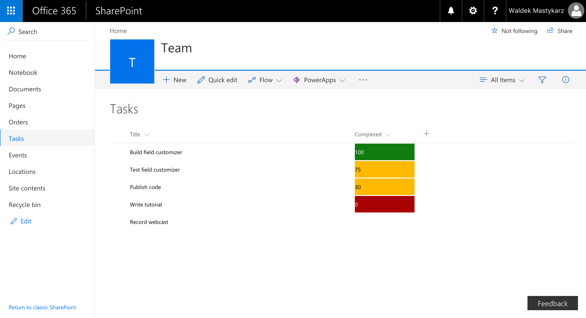
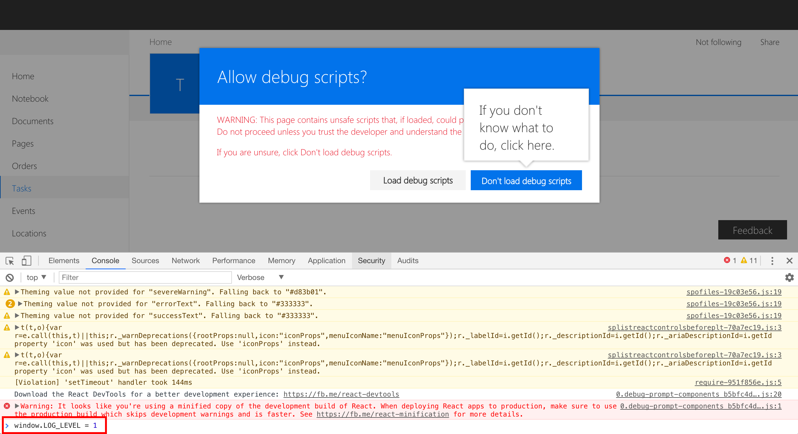
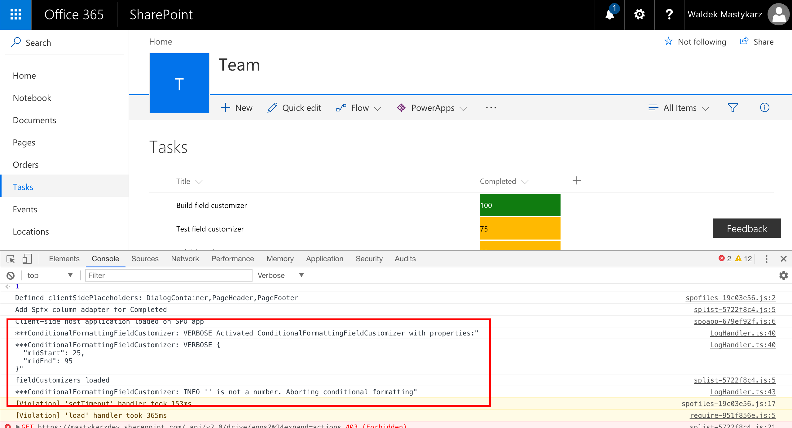

# Conditional formatting SharePoint Framework field customizer

## Summary

Sample SharePoint Framework field customizer that applies Excel-like conditional formatting to numeric fields based on their values.


## Used SharePoint Framework Version


## Applies to

* [SharePoint Framework Extensions Developer Preview](https://dev.office.com/sharepoint/docs/spfx/extensions/overview-extensions)
* [Office 365 developer tenant](http://dev.office.com/sharepoint/docs/spfx/set-up-your-developer-tenant)

## Solution

Solution|Author(s)
--------|---------
js-field-conditionalformatting|Waldek Mastykarz (MVP, [Rencore](https://rencore.com), @waldekm)

## Version history

Version|Date|Comments
-------|----|--------
1.0.0|June 29, 2017|Initial release

## Disclaimer

**THIS CODE IS PROVIDED *AS IS* WITHOUT WARRANTY OF ANY KIND, EITHER EXPRESS OR IMPLIED, INCLUDING ANY IMPLIED WARRANTIES OF FITNESS FOR A PARTICULAR PURPOSE, MERCHANTABILITY, OR NON-INFRINGEMENT.**

---

## Prerequisites

* Office 365 Developer tenant with a classic site collection and a list of numeric values

## Minimal Path to Awesome

* clone this repo
* in the command line run
  * `npm i`
  * `gulp serve-info --nobrowser`
* copy the field customizer debug query string parameters from the console output
* change the name of the field to the field that you use to store numbers
* specify values for the **midStart** and **midEnd** properties (start and end of the middle range)
* in the web browser
  * navigate to your list
  * to the URL of the list add the previously copied debug query string parameters

## Features

This project contains sample SharePoint Framework field customizer built without using JavaScript libraries. The field customizer uses three value ranges for coloring cells with red (lowest range), yellow (middle range) and green (highest range). Ranges are controlled using the `midStart` and `midEnd` properties, for example:

Color all values lower than 25 with red, values between 25 and 95 with yellow and values greater than 95 with green:

```text
?loadSPFX=true&debugManifestsFile=https://localhost:4321/temp/manifests.js&fieldCustomizers={"Completed":{"id":"dac19deb-462b-49a3-8c19-a0c3c553ddb9","properties":{"midStart":25,"midEnd":95}}}
```



This sample illustrates the following concepts on top of the SharePoint Framework:

* using parameters to pass configuration values to field customizers
* styling cell contents with CSS
* logging information from SharePoint Framework code
* building a custom SharePoint Framework log handler to log information to browser console
* configuring log level using the global `window.LOG_LEVEL` property

### Available configuration parameters

Parameter | Type | Possible values | Description
----------|------|-----------------|------------
`midStart`|number|any number lower than or equal `midEnd`|start value of the middle range (inclusive)
`midEnd`|number|any number greater than or equal `midStart`|end value of the middle range (inclusive)

### Logging information

This project contains a sample implementation of a custom SharePoint Framework log handler that logs information to browser console. By default the log level is set to Error (4) which will log only errors. If you want to increase the logging level to include verbose messages, when loading the field customizer, in the console, set the value of the global **LOG_LEVEL** property to 1, eg:

```js
window.LOG_LEVEL = 1
```






