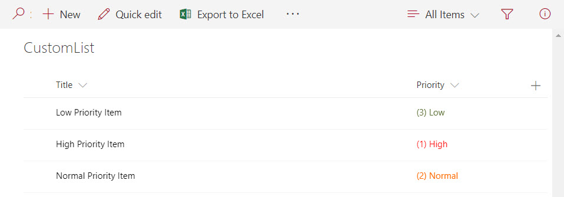
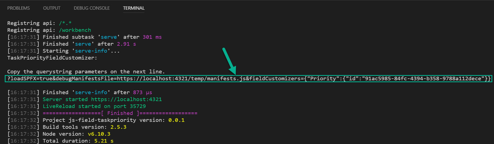
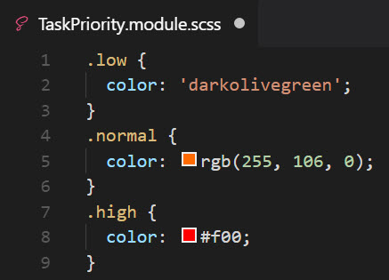

# js-field-taskpriority - Priority Field SharePoint Framework field customizer

## Summary

Sample SharePoint Framework field customizer that shows how to apply conditional color formatting to the values in a Priority field based on their value.



This sample illustrates the following concepts on top of the SharePoint Framework:

* styling cell contents with CSS
* setting CSS colors 3 different ways
* logging information to the JavaScript console

## SharePoint Framework Version


## Applies to

* [SharePoint Framework Extensions Developer Preview](https://dev.office.com/sharepoint/docs/spfx/extensions/overview-extensions)
* [Office 365 developer tenant](http://dev.office.com/sharepoint/docs/spfx/set-up-your-developer-tenant)

## Solution

Solution|Author(s)
--------|---------
js-field-taskpriority|Todd Baginski (MVP, [Canviz](https://canviz.com), @toddbaginski)

## Version history

Version|Date|Comments
-------|----|--------
1.0.0|August 24, 2017|Initial release

## Disclaimer

**THIS CODE IS PROVIDED *AS IS* WITHOUT WARRANTY OF ANY KIND, EITHER EXPRESS OR IMPLIED, INCLUDING ANY IMPLIED WARRANTIES OF FITNESS FOR A PARTICULAR PURPOSE, MERCHANTABILITY, OR NON-INFRINGEMENT.**

---

## Prerequisites

* Office 365 Developer tenant with a classic site collection
* Custom list with the Priority site column added to it
* Some sample data in the custom list

## Minimal Path to Awesome

* create a custom list
* add the Priority site column to the list
* create 3 list items, each with a different Priority column value 
* clone this repo
* in the command line run
  * `npm i`
  * `gulp serve-info --nobrowser`
        - Thanks @waldekm for the gulp task!  I modified it a bit to match this sample.
* copy the field customizer debug query string parameters from the console output, see the screenshot below



* open a web browser and navigate to the custom list with the Priority field and sample data
* in the address bar, append the query string parameters you copied to the URL
* press enter 
* click Load debug scripts
* marvel at the awesome power of conditional formatting right before your very eyes
  
  or (more likely)
  
  just copy and paste the code once you see it works and put it in your own solution to save time

## Features

This project contains a sample SharePoint Framework field customizer built without using JavaScript libraries. This sample demonstrates how to apply conditional color formatting to the values in a Priority Field based on their value.

A simple switch statement in the [/src/extensions/taskpriority/TaskPriorityFieldCustomizer.ts](/src/extensions/taskpriority/TaskPriorityFieldCustomizer.ts) class evaluates each Priority column value and applies the appropriate CSS stele to change the text color.

```javascript
 switch (event.cellValue) {
        case '(1) High':            
            event.cellDiv.classList.add(styles.high);
            console.log('(1) High Switch Hit');
            break;
        case '(2) Normal':
            event.cellDiv.classList.add(styles.normal);
        console.log('(2) Normal Switch Hit');
            break;
        case '(3) Low':
            event.cellDiv.classList.add(styles.low);
            console.log('(3) Low Switch Hit');
            break;
        default:
            break;
      }
```
This sample demonstrates three different ways to assign color value is CSS.  This is what the code looks like in the [/src/extensions/taskpriority/TaskPriority.module.scss](/src/extensions/taskpriority/TaskPriority.module.scss) file.

```scss
.low {
  color: 'darkolivegreen';
}
.normal {
  color: rgb(255, 106, 0);
}
.high {
  color: #f00;
}
```

This is what the code looks like in the VSCode editor:




