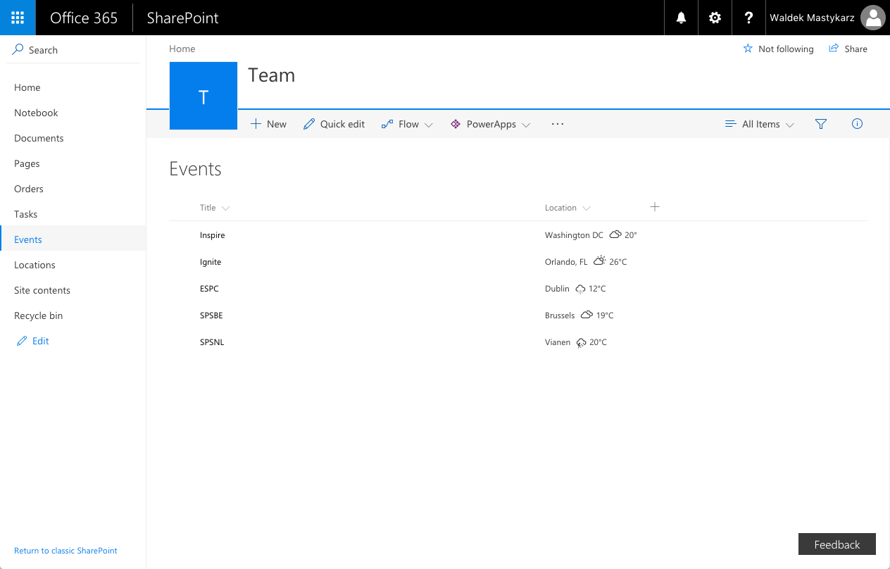

# Weather SharePoint Framework field customizer

## Summary

Sample SharePoint Framework field customizer showing weather conditions for the given location.



## Used SharePoint Framework Version


## Applies to

* [SharePoint Framework Extensions](https://dev.office.com/sharepoint/docs/spfx/extensions/overview-extensions)
* [Office 365](http://dev.office.com/sharepoint/docs/spfx/set-up-your-developer-tenant)

## Solution

Solution|Author(s)
--------|---------
js-field-weather|Waldek Mastykarz (MVP, [Rencore](https://rencore.com), @waldekm)

## Version history

Version|Date|Comments
-------|----|--------
1.0.0|June 29, 2017|Initial release
1.1.0|January 20, 2018|Updated to 1.4

## Disclaimer

**THIS CODE IS PROVIDED *AS IS* WITHOUT WARRANTY OF ANY KIND, EITHER EXPRESS OR IMPLIED, INCLUDING ANY IMPLIED WARRANTIES OF FITNESS FOR A PARTICULAR PURPOSE, MERCHANTABILITY, OR NON-INFRINGEMENT.**

---

## Minimal Path to Awesome

* clone this repo
* in the command line run
  * `npm i`
  * `gulp serve --nobrowser`
* copy the field customizer debug query string parameters from the console output
* change the name of the field to the field that you use to store location name
* in the web browser
  * navigate to the list with locations
  * to the URL of the list add the previously copied debug query string parameters

## Features

This project contains sample SharePoint Framework field customizer built using jQuery and the jQuery Weather plugin.

This sample illustrates the following concepts on top of the SharePoint Framework:

* loading jQuery and jQuery plugins from CDN
* loading non-module jQuery plugins with configured dependency on jQuery
* using parameters to pass configuration values to field customizers
* styling cell contents with CSS

### Available configuration parameters

Parameter | Type | Possible values | Description
----------|------|-----------------|------------
`unit`|string|`c` (default), `f`|temperature unit, `c` = Celsius, `f` = Fahrenheit

Show weather information for locations stored in the **Location** column, display temperature in Fahrenheit:

```text
?loadSPFX=true&debugManifestsFile=https://localhost:4321/temp/manifests.js&fieldCustomizers={"Location":{"id":"b754b644-6821-4ce7-94b4-e374e7b657e0","properties":{"unit":"f"}}}
```


