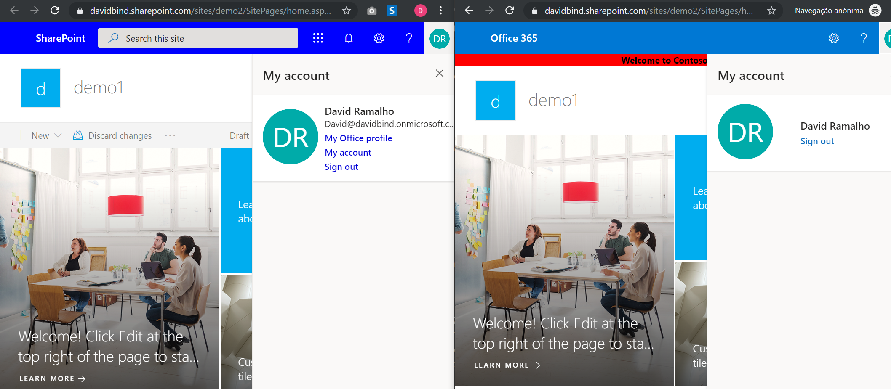
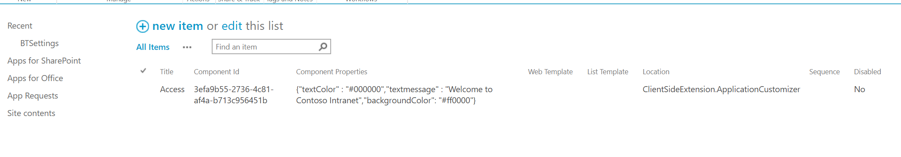

# Title of the sample
 
Guest Message

## Summary

SharePoint Application customizer that allow you to display a message to your External users.



## Used SharePoint Framework Version 


## Applies to

* [SharePoint Framework](https://dev.office.com/sharepoint)
* [PnPJS](https://pnp.github.io/pnp/)

## Prerequisites
 
* Office 365 subscription with SharePoint Online.

## Solution

Solution|Author(s)
--------|---------
guest-message-client-side-solution| David Ramalho ([sharepoint-tricks.com](http://sharepoint-tricks.com), [@davRamalho](https://twitter.com/davRamalho))

## Version history

Version|Date|Comments
-------|----|--------
1.0|September 22, 2019|Initial release

## Disclaimer
**THIS CODE IS PROVIDED *AS IS* WITHOUT WARRANTY OF ANY KIND, EITHER EXPRESS OR IMPLIED, INCLUDING ANY IMPLIED WARRANTIES OF FITNESS FOR A PARTICULAR PURPOSE, MERCHANTABILITY, OR NON-INFRINGEMENT.**

---

## Minimal Path to Awesome

- Clone this repository
- in the command line run:
  - `npm install`
  - `gulp serve`
- Open the debug URL with a Guest Account

## Features

This extension allow you to define the Background Color, Color of text and the Message to show to your external users. The example is below:

- textColor: #000000
- textmessage: Welcome to Contoso Intranet
- backgroundColor: "#ff0000

You can also use the Tenant Wide Extension to show this message on all the sites.

1. Go to your **Tenant App Catalog**
2. Open the **TenantWideExtensions** list
3. Click to Add
4. Add the following items:
    1. **Title**: Access
    2. **ClientCoponentID**: 3efa9b55-2736-4c81-af4a-b713c956451b
    3. **Component Properties**: {"textColor" : "#000000","textmessage" : "Welcome to Contoso Intranet","backgroundColor": "#ff0000"}
    3. **Location**: ClientSideExtension.ApplicationCustomizer	



## Debug URL for testing

Here's a debug URL for testing around this sample. **Updated based on your manifest id for easy testing of the sample**.

```
?debugManifestsFile=https%3A%2F%2Flocalhost%3A4321%2Ftemp%2Fmanifests.js&loadSPFX=true&customActions=%7B"3efa9b55-2736-4c81-af4a-b713c956451b"%3A%7B"location"%3A"ClientSideExtension.ApplicationCustomizer"%2C"properties"%3A%7B"textColor"%3A"%23000000"%2C"textmessage"%3A"Welcome+to+Contoso+Intranet"%2C"backgroundColor"%3A"%23ff0000"%7D%7D%7D
```