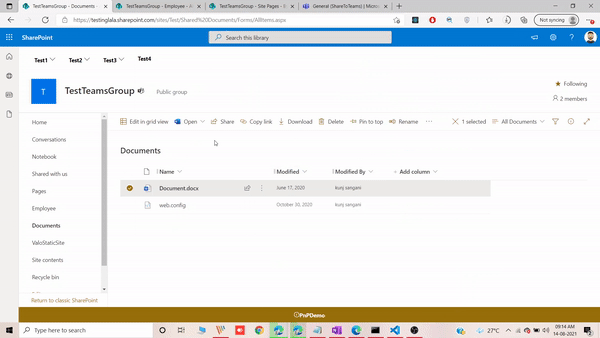
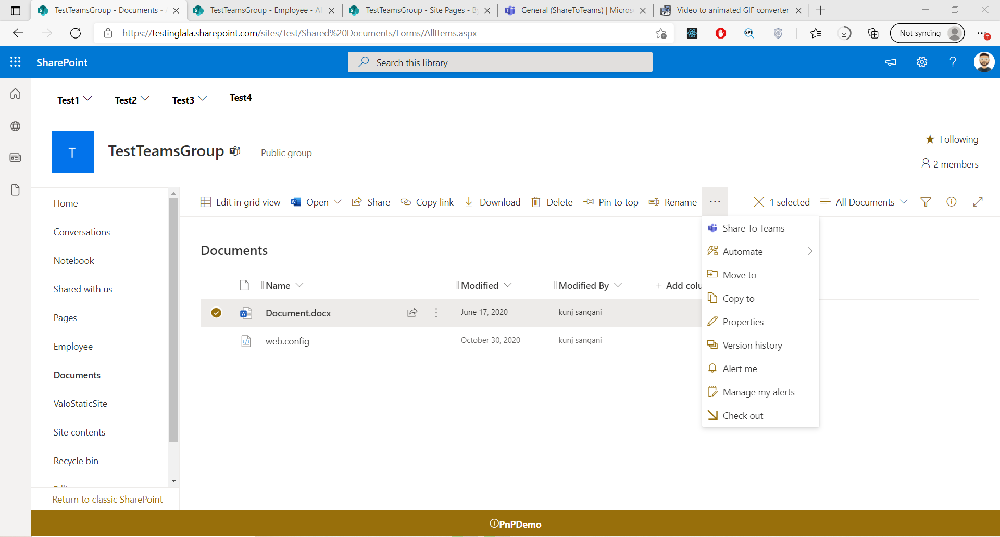
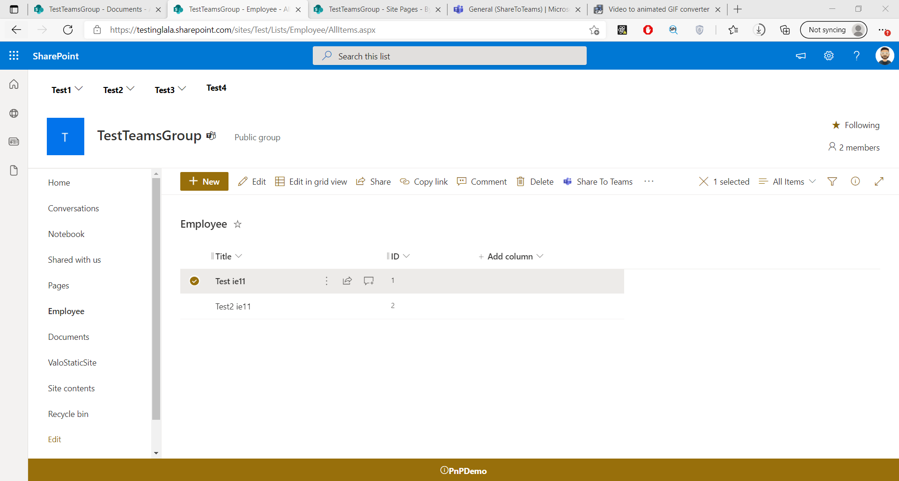
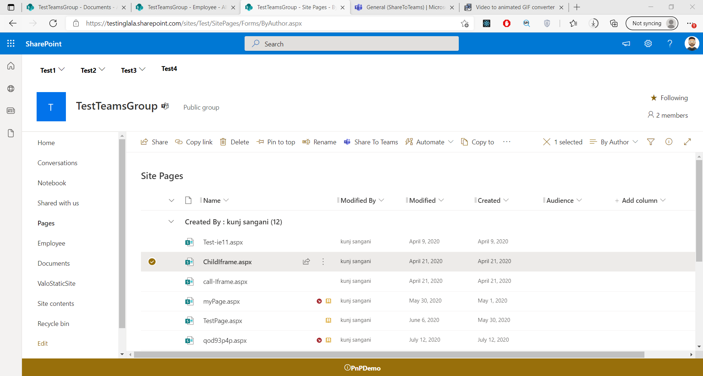
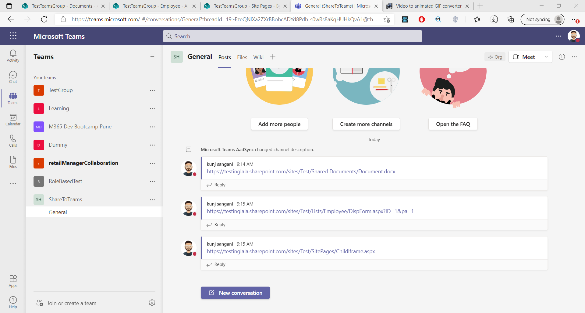

# Share to Teams - Command Set

## Summary

Share to teams helps us to share files along with folders in document library it also alows us to share pages in the site pages library and last but not the least it allows sharing list items to teams channels or group.

To achieve this we have taken help of the js file provided by microsoft for creating share to teams button for third-party websites. For more details check this [link](https://docs.microsoft.com/en-us/microsoftteams/platform/concepts/build-and-test/share-to-teams)







## Compatibility

 
 


-Incompatible-red.svg "SharePoint Server 2016 Feature Pack 2 requires SPFx 1.1")


## Applies to

- [SharePoint Framework](https://aka.ms/spfx)
- [Microsoft 365 tenant](https://docs.microsoft.com/en-us/sharepoint/dev/spfx/set-up-your-developer-tenant)

> Get your own free development tenant by subscribing to [Microsoft 365 developer program](http://aka.ms/o365devprogram)

## Prerequisites

> The tenant where the solution is deployed should have access to Microsoft Teams.

## Solution

Solution|Author(s)
--------|---------
Share To Teams | [Kunj Sangani](https://github.com/kunj-sangani) ([@sanganikunj](https://twitter.com/sanganikunj))

## Version history

Version|Date|Comments
-------|----|--------
1.0|August 14, 2021|Initial release

## Disclaimer

**THIS CODE IS PROVIDED *AS IS* WITHOUT WARRANTY OF ANY KIND, EITHER EXPRESS OR IMPLIED, INCLUDING ANY IMPLIED WARRANTIES OF FITNESS FOR A PARTICULAR PURPOSE, MERCHANTABILITY, OR NON-INFRINGEMENT.**

---

## Minimal Path to Awesome

- Clone this repository
- Ensure that you are at the solution folder
- in the command-line run:
  - **npm install**
  - **gulp serve**

## Features

This extension illustrates the following concepts:

- Sharing Files and Folders in document library to Teams
- Sharing List items to Teams
- Sharing site pages to Teams

This would help in collaborating as everyone in group/team can comment and provide some feedback directly into Teams

## Debug URL for testing
Here's a debug URL for testing around this sample. 

```
?debugManifestsFile=https://localhost:4321/temp/manifests.js&loadSPFX=true&customActions={"7b8edeba-e2b4-4992-a1f3-62184b16dcd6":{"location":"ClientSideExtension.ListViewCommandSet.CommandBar"}
```

## References

- [Getting started with SharePoint Framework](https://docs.microsoft.com/en-us/sharepoint/dev/spfx/set-up-your-developer-tenant)
- [Building for Microsoft teams](https://docs.microsoft.com/en-us/sharepoint/dev/spfx/build-for-teams-overview)
- [Use Microsoft Graph in your solution](https://docs.microsoft.com/en-us/sharepoint/dev/spfx/web-parts/get-started/using-microsoft-graph-apis)
- [Publish SharePoint Framework applications to the Marketplace](https://docs.microsoft.com/en-us/sharepoint/dev/spfx/publish-to-marketplace-overview)
- [Microsoft 365 Patterns and Practices](https://aka.ms/m365pnp) - Guidance, tooling, samples and open-source controls for your Microsoft 365 development
- [Share to Teams](https://docs.microsoft.com/en-us/microsoftteams/platform/concepts/build-and-test/share-to-teams)


## Disclaimer
**THIS CODE IS PROVIDED *AS IS* WITHOUT WARRANTY OF ANY KIND, EITHER EXPRESS OR IMPLIED, INCLUDING ANY IMPLIED WARRANTIES OF FITNESS FOR A PARTICULAR PURPOSE, MERCHANTABILITY, OR NON-INFRINGEMENT.**

## Help

We do not support samples, but we this community is always willing to help, and we want to improve these samples. We use GitHub to track issues, which makes it easy for  community members to volunteer their time and help resolve issues.

You can try looking at [issues related to this sample](https://github.com/pnp/sp-dev-fx-extensions/issues?q=label%3Ajs-share-to-teams) to see if anybody else is having the same issues.

You can also try looking at [discussions related to this sample](https://github.com/pnp/sp-dev-fx-extensions/discussions?discussions_q=label%3Ajs-share-to-teams) and see what the community is saying.

If you encounter any issues while using this sample, [create a new issue](https://github.com/pnp/sp-dev-fx-extensions/issues/new?assignees=&labels=Needs%3A+Triage+%3Amag%3A%2Ctype%3Abug-suspected&template=bug-report.yml&sample=JS-SHARE-TO-TEAMS&authors=@YOURGITHUBUSERNAME&title=JS-SHARE-TO-TEAMS%20-%20).

For questions regarding this sample, [create a new question](https://github.com/pnp/sp-dev-fx-extensions/issues/new?assignees=&labels=Needs%3A+Triage+%3Amag%3A%2Ctype%3Abug-suspected&template=question.yml&sample=JS-SHARE-TO-TEAMS&authors=@YOURGITHUBUSERNAME&title=JS-SHARE-TO-TEAMS%20-%20).

Finally, if you have an idea for improvement, [make a suggestion](https://github.com/pnp/sp-dev-fx-extensions/issues/new?assignees=&labels=Needs%3A+Triage+%3Amag%3A%2Ctype%3Abug-suspected&template=suggestion.yml&sample=JS-SHARE-TO-TEAMS&authors=@YOURGITHUBUSERNAME&title=JS-SHARE-TO-TEAMS%20-%20).


