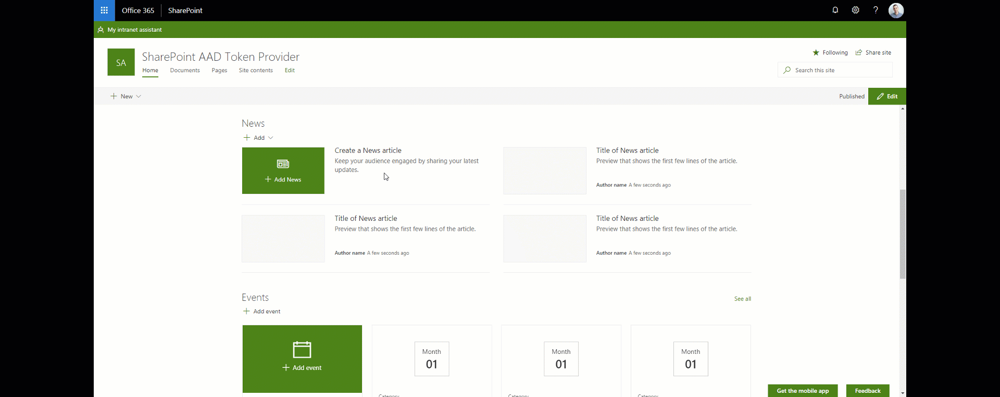
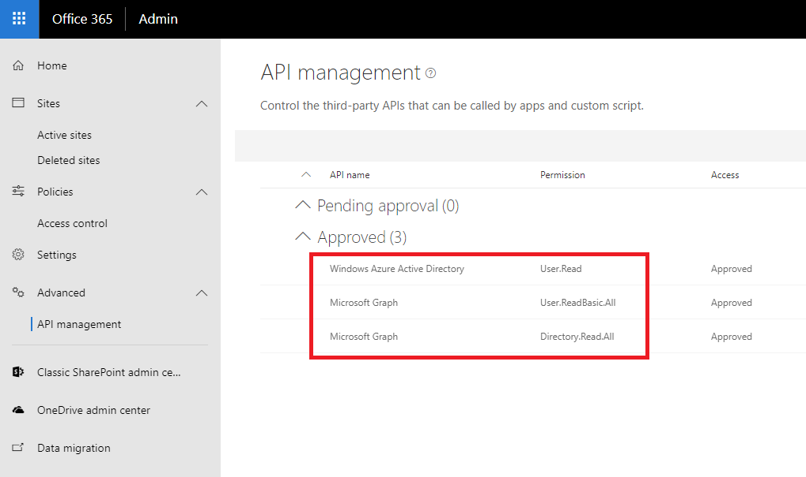
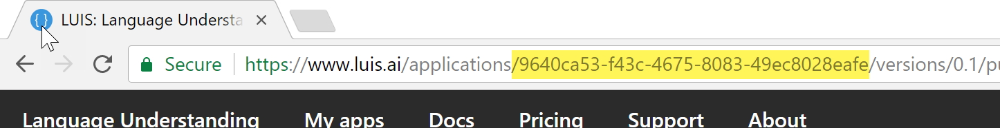

# SPFx AAD Token Provider Bot Extension #

## Summary ##

This sample demonstrates how to integrate a bot within a SharePoint Online portal supporting authentication to access Azure AD protected APIs like Microsoft graph resources. Behind the scenes, this sample uses the AADTokenProvider utility class provided with SPFx > 1.6.0 to seamlessly get an access token for the current user and send it to the bot. This way, the user is not prompted anymore for login to interact with the bot, improving overall experience.

### When to use this pattern? ###
This sample is suitable when you want to create a bot using the web chat channel for a SharePoint site **only**.
However, if you need to access protected APIs in your bot but also want mutliple channels (like, Microsoft Teams, Skype, etc.), you might use in combination the OAuth2 authorization grant flow implementation for Node.js instead. You can refer to this sample [https://github.com/SharePoint/sp-dev-fx-extensions/tree/master/samples/react-adal-bot](https://github.com/SharePoint/sp-dev-fx-extensions/tree/master/samples/react-adal-bot) to get started.

<p align="center">
  
</p>

The bot code is exactly the same as the [MSAL Bot sample](https://github.com/SharePoint/sp-dev-fx-extensions/tree/master/samples/react-msal-bot)

## Used SharePoint Framework Version 


## Applies to

* [SharePoint Framework](https:/dev.office.com/sharepoint)
* [Office 365 tenant](https://dev.office.com/sharepoint/docs/spfx/set-up-your-development-environment)

## Solution

Solution|Author(s)
--------|---------
react-aadtokenprovider-bot | Franck Cornu (aequos) - Twitter @FranckCornu

## Version history

Version|Date|Comments
-------|----|--------
1.0 | November 5th, 2018 | Initial release

## Disclaimer
**THIS CODE IS PROVIDED *AS IS* WITHOUT WARRANTY OF ANY KIND, EITHER EXPRESS OR IMPLIED, INCLUDING ANY IMPLIED WARRANTIES OF FITNESS FOR A PARTICULAR PURPOSE, MERCHANTABILITY, OR NON-INFRINGEMENT.**

---

## Minimal Path to Awesome

- Clone this repository
- Setup the environment as described below
- In the command line run:
  - `npm install`
  - `gulp bundle`
  - `gulp package-solution`
- Upload the generated package to the SharePoint app catalog
- Approve permissions in the modern SharePoint central admin portal
- Install the *PnP - AAD Token Provider Graph Bot* app in your site
- In the command line run:
  - `gulp serve --nobrowser`
- Play with the bot!

## Prerequisites ##
 
### 1- Setup the web API permissions ###

To access the Microsoft Graph API, you will need to register new API persmissions in the SPFx `package-solution.json` file:

```
"webApiPermissionRequests": [
  {
    "resource": "Windows Azure Active Directory",
    "scope": "User.Read"
  },
  {
    "resource": "Microsoft Graph",
    "scope": "User.ReadBasic.All"
  },
  {
    "resource": "Microsoft Graph",
    "scope": "Directory.Read.All"
  }
]
```

Those permissions need to be approved in the modern SharePoint central admin portal to get this sample work:

<p align="center">
  
</p>

### 2- Create the LUIS Model ###

- Go to the LUIS portal [https://www.luis.ai](https://www.luis.ai).
- Import a new application by reusing the **./bot/luis_sample_model.json** file. It will import intents and utterances automatically for this specific example. In the solution, intents are matched to specific graph queries. This is a very basic example so you can use your own intent/query combinations based on your requirements (use the [Microsoft Graph Explorer](https://developer.microsoft.com/en-us/graph/graph-explorer) to see samples):

  | LUIS Intent                |Graph Query
  | ---------------------------| -------------------------------------------------------------|
  | GetMyGroups                | https://graph.microsoft.com/v1.0/me/memberOf
  | GetMyManager               | https://graph.microsoft.com/v1.0/me/manager                        
  | <your_intent>              | <your_graph_query>

- Train and publish the application to the production slot. You can use the LUIS starter key to get started.

### 3- Create the bot in Azure ###
- In an Azure tenant (can be different from your Office 365 account), create a new *"Web App Bot"* (you can use a *"Functions Bot"* as well with few refactoring steps depending your requirements).
<p align="center">
  
</p>

- In the bot template, select a basic **Node.js** bot.
- In the bot *"Build"* setting, open the online code editor:
  - Replace the **app.js** code by the one of this sample contained in the **app.js** file.
  - Same thing for the **package.json** file.
<p align="center">
  
</p>

- Open the console and type the following command line:
  - `npm i`
<p align="center">
  
</p>

- In the application settings, add the following key/value pairs for the LUIS application:

  <p align="center">
    
  </p>

  - **LuisAppId**: you can get this value directly in the URL on your LUIS application

  <p align="center">
    
  </p>

  - **LuisAPIKey**: you can get this value in the publish settings.

  <p align="center">
    
  </p>  

- In the *"Channels"* options, add a new **"Direct Line"** channel and generate a new secret key.

  <p align="center">
    
  </p>  

### 4- Store your environement settings in the tenant property bag ###

The SharePoint extension does not store any settings directly in the code. They are fetched from the tenant property bag using the REST APIs. Once read, they are stored in the browser local storage to improve performances. 

- In the solution, modifiy the **Set-TenantProperties.ps1** PowerShell script to add your own values as follow: 

  | Setting                   | Value
  | --------------------------| -------------------------------------------------------------|
  | Bot Id                    | The bot application identifier. You can get this value in the *"Settings"* option from the bot Azure resource (the "Microsoft App ID" value).
  | Direct Line Secret        | The bot Direct Line channel secret. You can get this value in the *"Channels"* option from the bot Azure resource.

 
- Execute the script targeting your Office 365 tenant. Make sure the latest [PnP Cmdlets](https://github.com/SharePoint/PnP-PowerShell/releases) are installed on your machine.

## Debug your bot locally ##

### Debug the SPFx extension ###

To debug the SPFx code, you will need to package (`gulp bundle` and `gulp package-solution`) and deploy the application in your Office 365 environment first and then host your code locally (by running `gulp serve --nobrowser`). 

You could also debug using the SharePoint hosted workbench but, in this scenario, you would update the redirect URL of your Azure AD App pointing to the workbench.aspx page in your SharePoin site.

For convenience, you can also use the SPFx [debug configuration for Visual Studio code](https://docs.microsoft.com/en-us/sharepoint/dev/spfx/debug-in-vscode).

### Debug the bot logic ###

To debug the bot logic, you will need to use the **ngrok** third party tool to create a gateway pointing to your local machine. 
- Download ngrok ([executable](https://ngrok.com/download) or [npm cli](https://www.npmjs.com/package/ngrok))
- In a Node.js console, run `ngrok http 3978` and copy the generated URL (the *https* one)
- Start your Node.js server (i.e your bot). In Visual Studio Code, simply press F5.
- In the bot settings from your Azure portal, change the messaging endpoint by the generated ngrok URL:
  <p align="center">
    
  </p>  

- Send messages through the SPFx extension. Messages will now be redirected to your local machine.
- Don't forget to setup environment variables in your `launch.json` file in you work with Visual Studio Code (_LuisAppId_ & _LuisApiKey_)

**Important**: in this mode, your bot won't be able to send messages back to your SPFx extension so won't see them.

## Features
This Web Part illustrates the following concepts on top of the SharePoint Framework and Bot Framework:

- *SharePoint Framework concepts*
    - Store and read settings in the tenant property bag using REST
    - Integrate and configure the [Bot Framework Web Chat](https://github.com/Microsoft/BotFramework-WebChat) React control with the Direct Line channel.
        - Retrieve the bot conversation history for the current user
    - Use the PnP JavaScript storage utilities (i.e. local storage).
- *Bot Framework concepts*
    - Use the [backchannel](https://docs.microsoft.com/en-us/bot-framework/nodejs/bot-builder-nodejs-backchannel) to send data between a JavaScript application (i.e SPFx extension) and the bot.
    - Store and use private conversation data for the current using in the ["in memory"](https://docs.microsoft.com/en-us/bot-framework/nodejs/bot-builder-nodejs-state) bot storage


