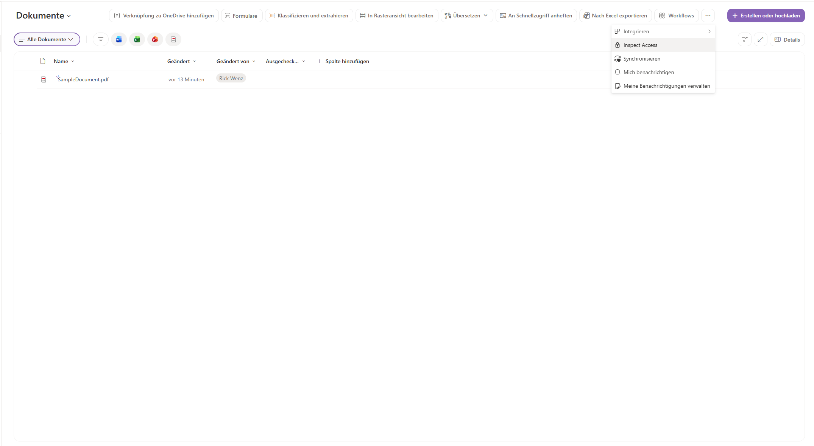
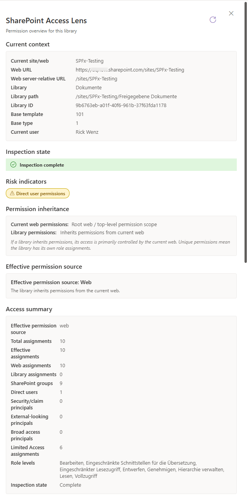
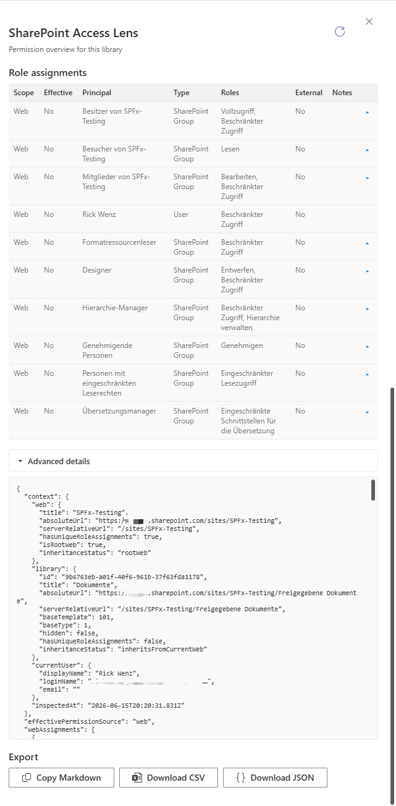

# Access Lens

## Summary

Access Lens is a read-only SharePoint Framework ListView Command Set for modern SharePoint Online document libraries.

It adds an **Inspect Access** command to the document library command bar. When selected, the extension opens a right-side panel that summarizes the permission situation of the current web and document library, including permission inheritance, effective permission source, role assignments, risk indicators, SharePoint group expansion, and export options.







## Compatibility

| Important                                                                                                                                                                                                     |
| :---------------------------------------------------------------------------------------------------------------------------------------------------------------------------------------------------------------------- |
| Every SPFx version is optimally compatible with specific versions of Node.js. In order to build and run this sample, make sure that the Node.js version on your workstation matches the version listed in this section. |
| Refer to https://aka.ms/spfx-matrix for more information on SPFx compatibility.                                                                                                                                         |

This sample is optimally compatible with the following environment configuration:


-Incompatible-red.svg)


## Applies to

* [SharePoint Framework](https://learn.microsoft.com/sharepoint/dev/spfx/sharepoint-framework-overview)
* [SharePoint Framework Extensions](https://learn.microsoft.com/sharepoint/dev/spfx/extensions/overview-extensions)
* [ListView Command Sets](https://learn.microsoft.com/sharepoint/dev/spfx/extensions/get-started/building-simple-cmdset-with-dialog-api)
* [Microsoft 365 tenant](https://learn.microsoft.com/sharepoint/dev/spfx/set-up-your-developer-tenant)
* SharePoint Online document libraries

> Get your own free development tenant by subscribing to the [Microsoft 365 Developer Program](https://aka.ms/m365devprogram).

## Contributors

* [Rick Wenz](https://github.com/rwenz02)

## Version history

| Version | Date          | Comments        |
| ------- | ------------- | --------------- |
| 1.0.0   | June 15, 2026 | Initial release |

## Prerequisites

* SharePoint Online tenant
* Modern SharePoint Online document library
* Node.js v22 compatible with SPFx 1.23.0
* Tenant app catalog or site collection app catalog for deployment
* Permissions to install SharePoint Framework solutions

No Microsoft Graph API permissions or admin consent are required.

This sample runs in the browser and reads SharePoint permission information by using the current SharePoint context and the permissions of the current user.

## Minimal Path to Awesome

* Clone this repository or [download this sample as a ZIP file](https://pnp.github.io/download-partial/?url=https://github.com/pnp/sp-dev-fx-extensions/tree/main/samples/react-access-lens)
* In the command line, move to the sample folder:

```bash
cd samples/react-access-lens
```

* Install dependencies:

```bash
npm install
```

* Update `config/serve.json` and replace the sample `pageUrl` with the URL of a modern SharePoint Online document library in your tenant, for example:

```json
"pageUrl": "https://contoso.sharepoint.com/sites/demo/Shared%20Documents/Forms/AllItems.aspx"
```

* Start the local debug server:

```bash
heft start --serve-config=accessLens
```

* Open the generated SharePoint debug URL in the browser.
* When prompted, allow loading debug manifests from `https://localhost:4321`.
* Open a modern document library and select **Inspect Access** from the command bar.

## Features

Access Lens provides a focused permission overview directly inside a SharePoint document library.

This extension illustrates the following concepts:

* Building a SharePoint Framework ListView Command Set
* Rendering a React panel from a command bar action
* Reading SharePoint web and list role assignments with PnPjs
* Inspecting permission inheritance on web and library scope
* Expanding visible SharePoint group members on demand
* Classifying principals such as users, SharePoint groups, security groups, claims, and broad access groups
* Showing review indicators for potentially relevant access patterns
* Exporting inspection results as Markdown, CSV, or JSON
* Protecting CSV export values against formula injection
* Handling partial inspections without claiming that no risk exists

The extension includes the following capabilities:

### Permission inheritance overview

Shows whether the current library inherits permissions from the web or has unique permissions.

### Effective permission source

Highlights whether the effective role assignments come from the web or directly from the library.

### Role assignment table

Lists principals such as users, SharePoint groups, security groups, security principals, claims, and their assigned role definitions.

### SharePoint group expansion

Allows SharePoint groups to be expanded to inspect visible group members. The visible members depend on the permissions of the current user.

### Risk indicators

Displays warning and information badges for patterns such as:

* Unique library permissions
* Direct user assignments
* External-looking principals
* Broad access groups
* A single visible SharePoint owner

### Partial inspection handling

Distinguishes between complete, partial, and failed inspections. The extension does not claim that no risk exists when required permission data could not be read.

### Export options

Allows results to be copied as Markdown or downloaded as CSV or JSON. CSV export includes formula injection protection.

### Debug mode

Appending `?debug=true` to the page URL shows additional raw inspection details in the **Advanced details** section and JSON export.

## What it does not do

This extension is designed as a visibility aid and does not act as a full security scanner.

It does not:

* Modify, create, or delete permissions
* Scan entire tenants
* Scan entire site collections
* Scan folders or individual files
* Use a backend service, database, or external storage
* Require Microsoft Graph permissions
* Send exported data over the network
* Replace a full access review, compliance process, or security assessment

## Supported contexts

The extension is intended for standard SharePoint Online document libraries.

The custom action should be registered for document libraries by using `RegistrationId="101"` and `RegistrationType="List"`.

At runtime, the extension validates that a list context is available before showing the command.

## Panel sections

| #  | Section                     | Description                                                                                               |
| -- | --------------------------- | --------------------------------------------------------------------------------------------------------- |
| 1  | Header                      | Shows the title, subtitle, **Refresh** button, and close button                                           |
| 2  | Current context             | Shows web title, web URL, library title, library path, library ID, template information, and current user |
| 3  | Inspection state            | Shows whether the inspection completed, partially completed, or failed                                    |
| 4  | Risk indicators             | Displays detected review indicators as badges                                                             |
| 5  | Permission inheritance      | Shows web and library permission inheritance status                                                       |
| 6  | Effective permission source | Shows whether web or library role assignments are effective                                               |
| 7  | Access summary              | Summarizes assignments by type, scope, and classification                                                 |
| 8  | Role assignments            | Lists principals, role definitions, scope, and notes                                                      |
| 9  | Advanced details            | Shows normalized JSON details and additional raw data in debug mode                                       |
| 10 | Export                      | Provides Markdown, CSV, and JSON export options                                                           |

## Debug URL for testing

Use the following debug query string to test the command set on a modern SharePoint Online document library.

```text
?loadSPFX=true&debugManifestsFile=https://localhost:4321/temp/manifests.js&customActions={"42b08ab6-ee15-419a-96da-c68be824118b":{"location":"ClientSideExtension.ListViewCommandSet.CommandBar","properties":{}}}
```

The full debug URL should point to a document library view, for example:

```text
https://contoso.sharepoint.com/sites/demo/Shared%20Documents/Forms/AllItems.aspx?loadSPFX=true&debugManifestsFile=https://localhost:4321/temp/manifests.js&customActions={"42b08ab6-ee15-419a-96da-c68be824118b":{"location":"ClientSideExtension.ListViewCommandSet.CommandBar","properties":{}}}
```

## Build and package

To build the project:

```bash
heft clean
heft build
```

To create a production package:

```bash
heft test --clean --production
heft package-solution --production
```

The generated `.sppkg` file is created in the `sharepoint/solution` folder.

> Do not include generated `.sppkg` files, `lib`, `dist`, `temp`, `release`, or `node_modules` in pull requests to the sample repository.

## Installation

1. Build the solution package.
2. Upload the generated `.sppkg` file to the tenant app catalog or a site collection app catalog.
3. Deploy the solution.
4. Navigate to the target SharePoint site.
5. Open **Site contents**.
6. Select **New** > **App**.
7. Add the **SharePoint Access Lens** app to the site.
8. Open a modern document library.
9. Select **Inspect Access** from the command bar.

## Usage

1. Open a modern SharePoint document library.
2. Select **Inspect Access** in the command bar.
3. Review the current context and inspection state.
4. Check the permission inheritance and effective permission source.
5. Review risk indicators and role assignments.
6. Expand SharePoint groups when member information is available.
7. Export the result as Markdown, CSV, or JSON if needed.
8. Select **Refresh** to run the inspection again.

## Debug mode

To enable debug mode, append the following query string parameter to the page URL:

```text
?debug=true
```

When debug mode is active, the **Advanced details** section and JSON export include additional raw inspection details.

If the page already contains other query string parameters, append debug mode with `&debug=true`.

## Privacy and data handling

Access Lens runs entirely in the browser as a SharePoint Framework extension.

* No backend service is used.
* No database is used.
* No telemetry endpoint is used by this sample.
* Exported data is generated locally in the browser.
* Permission data is read from the current SharePoint context by using the current user's permissions.

## Known limitations

* The extension only inspects the current web and current document library.
* It does not inspect folder-level or item-level unique permissions.
* It does not scan other sites, site collections, or the full tenant.
* SharePoint group member expansion depends on what the current user is allowed to read.
* External-looking principals are detected by heuristic indicators and should be reviewed manually.
* Risk indicators are review hints, not security guarantees.
* The extension is intended for modern SharePoint Online document libraries.

## References

* [SharePoint Framework overview](https://learn.microsoft.com/sharepoint/dev/spfx/sharepoint-framework-overview)
* [SharePoint Framework extensions overview](https://learn.microsoft.com/sharepoint/dev/spfx/extensions/overview-extensions)
* [Build your first ListView Command Set extension](https://learn.microsoft.com/sharepoint/dev/spfx/extensions/get-started/building-simple-cmdset-with-dialog-api)
* [Debug SharePoint Framework solutions on modern SharePoint pages](https://learn.microsoft.com/sharepoint/dev/spfx/debug-modern-pages)
* [PnPjs documentation](https://pnp.github.io/pnpjs/)
* [Microsoft 365 & Power Platform Community](https://aka.ms/m365pnp)

## Disclaimer

**THIS CODE IS PROVIDED *AS IS* WITHOUT WARRANTY OF ANY KIND, EITHER EXPRESS OR IMPLIED, INCLUDING ANY IMPLIED WARRANTIES OF FITNESS FOR A PARTICULAR PURPOSE, MERCHANTABILITY, OR NON-INFRINGEMENT.**

This sample is intended as a visibility and learning aid. It does not replace a full access review, compliance process, or security assessment.

## Help

We do not support samples, but this community is always willing to help, and we want to improve these samples. We use GitHub to track issues, which makes it easy for community members to volunteer their time and help resolve issues.

You can try looking at [issues related to this sample](https://github.com/pnp/sp-dev-fx-extensions/issues?q=label%3Areact-access-lens) to see if anybody else is having the same issues.

You can also try looking at [discussions related to this sample](https://github.com/pnp/sp-dev-fx-extensions/discussions?discussions_q=label%3Areact-access-lens) and see what the community is saying.

If you encounter any issues while using this sample, [create a new issue](https://github.com/pnp/sp-dev-fx-extensions/issues/new?assignees=&labels=Needs%3A+Triage+%3Amag%3A%2Ctype%3Abug-suspected&template=bug-report.yml&sample=react-access-lens&authors=@rwenz02&title=react-access-lens%20-%20).

For questions regarding this sample, [create a new question](https://github.com/pnp/sp-dev-fx-extensions/issues/new?assignees=&labels=Needs%3A+Triage+%3Amag%3A%2Ctype%3Aquestion&template=question.yml&sample=react-access-lens&authors=@rwenz02&title=react-access-lens%20-%20).

Finally, if you have an idea for improvement, [make a suggestion](https://github.com/pnp/sp-dev-fx-extensions/issues/new?assignees=&labels=Needs%3A+Triage+%3Amag%3A%2Ctype%3Aenhancement&template=suggestion.yml&sample=react-access-lens&authors=@rwenz02&title=react-access-lens%20-%20).

