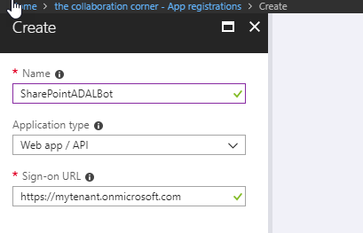
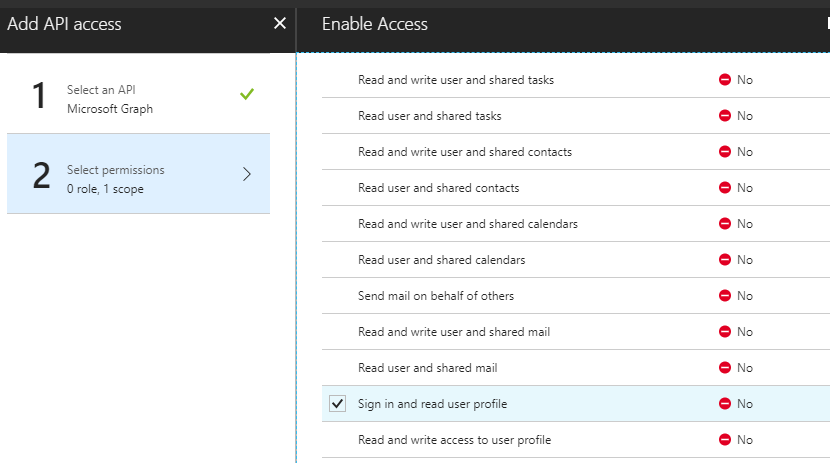
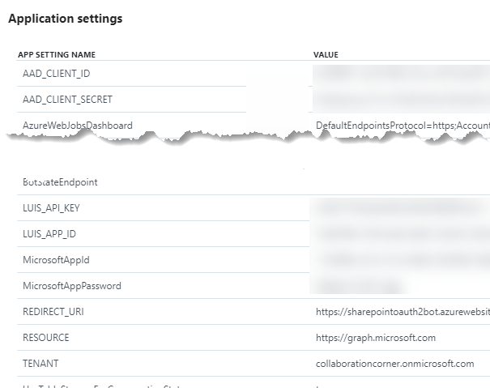
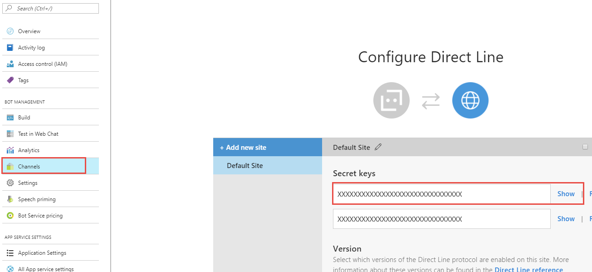
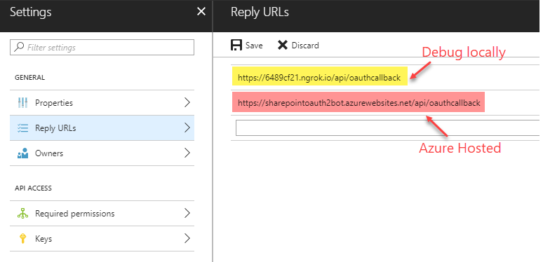
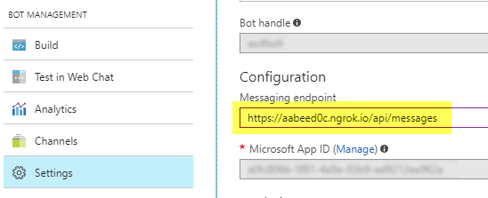
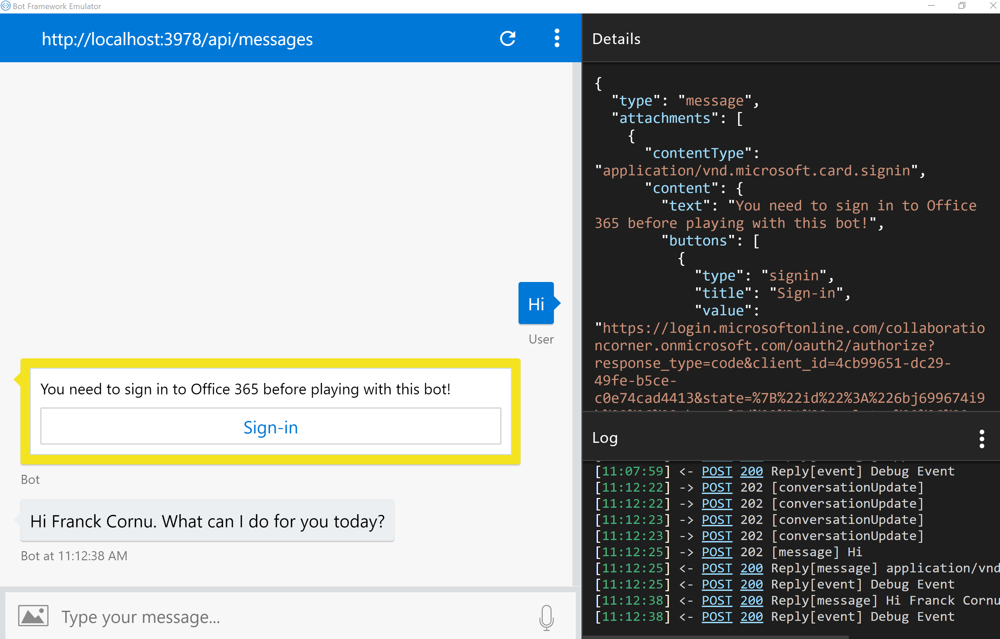

# SPFx ADAL Bot Extension #

## Summary ##

This sample demonstrates how to integrate a bot within a SharePoint Online portal supporting authentication to access Azure AD protected APIs like Microsoft graph resources. Behind the scenes, this sample implements the OAuth2 Authorization Code Grant Flow using the ADAL JavaScript library for Node.js. 

### When to use this pattern? ###
This sample is suitable when you want to create a bot using multiple channels, for instance to integrate a bot assistant in your SharePoint intranet portal and Microsoft Teams or Skype For Business as well. 

<p align="center">
  
</p>

## Used SharePoint Framework Version 


## Applies to

* [SharePoint Framework](https:/dev.office.com/sharepoint)
* [Office 365 tenant](https://dev.office.com/sharepoint/docs/spfx/set-up-your-development-environment)

## Solution

Solution|Author(s)
--------|---------
react-adal-bot | Franck Cornu (aequos) - Twitter @FranckCornu

## Version history

Version|Date|Comments
-------|----|--------
1.0 | August 1st, 2018 | Initial release

## Disclaimer
**THIS CODE IS PROVIDED *AS IS* WITHOUT WARRANTY OF ANY KIND, EITHER EXPRESS OR IMPLIED, INCLUDING ANY IMPLIED WARRANTIES OF FITNESS FOR A PARTICULAR PURPOSE, MERCHANTABILITY, OR NON-INFRINGEMENT.**

---

## Minimal Path to Awesome

- Clone this repository
- Setup the environment as described below
- In the command line run:
  - `npm install`
  - `gulp bundle`
  - `gulp package-solution`
- Upload the generated package to the SharePoint app catalog (tenant or site app catalog)
- Install the *PnP - ADAL Graph Bot* app in your site
- In the command line run:
  - `gulp serve --nobrowser`
- Play with the bot!

## Prerequisites ##
 
### 1- Setup the Azure AD application ###

To access the Microsoft Graph API, you will need to register a new app in the Azure Active Directory (v1) behind your Office 365 tenant using the Azure portal.
- Go to [https://portal.azure.com](https://portal.azure.com). Log in with an administrator account of the tenant you want to give access to and create a new application.
- Register a new application. Use your tenant URL as Sign-on URL (i.e. https://mytenant.onmicrosoft.com). This value will be updated afterwards.
- In "**Required Permissions**", add the "_Sign in and read user profile_" permission for Microsoft Graph API

<p align="center">
  
</p>

<p align="center">
  
</p>

### 2- Create the LUIS Model ###

- Go to the LUIS portal [https://www.luis.ai](https://www.luis.ai).
- Import a new application by reusing the **./bot/luis_sample_model.json** file. It will import intents and utterances automatically for this specific example. In the solution, intents are matched to specific graph queries. This is a very basic example so you can use your own intent/query combinations based on your requirements (use the [Microsoft Graph Explorer](https://developer.microsoft.com/en-us/graph/graph-explorer) to see samples):

  | LUIS Intent                |Graph Query
  | ---------------------------| -------------------------------------------------------------|
  | GetMyGroups                | https://graph.microsoft.com/v1.0/me/memberOf
  | GetMyManager               | https://graph.microsoft.com/v1.0/me/manager                        
  | <your_intent>              | <your_graph_query>

- **Train** and **publish** the application to the production slot. You can use the LUIS starter key to get started.

### 3- Create the bot in Azure ###
- In an Azure tenant (can be different from your Office 365 tenant), create a new *"Web App Bot"* (you can use a *"Functions Bot"* as well with few refactoring steps depending your requirements).
<p align="center">
  
</p>

- In the bot template, select a basic **Node.js** bot.
- In the bot *"Build"* setting, open the online code editor:
  - Replace the **app.js** code by the one of this sample contained in the **app.js** file form the solution.
  - Same thing for the **package.json** file.
<p align="center">
  
</p>

- Open the console and type the following command line:
  - `npm i`
<p align="center">
  
</p>

- In the application settings, add the following key/value pairs:

Variable | Comment | Sample value
-------- | ------- | ------------
REDIRECT_URI | This URL will be used for the Azure AD Application to send the authorization code (must be the same as the one configured in the AAD app) | "<your_bot_azurewebsite_url>/api/oauthcallback". In debug mode (locally), this URL have to be replaced with the one generated by **ngrok** (ex https://2dbc8d15.ngrok.io/api/oauthcallback)
TENANT | The tenant Id or domain name | "<your_company>.onmicrosoft.com"
RESOURCE | The resource endpoint we want to give access to (in this case, Microsoft Graph) | "https://graph.microsoft.com."
AAD_CLIENT_ID | The client Id retrieved from the Azure AD App | "3c837f67-1f08-4a89-8e46-e8ab75f2ec22"
AAD_CLIENT_SECRET | The client secret retrieved from the Azure AD App | "e+8eV0GHACfvb7kYrX2KkqC1RzNEYqK8tHW4piYlNZg="
LUIS_APP_ID | The LUIS application ID | "7bd9789f-c786-4e4b-8d83-32e29c1c84c2". You can get this value directly in the URL on your LUIS application
LUIS_API_KEY | The LUIS api key | "e26d277b6c8b4d02b549d5088045e3c3". You can get this value in the publish settings

  <p align="center">
    
  </p>

- In the *"Channels"* options, add a new **"Direct Line"** channel and generate a new secret key.

  <p align="center">
    
  </p>  

### 4- Store your environement settings in the tenant property bag ###

The SharePoint extension does not store any settings directly in the code. They are fetched from the tenant property bag using the REST APIs. Once read, they are stored in the browser local storage to improve performances. 

- In the solution, modifiy the **Set-TenantProperties.ps1** PowerShell script to add your own values as follow: 

  | Setting                   | Value
  | --------------------------| -------------------------------------------------------------|
  | Bot Id                    | The bot application identifier. You can get this value in the *"Settings"* option from the bot Azure resource (the "Microsoft App ID" value).
  | Direct Line Secret        | The bot Direct Line channel secret. You can get this value in the *"Channels"* option from the bot Azure resource.
 
- Execute the script targeting your Office 365 tenant. Make sure the latest [PnP Cmdlets](https://github.com/SharePoint/PnP-PowerShell/releases) are installed on your machine.

### 5- Update AAD application Reply URL with bot ##

To be able to send back the AAD tokens to the bot, you must add add the **<your_bot_azurewebsite_url>/api/oauthcallback** URL to the _Reply URLs_ in the AAD application:


  <p align="center">
    
  </p>  

## Debug your bot locally ##

### Debug the SPFx extension ###

To debug the SPFx code, you can:

- Package (`gulp bundle` and `gulp package-solution`) and deploy the application in your Office 365 environment first and then host your code locally (by running `gulp serve --nobrowser`). 
- Run the "graphBot" serve configuration (see _serve.json_ file) using your own URL (i.e. a test SharePoint modern site) `gulp serve --config=graphBot`. This will load the extension containing the bot control.

### Debug the bot logic (wth SPFx) ###

To debug the communication between SPFx and your bot, you will need to use the **ngrok** third party tool to create a gateway pointing to your local machine. 
- Download ngrok ([executable](https://ngrok.com/download) or [npm cli](https://www.npmjs.com/package/ngrok))
- In a Node.js console, run `ngrok http 3978` and copy the generated URL (the *https* one)
- Start your Node.js server (i.e your bot). In Visual Studio Code, simply press F5.
- In the bot settings from your Azure portal, change the messaging endpoint by the generated ngrok URL:
  <p align="center">
    
  </p>  

- Send messages through the SPFx extension. Messages will now be redirected to your local machine.

**Important**: in this mode, your bot won't be able to send messages back to your SPFx extension so won't see them.

### Debug the bot logic (standalone) ###

To debug the bot logic and AAD flow locally you can use the [Bot Framework Emulator](https://github.com/Microsoft/BotFramework-Emulator/releases).

- In a Node.js console, `run ngrok http 3978` and copy/paste the generated URL (the https one) in the REDIRECT_URI variable in the bot application settings.
- Configure your Node.js env settings in VSCode like this (reply URLS have to be the same between your local config and AAD app):

```
{
            "type": "node",
            "request": "launch",
            "name": "Launch Program",
            "program": "${workspaceFolder}\\app.js",
            "env": {
                "AAD_CLIENT_ID": "<aad_id>",
                "AAD_CLIENT_SECRET": "<aad_secret>",
                "TENANT": "<your_tenant>.onmicrosoft.com",
                "REDIRECT_URI": "https://2dbc8d15.ngrok.io/api/oauthcallback",
                "RESOURCE": "https://graph.microsoft.com",
                "LUIS_APP_ID": "<your_app_id>",
                "LUIS_API_KEY": "<your_api_key>"
            }
        }
```

- Start your Node.js server (i.e your bot). In Visual Studio Code, simply press F5.
- Open the emulator and connect to _http://localhost:3978/api/messages_
- You can now debug your bot and test the AAD flow.

  <p align="center">
    
  </p>  


## Features
This Web Part illustrates the following concepts on top of the SharePoint Framework and Bot Framework:

- *SharePoint Framework concepts*
    - Use the  [ADAL node.js library](https://github.com/AzureAD/azure-activedirectory-library-for-nodejs)  to access Azure AD protected APIs (ex: Microsoft Graph API) using the [OAuth2  authorization code grant flow](https://docs.microsoft.com/en-us/azure/active-directory/develop/active-directory-protocols-oauth-code).
    - Store and read settings in the tenant property bag using REST
    - Integrate and configure the [Bot Framework Web Chat](https://github.com/Microsoft/BotFramework-WebChat) React control with the Direct Line channel.
        - Retrieve the bot conversation history for the current user
    - Use the PnP JavaScript storage utilities (i.e. local storage).
- *Bot Framework concepts*
    - Handle the authorization flow to access protected resources
    - Store and use private conversation data for the current using in the ["in memory"](https://docs.microsoft.com/en-us/bot-framework/nodejs/bot-builder-nodejs-state) bot storage


