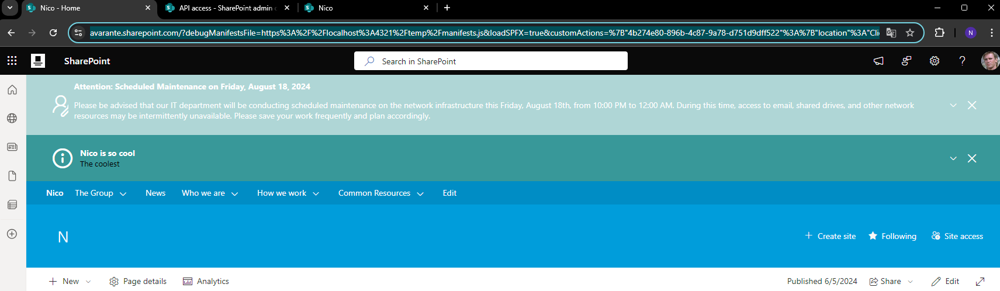

# Alert Banner SPFx Extension

## Summary

The **Alert Banner SPFx Extension** is a custom SharePoint Framework (SPFx) extension designed to display alert notifications prominently in the Banner of Modern SharePoint sites. These alerts are dynamically retrieved from a SharePoint list using the Microsoft Graph API, ensuring users receive important updates and information seamlessly integrated with Microsoft 365 services.



This project based and draws inspiration from the work of Thomas Daly on this alerts banner! 
Special thanks to Thomas Daly for the original concept!

[Thomas Daly alert banner](https://github.com/tom-daly/alerts-banner)

## Goal of this Project

Alert banners are frequently requested by organizations such as IT departments but are not readily available out-of-the-box. This extension aims to provide a flexible and reusable alert system that any organization can deploy with ease.

Additionally, this project serves as an opportunity to refresh and enhance coding skills within the SPFx ecosystem.

## Used SharePoint Framework Version


## Applies to

- [SharePoint Framework](https://aka.ms/spfx)
- [Microsoft 365 tenant](https://docs.microsoft.com/en-us/sharepoint/dev/spfx/set-up-your-developer-tenant)

> Get your own free development tenant by subscribing to the [Microsoft 365 developer program](http://aka.ms/o365devprogram).

## Prerequisites

- Node.js (v18.x or later)
- React 17
- SPFx (v1.19.x or later)
- A SharePoint Online site collection
- Appropriate permissions to access and configure the tenant App Catalog

## Solution

| Solution     | Author(s)                                         |
| ------------ | ------------------------------------------------- |
| alert-banner | [Nicolas Kheirallah](https://github.com/nicolasKheirallah) |

## Version History

| Version | Date            | Comments                                        |
| ------- | --------------- | ----------------------------------------------- |
| 1.2     | October 11, 2024| Added dynamic alerttypes, added support for homesite, hubsite and local site |
| 1.1     | August 17, 2024 | Added caching and session management for alerts |
| 1.0     | July 15, 2024   | Initial release                                 |

## Disclaimer

**THIS CODE IS PROVIDED _AS IS_ WITHOUT WARRANTY OF ANY KIND, EITHER EXPRESS OR IMPLIED, INCLUDING ANY IMPLIED WARRANTIES OF FITNESS FOR A PARTICULAR PURPOSE, MERCHANTABILITY, OR NON-INFRINGEMENT.**

---

## Minimal Path to Awesome

- Clone this repository.
- Navigate to the solution folder.
- In the command line, run:
  - `npm install`
  - `./buildProject.cmd`
  - `Deploy to app catalog`

> Additional steps may be required depending on your environment configuration.

## Features

This SPFx extension offers the following capabilities:

- **Fetch Alerts**: Retrieves alerts from a designated SharePoint list using the Microsoft Graph API.
- **Display Alerts**: Show alerts prominently in the banner of Modern SharePoint pages.
- **Dynamic Alert Type Configuration**: Configure alert types dynamically using a JSON property, allowing easy customization and scalability.
- **User Interaction Handling**: Allows users to dismiss alerts, with the option to prevent dismissed alerts from reappearing.
- **Performance Optimization**: Utilizes local storage for caching alerts, improving performance.

## TODO

- ~~**Multi-Site Support**: Extend support for Root, Local, and Hub sites. ~~(Done)
- **Enhanced Design**: Improve design aesthetics and CSS customization options.
- **Advanced Sorting**: Implement sorting of alerts based on priority and date.

## Managing Alerts

- **Global Alerts**: Deployed across all sites, fetching alerts from the root site where the extension is installed.
- **Local Alerts**: After the extension is added to a site collection, a new list titled "Alerts" is automatically created in the Site Contents. To create a new alert, simply add a new item to this list.

### Alert List Configuration:

- **Title**: The main heading of the alert.
- **Description**: Detailed message content.
- **AlertType**: The type of alert, such as Info, Warning, Maintenance, or Interruption.
- **Link**: Optional URL for additional information or related content.

### Dynamic Alert Type Configuration:

Alert types can now be customized dynamically using a JSON configuration property. This allows administrators to add, modify, or remove alert types without altering the codebase. The JSON structure defines the appearance and behavior of each alert type, including icons, colors, and additional styles.

**Example JSON Structure:**

```json
[
    {
       "name":"Info",
       "iconName":"Info12",
       "backgroundColor":"#389899",
       "textColor":"#ffffff",
       "additionalStyles":""
    },
    {
       "name":"Warning",
       "iconName":"ShieldAlert",
       "backgroundColor":"#f1c40f",
       "textColor":"#ffffff",
       "additionalStyles":""
    },
    {
       "name":"Maintenance",
       "iconName":"CRMServices",
       "backgroundColor":"#afd6d6",
       "textColor":"#ffffff",
       "additionalStyles":""
    },
    {
       "name":"Interruption",
       "iconName":"IncidentTriangle",
       "backgroundColor":"#c54644",
       "textColor":"#ffffff",
       "additionalStyles":""
    }
 ]
```

## References

- [Getting started with SharePoint Framework](https://docs.microsoft.com/en-us/sharepoint/dev/spfx/set-up-your-developer-tenant)
- [Building for Microsoft Teams](https://docs.microsoft.com/en-us/sharepoint/dev/spfx/build-for-teams-overview)
- [Use Microsoft Graph in your solution](https://docs.microsoft.com/en-us/sharepoint/dev/spfx/web-parts/get-started/using-microsoft-graph-apis)
- [Publish SharePoint Framework applications to the Marketplace](https://docs.microsoft.com/en-us/sharepoint/dev/spfx/publish-to-marketplace-overview)
- [Microsoft 365 Patterns and Practices](https://aka.ms/m365pnp) - Guidance, tooling, samples, and open-source controls for your Microsoft 365 development.

## Concepts Demonstrated

This extension showcases:

- **Integration of the Microsoft Graph API** within SPFx extensions for efficient data retrieval.
- **Dynamic Configuration Management**: Utilizing JSON properties to configure alert types, enhancing flexibility and maintainability.
- **Customizing the banner Section** of Modern SharePoint pages to provide a consistent and visible alerting mechanism.
- **Efficient State Management and Caching** using local and session storage to optimize performance and reduce redundant data fetching.
- **Responsive Design and User Interaction Handling** to ensure alerts are accessible and user-friendly across various devices and screen sizes.
