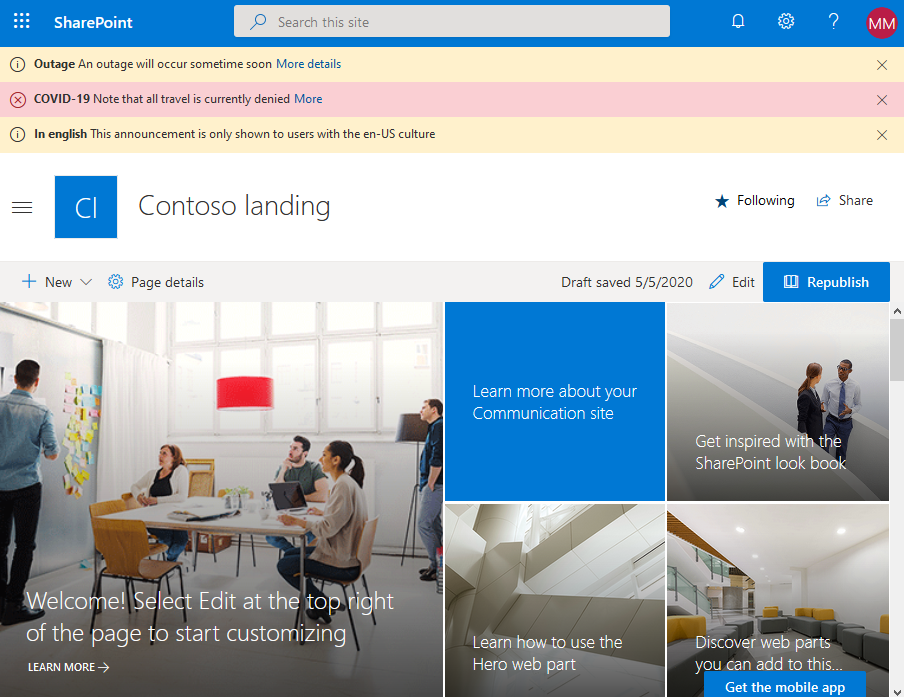

# Announcements SharePoint Framework Application Customizer

## Summary

SharePoint Framework application customizer displaying an information banner using office-fabric-ui MessageBar.

Inspired by react-app-announcements by Waldek Mastykarz (MVP, [Rencore](https://rencore.com), @waldekm),
js-application-alert-message Sudharsan K.(@sudharsank, Know More) and
the sp-starter-kit alertNotification component.



## Applies to

- [SharePoint Framework](https://dev.office.com/sharepoint)
- [Office 365 tenant](https://dev.office.com/sharepoint/docs/spfx/set-up-your-development-environment)

## Version history

| Version | Date                | Comments                                           |
| ------- | ------------------- | -------------------------------------------------- |
| 2.0     | May 20th, 2020      | Initial release                                    |
| 2.1     | June 18th, 2020     | Handle empty start and end dates for announcements |
| 2.2     | March 12th, 2024    | Update SPFx to 1.18 and pnpjs to 3.23              |
| 2.3     | October 6th, 2024   | Update SPFx to 1.20.0                              |
| 2.4     | December 10th, 2024 | Allow ability to hide dismiss button               |

## Contributors

- [Mike Myers](https://github.com/thespooler)
- [Sandeep P S](https://github.com/Sandeep-FED)

## Compatibility

| :warning: Important                                                                                                                                                                                                                                                                                   |
| :---------------------------------------------------------------------------------------------------------------------------------------------------------------------------------------------------------------------------------------------------------------------------------------------------- |
| Every SPFx version is optimally compatible with specific versions of Node.js. In order to be able to build this sample, you need to ensure that the version of Node on your workstation matches one of the versions listed in this section. This sample will not work on a different version of Node. |
| Refer to <https://aka.ms/spfx-matrix> for more information on SPFx compatibility.                                                                                                                                                                                                                     |

This sample is optimally compatible with the following environment configuration:


-Incompatible-red.svg> "SharePoint Server 2016 Feature Pack 2 requires SPFx 1.1")


## Minimal Path to Awesome

- Clone this repository
- Create the announcements list in SharePoint
- `npm install`
- `gulp serve`
- Open a browser on a SharePoint site having the appropriate announcements list and append this query string to the URL (remember to change the `siteUrl` and `listName`!)

```
?loadSPFX=true&debugManifestsFile=https://localhost:4321/temp/manifests.js&customActions={"dd7ec4fd-97aa-44c5-b6ad-87535862e0bf":{"location":"ClientSideExtension.ApplicationCustomizer","properties":{"listName":"Site Announcements","siteUrl": "/sites/Contoso"}}}
```

### Announcements list columns

The Announcements list must have the following columns. Also note that a PnP Provisioning template is provided in `sharepoint/assets/pnptemplate.xml` that can (and should!) be used to deploy the list.

| Column        | Type     | Values                         |
| ------------- | -------- | ------------------------------ |
| Locale        | Choice   | `en-US`, `fr-FR`, `es-ES`, ... |
| Announcement  | Note     |
| Link          | URL      |
| Urgent        | Boolean  |
| StartDateTime | DateTime |
| EndDateTime   | DateTime |
| IsHideClose   | Boolean  |

### Build and deploy

- `npm i`
- `gulp clean`
- `gulp bundle --ship`
- `gulp build --ship`
- `gulp package-solution --ship`
- Deploy the app package (`sharepoint/solution/react-application-announcements.spkg`) to your tenant AppCatalog
- Deploy a list with the appropriate fields
- Add the extension custom action with the appropriate settings

### Using PnPPowerShell

To deploy the announcements list and add the custom action to your desired site, the easiest solution is using PnPPowerShell.

1. Install PnPPowerShell `Install-Module SharePointPnPPowerShellOnline`
1. Connect to your site `Connect-PnPOnline https://MyTenant.sharepoint.com/sites/MySite`
1. Deploy the PnP Provisioning template `Invoke-PnPSiteTemplate sharepoint\assets\pnptemplate.xml -Handlers Fields,ContentTypes,Lists`
1. Add the custom action (remember to replace Contoso in the ClientSideComponentProperties by your site name) `Add-PnPCustomAction -Name "Announcements" -Title "Announcements" -Location "ClientSideExtension.ApplicationCustomizer" -ClientSideComponentId "dd7ec4fd-97aa-44c5-b6ad-87535862e0bf" -ClientSideComponentProperties '{"listName":"Site Announcements", "siteUrl":"/sites/Contoso"}'`

Also, note that the template file also includes an example on how to deploy an extension on a site. This requires the app to be deployed to the app catalog

## Features

This extension illustrates the following concepts:

- SPFX Extensions and Application Customizers
- React (with Hooks)
- Office Fabric UI React
- PnPJS
- PnP Provisioning templates
- Custom actions
- PnPPowerShell

## Disclaimer

**THIS CODE IS PROVIDED _AS IS_ WITHOUT WARRANTY OF ANY KIND, EITHER EXPRESS OR IMPLIED, INCLUDING ANY IMPLIED WARRANTIES OF FITNESS FOR A PARTICULAR PURPOSE, MERCHANTABILITY, OR NON-INFRINGEMENT.**

## Help

We do not support samples, but we this community is always willing to help, and we want to improve these samples. We use GitHub to track issues, which makes it easy for community members to volunteer their time and help resolve issues.

You can try looking at [issues related to this sample](https://github.com/pnp/sp-dev-fx-extensions/issues?q=label%3Areact-application-announcements) to see if anybody else is having the same issues.

You can also try looking at [discussions related to this sample](https://github.com/pnp/sp-dev-fx-extensions/discussions?discussions_q=label%3Areact-application-announcements) and see what the community is saying.

If you encounter any issues while using this sample, [create a new issue](https://github.com/pnp/sp-dev-fx-extensions/issues/new?assignees=&labels=Needs%3A+Triage+%3Amag%3A%2Ctype%3Abug-suspected&template=bug-report.yml&sample=react-application-announcements&authors=@thespooler&title=react-application-announcements%20-%20).

For questions regarding this sample, [create a new question](https://github.com/pnp/sp-dev-fx-extensions/issues/new?assignees=&labels=Needs%3A+Triage+%3Amag%3A%2Ctype%3Abug-suspected&template=question.yml&sample=react-application-announcements&authors=@thespooler&title=react-application-announcements%20-%20).

Finally, if you have an idea for improvement, [make a suggestion](https://github.com/pnp/sp-dev-fx-extensions/issues/new?assignees=&labels=Needs%3A+Triage+%3Amag%3A%2Ctype%3Abug-suspected&template=suggestion.yml&sample=react-application-announcements&authors=@thespooler&title=react-application-announcements%20-%20).


