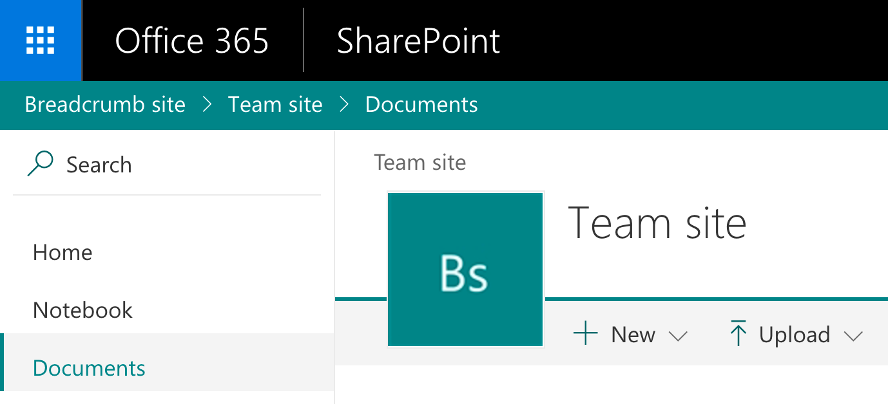

# Breadcrumb Application Customizer

## Summary

This sample shows how to create a breadcrumb element and append it to your site via the SharePoint Framework Application Customizer extension.



## Used SharePoint Framework Version


## Applies to

* [SharePoint Framework](http://dev.office.com/sharepoint/docs/spfx/sharepoint-framework-overview)
* [Office 365 developer tenant](http://dev.office.com/sharepoint/docs/spfx/set-up-your-developer-tenant)

## Solution

| Solution                            | Author(s)                                                                                         |
| ----------------------------------- | ------------------------------------------------------------------------------------------------- |
| React-application-breadcrumb        | Elio Struyf (MVP, U2U,[@eliostruyf](https://twitter.com/eliostruyf))                                 |
| React-application-breadcrumb        | Swaminathan Sriram ([@SwaminathanSri3](https://twitter.com/SwaminathanSri3)) -- Upgrade to SPFx 1.11 |
| react-application-breadcrumb@v2.1.0 | Thomas Daly (MVP, [@\_tomdaly\_](https://twitter.com/_tomdaly_))                                    |

## Version history

| Version | Date             | Comments                                                    |
| ------- | ---------------- | ----------------------------------------------------------- |
| 2.1     | October 10, 2024 | Upgrade SPFx from v1.11 to v1.20.0, update to use Fluent UI |
| 2.0     | October 3, 2020  | Updated to SPFx v1.11                                       |
| 1.1     | August 31, 2017  | Updates for v1.2.0                                          |
| 1.0     | August 9, 2017   | Initial release                                             |

## Disclaimer

**THIS CODE IS PROVIDED *AS IS* WITHOUT WARRANTY OF ANY KIND, EITHER EXPRESS OR IMPLIED, INCLUDING ANY IMPLIED WARRANTIES OF FITNESS FOR A PARTICULAR PURPOSE, MERCHANTABILITY, OR NON-INFRINGEMENT.**

---

## Minimal Path to Awesome

- Clone this repository
- Move to folder where this readme exists
- In the command window run:
  - `npm install`
  - `gulp serve --nobrowser`
- Open your SharePoint developer site and append the provided query string parameters from the command output

> If you want, you can also test bundle and package it. The necessary feature configuration has already been done.

## Debug URL for testing

Here's a debug URL for testing around this sample.

```
?loadSPFX=true&debugManifestsFile=https://localhost:4321/temp/manifests.js&customActions={"57fa430d-8154-4b00-b285-679314f4f390":{"location":"ClientSideExtension.ApplicationCustomizer"}}
```

## Features

This project contains SharePoint Framework extensions that illustrates next features:

* Calling the SharePoint REST APIs
* Using React components in SharePoint Framework application customizer extensions
* Using Fluent UI React library to build the site breadcrumb component


