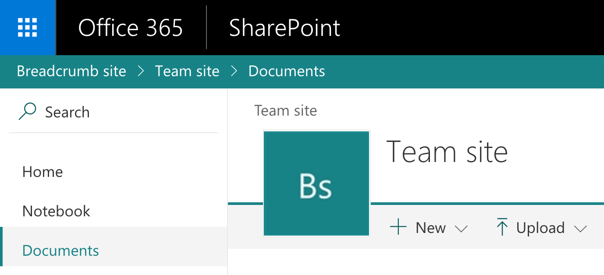

# Breadcrumb application customizer

## Summary
This sample shows how to create a breadcrumb element and append it to your site via the SharePoint Framework Application Customizer extension.



## Used SharePoint Framework Version 


## Applies to

* [SharePoint Framework](http://dev.office.com/sharepoint/docs/spfx/sharepoint-framework-overview)
* [Office 365 developer tenant](http://dev.office.com/sharepoint/docs/spfx/set-up-your-developer-tenant)

## Solution

Solution|Author(s)
--------|---------
React-application-breadcrumb | Elio Struyf (MVP, U2U, [@eliostruyf](https://twitter.com/eliostruyf))

## Version history

Version|Date|Comments
-------|----|--------
1.1|August 31, 2017|Updates for v1.2.0
1.0|August 9, 2017|Initial release

## Disclaimer
**THIS CODE IS PROVIDED *AS IS* WITHOUT WARRANTY OF ANY KIND, EITHER EXPRESS OR IMPLIED, INCLUDING ANY IMPLIED WARRANTIES OF FITNESS FOR A PARTICULAR PURPOSE, MERCHANTABILITY, OR NON-INFRINGEMENT.**

---

## Minimal Path to Awesome

- Clone this repository
- Move to folder where this readme exists
- In the command window run:
  - `npm install`
  - `gulp serve-info --nobrowser` 
    - This is a custom build task. You can read more about it here: [Show SharePoint Framework Extensions debug information](https://github.com/SharePoint/sp-dev-build-extensions/tree/master/gulp-tasks/serve-info)
- Open your SharePoint developer site and append the provided query string parameters from the command output

> If you want, you can also test bundle and package it. The necessary feature configuration has already been done.

## Debug URL for testing
Here's a debug URL for testing around this sample. 

```
?loadSPFX=true&debugManifestsFile=https://localhost:4321/temp/manifests.js&customActions={"57fa430d-8154-4b00-b285-679314f4f390":{"location":"ClientSideExtension.ApplicationCustomizer"}}
```

## Features
This project contains SharePoint Framework extensions that illustrates next features:
* Calling the SharePoint Rest APIs
* Using React components in SharePoint Framework application customizer extensions
* Using an Office UI Fabric component to built the site breadcrumb component


