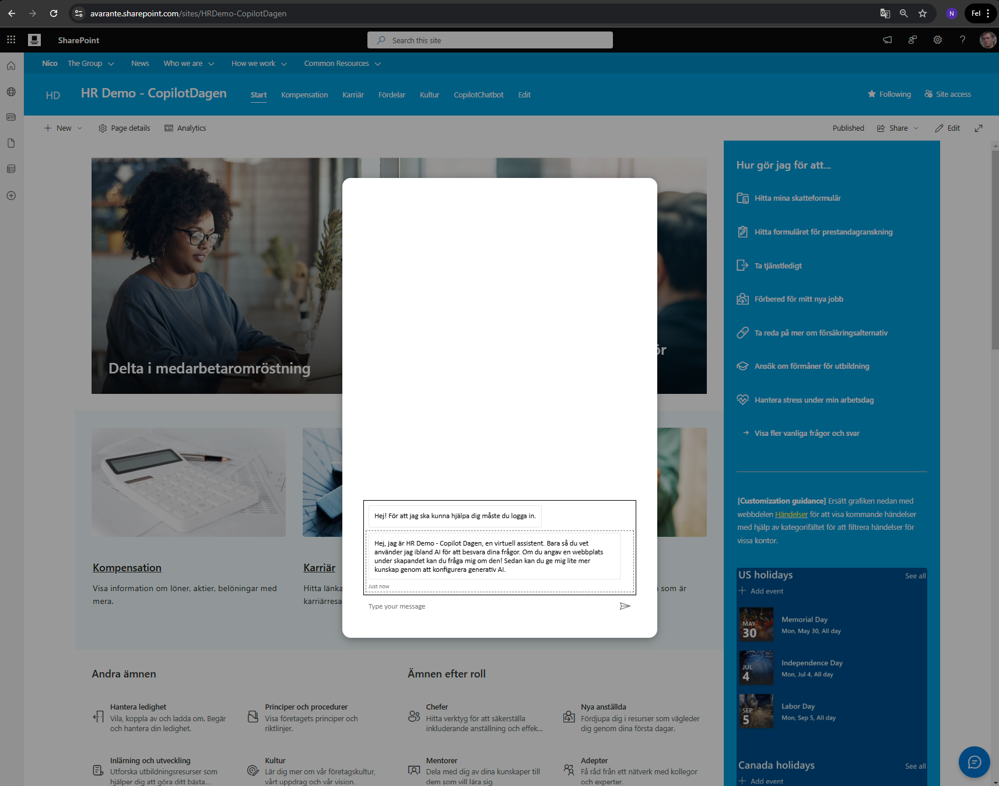

# Chatbot Integration for SharePoint Online

## Summary

This solution integrates a chatbot within SharePoint Online using a Tenant App Catalog and Azure AD App Registration. It provides a seamless way to enhance user engagement on SharePoint sites by embedding a customizable chatbot interface. You have a per site agent by creating it in a SharePoint list or a global one by adding json to TWE

This is based on SharePointSSO




### Key Features

- Tenant-wide chatbot integration for SharePoint Online.
- Configurable settings via SharePoint lists or JSON fallback.
- Secure authentication using Azure AD and MSAL.
- Easy deployment and management.

### Screenshots

#### API Permissions Setup


#### Adding APIs in Azure AD


#### Chatbot Interface


#### Application Client ID in Azure


#### Custom Scopes for API


#### Scope Permissions Setup


#### Token Exchange URL Configuration


## Technologies Used

- **SharePoint Framework (SPFx)**
- **React**
- **Azure AD for Authentication**
- **Microsoft Graph API**
- **SCSS for Styling**


## Compatibility

| :warning: Important          |
|:---------------------------|
| Every SPFx version is optimally compatible with specific versions of Node.js. In order to be able to build this sample, you need to ensure that the version of Node on your workstation matches one of the versions listed in this section. This sample will not work on a different version of Node.|
|Refer to <https://aka.ms/spfx-matrix> for more information on SPFx compatibility.   |

This sample is optimally compatible with the following environment configuration:


-Incompatible-red.svg "SharePoint Server 2016 Feature Pack 2 requires SPFx 1.1")


## Prerequisites

Before deploying the chatbot solution, ensure you have the following:

1. **SharePoint Environment**:

   - A Tenant App Catalog site.

2. **Permissions**:

   - Administrative permissions to manage the App Catalog and create lists.

3. **Azure AD App Registration**:

   - Configured with necessary API permissions for MSAL authentication.

4. **Development Tools**:

   - Node.js, NPM, Gulp, and Visual Studio Code installed.

5. **Access to PVA Chatbot**:

   - Endpoint URL for the chatbot to be embedded.

---

## Deployment Steps

### 1. Prepare the SPFx Solution

1. Clone this repository and navigate to the solution folder.
2. Install dependencies:
   ```bash
   npm install
   ```
3. Bundle the solution:
   ```bash
   gulp bundle --ship
   ```
4. Package the solution:
   ```bash
   gulp package-solution --ship
   ```

### 2. Deploy to the Tenant App Catalog

1. Navigate to your Tenant App Catalog.
2. Upload the `.sppkg` file from the `sharepoint/solution` folder.
3. Deploy the package and enable tenant-wide deployment.

### 3. Configure Azure AD Permissions

1. Open the Azure Portal and locate your App Registration.
2. Grant the following API permissions:
   - `User.Read`
   - Any additional scopes required by your backend.
3. Grant admin consent for the permissions.

### 4. Set Up the Configuration List

1. Create a SharePoint list named `TenantWideExtensionsConfig` with the following columns:

   - **Title** (Default): Use for identification or leave it empty.
   - **BotURL**: Single line of text (Chatbot endpoint URL).
   - **BotName**: Single line of text (Chatbot display name).
   - **ButtonLabel**: Single line of text (Chat toggle button label).
   - **BotAvatarImage**: Hyperlink or Picture (Avatar image URL).
   - **BotAvatarInitials**: Single line of text (Fallback initials for avatar).
   - **Greet**: Yes/No (Should the bot greet users?).
   - **CustomScope**: Single line of text (MSAL authentication scope).
   - **ClientID**: Single line of text (Azure AD App Registration Client ID).
   - **Authority**: Single line of text (Azure AD Authority URL).

2. Add a single item with the required values.

   > **Note:** Ensure that only **one item** exists in this list, as the Application Customizer fetches the **first item** for configuration.

### 5. Configure JSON Fallback Configuration

If the configuration list is not available, update the fallback JSON file with the following fields:

```json
{
  "BotURL": "<PVA chatbot URL>",
  "BotName": "<Chatbot Display Name>",
  "ButtonLabel": "<Chat Toggle Button Label>",
  "BotAvatarImage": "<URL to Avatar Image>",
  "BotAvatarInitials": "<Avatar Initials>",
  "Greet": true,
  "CustomScope": "<Custom Scope for MSAL>",
  "ClientID": "<Azure AD Client ID>",
  "Authority": "<Azure AD Authority URL>"
}
```

   > **Note:** Ensure the structure matches that of the SharePoint list.

### 6. Verify Deployment

1. Navigate to a SharePoint site where the extension is deployed.
2. Confirm the chatbot toggle button appears.
3. Click the button to test the chatbot functionality.


## Troubleshooting

### Common Issues

1. **Chatbot not appearing**:
   - Verify the configuration list setup and JSON fallback.

2. **Authentication Errors**:
   - Check Azure AD App Registration permissions.

3. **UI Issues**:
   - Confirm SCSS styles are correctly compiled.

### Debugging Tips

- Use browser developer tools to inspect network requests.
- Review Azure Portal logs for authentication errors.
- Verify SPFx configuration in `elements.xml`.

## Contributors

- [Nicolas Kheirallah](https://github.com/NicolasKheirallah)


## Version History

| Version | Date       | Comments        |
|---------|------------|-----------------|
| 1.0     | Jan 8, 2025 | Initial Release |

## Disclaimer

**THIS CODE IS PROVIDED *AS IS* WITHOUT WARRANTY OF ANY KIND, EITHER EXPRESS OR IMPLIED, INCLUDING ANY IMPLIED WARRANTIES OF FITNESS FOR A PARTICULAR PURPOSE, MERCHANTABILITY, OR NON-INFRINGEMENT.**

## Help

We do not support samples, but we this community is always willing to help, and we want to improve these samples. We use GitHub to track issues, which makes it easy for  community members to volunteer their time and help resolve issues.

You can try looking at [issues related to this sample](https://github.com/pnp/sp-dev-fx-extensions/issues?q=label%3Areact-application-chatbubble-copilot) to see if anybody else is having the same issues.

You can also try looking at [discussions related to this sample](https://github.com/pnp/sp-dev-fx-extensions/discussions?discussions_q=label%3Areact-application-chatbubble-copilot) and see what the community is saying.

If you encounter any issues while using this sample, [create a new issue](https://github.com/pnp/sp-dev-fx-extensions/issues/new?assignees=&labels=Needs%3A+Triage+%3Amag%3A%2Ctype%3Abug-suspected&template=bug-report.yml&sample=react-application-chatbubble-copilot&authors=@NicolasKheirallah&title=react-application-chatbubble-copilot%20-%20).

For questions regarding this sample, [create a new question](https://github.com/pnp/sp-dev-fx-extensions/issues/new?assignees=&labels=Needs%3A+Triage+%3Amag%3A%2Ctype%3Abug-suspected&template=question.yml&sample=react-application-chatbubble-copilot&authors=@NicolasKheirallah&title=react-application-chatbubble-copilot%20-%20).

Finally, if you have an idea for improvement, [make a suggestion](https://github.com/pnp/sp-dev-fx-extensions/issues/new?assignees=&labels=Needs%3A+Triage+%3Amag%3A%2Ctype%3Abug-suspected&template=suggestion.yml&sample=react-application-chatbubble-copilot&authors=@NicolasKheirallah&title=react-application-chatbubble-copilot%20-%20).


