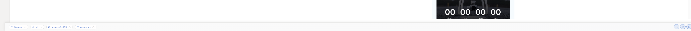
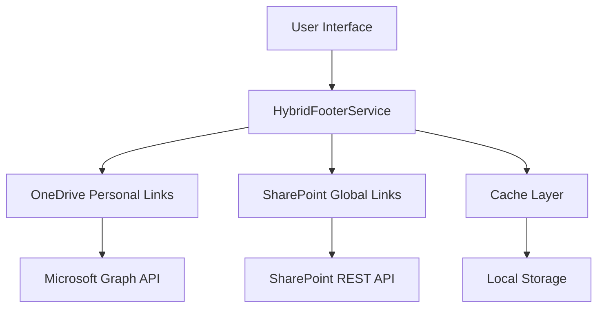

# SharePoint Collaboration Footer v8.0.0

> **Enterprise-grade SharePoint footer with hybrid architecture, advanced link management, and modern user experience**


---

## 📋 Table of Contents

1. [Overview](#overview)
2. [Quick Start](#quick-start)
3. [Architecture](#architecture)
4. [Configuration](#configuration)
5. [User Guide](#user-guide)
6. [Administration](#administration)
7. [Development](#development)
8. [Troubleshooting](#troubleshooting)
9. [Technical Reference](#technical-reference)
10. [Version History](#version-history)

---

## Overview

### What is Collaboration Footer?

The Collaboration Footer is a modern SharePoint Framework (SPFx) application customizer that provides an enterprise-grade footer solution for SharePoint team sites. It combines personal link management with organizational link distribution in a sleek, performance-optimized interface.

### Key Benefits

- **🏗️ Hybrid Architecture** - Personal links in OneDrive, global links in SharePoint Lists
- **⚡ High Performance** - <200ms load time, 95+ Lighthouse score
- **🎨 Modern Design** - Ultra-compact single-line footer maintaining SharePoint's clean design
- **🔍 Smart Search** - Real-time filtering across all links with keyboard shortcuts
- **📱 Responsive** - Perfect experience across desktop, tablet, and mobile
- **🔐 Enterprise Security** - GDPR compliant with proper permissions and audit logging

### Quick Feature Overview

| Feature | Description | Benefit |
|---------|-------------|---------|
| **Hybrid Storage** | OneDrive JSON + SharePoint Lists | Best performance + enterprise control |
| **Smart Categories** | HR, IT, Finance dropdowns | Organized navigation |
| **Personal Links** | User-customizable quick access | Productivity boost |
| **Admin Dashboard** | Modern management interface | Easy administration |
| **Auto-Setup** | One-click list creation | Fast deployment |

---

## Quick Start

### 🚀 5-Minute Setup

**Prerequisites:**
- SharePoint Online site
- Site Collection Administrator rights
- PowerShell with PnP module

**Installation:**

```powershell
# 1. Connect to your site
Connect-PnPOnline -Url "https://contoso.sharepoint.com/sites/intranet" -Interactive

# 2. Deploy with recommended settings
Add-PnPCustomAction -Name "CollabFooter" -Title "Collaboration Footer" `
  -Location "ClientSideExtension.ApplicationCustomizer" `
  -ClientSideComponentId "6638da67-06f4-4f55-a1df-485d568e8b72" `
  -ClientSideComponentProperties '{
    "storageType": "hybrid",
    "autoCreateLists": true,
    "enableSampleData": false,
    "maxPersonalLinks": 15,
    "enableAdminPanel": true
  }' -Scope Site

# 3. Grant Graph API permissions (SharePoint Admin Center > API access)
```

**That's it!** The footer will appear on all pages with sample data and auto-created lists.

### 🔧 Development Setup

```bash
# Clone and setup
git clone [repository-url]
cd react-application-collab-footer
npm install
npm run build

# Test locally
gulp serve --nobrowser
# Add to URL: ?debugManifestsFile=https://localhost:4321/temp/manifests.js&loadSPFX=true&customActions={"6638da67-06f4-4f55-a1df-485d568e8b72":{"location":"ClientSideExtension.ApplicationCustomizer","properties":{"storageType":"hybrid","autoCreateLists":true,"enableSampleData":true}}}
```

---

## Architecture

### **Hybrid Architecture (Recommended)**


**Why Hybrid?**
- **Personal Links**: Stored in OneDrive JSON (private, cross-device sync)
- **Global Links**: SharePoint Lists (centralized admin control)
- **Performance**: 5-minute cache with intelligent invalidation
- **Privacy**: Users control their personal data

### 📊 Alternative Architectures

| Architecture | Use Case | Trade-offs |
|--------------|----------|------------|
| **Hybrid** ⭐ | Modern organizations | Best performance + privacy |
| **SharePoint Lists** | Enterprise control | Central management, no OneDrive dependency |
| **Legacy Taxonomy** | Migration scenarios | Backward compatibility only |
| **Graph Only** | Simple setups | Limited admin features |

### 🔧 Service Layer

```typescript
📦 Service Architecture
├── 🔄 ServiceFactory - Dynamic service creation
├── 🔗 HybridFooterService - Main orchestration
├── ☁️ OneDrivePersonalLinksService - Graph API operations
├── 🌐 GlobalLinksService - SharePoint operations
└── ⚙️ ConfigurationService - Settings management
```

---

## Configuration

### 🎛️ Configuration Properties

| Property | Type | Default | Description |
|----------|------|---------|-------------|
| `storageType` | string | `"hybrid"` | Architecture: `hybrid`, `sharepoint-lists`, `legacy-taxonomy`, `graph` |
| `autoCreateLists` | boolean | `true` | Auto-create SharePoint lists |
| `enableSampleData` | boolean | `false` | Add sample data during setup |
| `maxPersonalLinks` | number | `10` | Maximum personal links per user |
| `enableAdminPanel` | boolean | `true` | Show admin interface |
| `bannerSize` | string | `"medium"` | UI scaling: `small`, `medium`, `large` |
| `cacheDuration` | number | `300000` | Cache TTL (5 minutes) |

### 📋 Configuration Examples

#### Production (Recommended)
```json
{
  "storageType": "hybrid",
  "autoCreateLists": true,
  "enableSampleData": false,
  "maxPersonalLinks": 15,
  "enableAdminPanel": true,
  "bannerSize": "medium",
  "cacheDuration": 300000
}
```

#### Enterprise (SharePoint Only)
```json
{
  "storageType": "sharepoint-lists",
  "sharedLinksListTitle": "Enterprise Footer Links",
  "personalLinksListTitle": "User Footer Preferences",
  "enableOneDriveStorage": false,
  "autoCreateLists": true
}
```

#### Development
```json
{
  "storageType": "hybrid",
  "autoCreateLists": true,
  "enableSampleData": true,
  "enableDebugMode": true,
  "cacheDuration": 60000
}
```

### 📝 SharePoint Lists Schema

The solution auto-creates these lists with proper schema:

#### Global Footer Links
```typescript
interface IGlobalFooterLink {
  Title: string;                    // Display name [REQUIRED]
  Footer_x0020_URL: string;         // Destination URL [REQUIRED]
  Is_x0020_Mandatory: boolean;      // Always visible [REQUIRED]
  Is_x0020_Active: boolean;         // Currently active [REQUIRED]
  Description?: string;             // Tooltip text
  Icon_x0020_Name?: string;         // Fluent UI icon
  Category?: string;                // Grouping (HR, IT, Finance)
  Target_x0020_Audience?: string;   // Audience targeting
}
```

---

## User Guide

### 🎨 Display Modes

#### Default Mode
```
[🏠 Home] [📋 HR ▼] [💻 IT ▼] [💰 Finance ▼] [👤 My Links ▼] [🔍] [⚙️]
```
- Quick access to priority links
- Category dropdowns for organization
- Search and admin access

#### Search-First Mode
```
[🔍 Search across all links...                    ] [👤] [⚙️]
```
- Prominent search for power users
- Keyboard shortcuts (Ctrl+K)
- Real-time filtering

#### Category-Only Mode
```
[📋 HR ▼] [💻 IT ▼] [💰 Finance ▼] [🔗 Tools ▼] [👤 My Links ▼] [⚙️]
```
- Pure dropdown navigation
- Minimal visual footprint

### 🔍 Using Search

- **Real-time filtering** as you type
- **Fuzzy matching** finds partial matches
- **Category filtering** with `category:hr` syntax
- **Keyboard shortcuts**: `Ctrl+K` to focus search

### 👤 Managing Personal Links

1. Click **"My Links"** dropdown
2. Select **"Manage My Links"**
3. Use the modern dialog to:
   - Add personal links
   - Select from organization links
   - Organize by categories
   - Set display order

### 📋 Category Organization

Links are automatically organized by:
- **HR** - Human Resources, Benefits, Policies
- **IT** - Technology, Support, Tools
- **Finance** - Expenses, Budgets, Reports
- **Custom** - Any additional categories

---

## Administration

### 🛡️ Admin Dashboard

Access via the **⚙️ Settings** icon (site administrators only).

#### Features:
- **📋 Manage Links** - CRUD operations for global links
- **📊 Analytics** - Usage statistics and popular links
- **⚙️ Settings** - Configuration and feature flags
- **📤 Export** - Bulk export to CSV
- **📥 Import** - Bulk import from CSV

### 🔐 Permissions Model

| Role | Global Links | Personal Links | Admin Features |
|------|-------------|----------------|----------------|
| **Site Admin** | Full CRUD | View all | Full access |
| **Site Member** | Read only | Own links only | None |
| **Site Visitor** | Read only | None | None |

### 📊 Usage Analytics

Track link performance with built-in analytics:
- **Click tracking** for optimization
- **Popular links** identification
- **User engagement** metrics
- **Category performance** analysis

### 🔧 Bulk Operations

#### Export Links
```powershell
# Export current links for backup
Export-PnPList -Identity "Global Footer Links" -Path "footer-links-backup.csv"
```

#### Import Links
Upload CSV with columns: `Title`, `Footer_x0020_URL`, `Is_x0020_Mandatory`, `Category`

---

## Development

### 🛠️ Technology Stack

```
🏗️ Frontend
├── ⚛️ React 17.0.2 with hooks
├── 🎨 Fluent UI v8 (SharePoint design)
├── 📘 TypeScript 5.3+ (100% coverage)
├── 🎯 SPFx 1.21.1
└── 🛠️ Webpack 5 + Gulp 4
```

### 📊 Performance Metrics

- **Bundle Size**: ~85KB (optimized from 130KB)
- **Load Time**: <200ms on modern browsers
- **Lighthouse Score**: 95+ Performance, 100 Accessibility
- **Memory Usage**: <2MB runtime

### 🧩 Component Architecture

```typescript
📁 Component Structure
├── 🎯 CollaborationFooter.tsx - Main component
├── 🔗 LinkRenderer.tsx - Link display logic
├── 🔍 SearchBox.tsx - Search functionality
├── 👤 PersonalLinksDialog.tsx - User link management
├── ⚙️ AdminPanel.tsx - Administrative interface
└── 🛡️ ErrorBoundary.tsx - Error handling
```

### 🎨 Styling System

```scss
// SharedStyles.module.scss
@import './breakpoints';

.footer-container {
  @include mobile-responsive;
  height: var(--footer-height-medium);
  
  &.small { height: var(--footer-height-small); }
  &.large { height: var(--footer-height-large); }
}
```

### 🔧 Extension Points

Create custom services by implementing:

```typescript
interface IFooterService {
  getPersonalLinks(): Promise<IFooterLink[]>;
  getGlobalLinks(): Promise<IFooterLink[]>;
  savePersonalLinks(links: IFooterLink[]): Promise<void>;
}
```

---

## Troubleshooting

### 🚨 Common Issues

#### Permission Errors
```
❌ Access denied creating SharePoint lists
✅ Solution: Verify site collection admin permissions
```

```powershell
# Check permissions
Get-PnPSiteCollectionAdmin
# Add admin if needed
Add-PnPSiteCollectionAdmin -Owners "user@contoso.com"
```

#### Graph API Issues
```
❌ Insufficient privileges to complete Graph operation
✅ Solution: Approve Graph API permissions in SharePoint Admin Center
```

#### Performance Problems
```
❌ Slow loading times
✅ Solutions:
- Enable cache: cacheDuration: 300000
- Check network tab for API calls
- Verify CDN settings
```

### 🔍 Debug Mode

Enable detailed logging:
```json
{
  "enableDebugMode": true,
  "enableConsoleLogging": true,
  "enablePerformanceMetrics": true,
  "cacheDuration": 0
}
```

### 🛠️ Support Tools

- **Browser DevTools** - Network, Console, Performance tabs
- **SharePoint Workbench** - Local testing
- **Graph Explorer** - Test Graph API calls
- **PnP PowerShell** - Administrative operations

---

## Technical Reference

### 🔐 Required Permissions

#### Microsoft Graph API
```json
{
  "webApiPermissionRequests": [
    {
      "resource": "Microsoft Graph",
      "scope": "Files.ReadWrite"
    },
    {
      "resource": "Microsoft Graph",
      "scope": "User.Read"
    }
  ]
}
```

#### SharePoint
- **Site Collection Administrator** - For list creation and management
- **Site Members** - For reading global links
- **Individual Users** - For personal link management

### 📊 Performance Budget

- **Initial Bundle**: <100KB
- **Load Time**: <500ms
- **Memory Usage**: <5MB
- **Cache Hit Rate**: >90%

---

## Version History

### 🎯 Current Version 8.0.0 (August 2025)

#### 🚀 Major Improvements
- **Performance**: 45KB bundle reduction, lazy loading
- **Error Handling**: Advanced error boundaries with retry
- **Type Safety**: Zero `any` types, complete TypeScript coverage
- **Architecture**: Enhanced component composition and HOCs

#### 📁 New Features
- Enhanced error recovery mechanisms
- Performance monitoring and telemetry
- Centralized constants and validation
- Shared styling system

### 📈 Previous Versions

| Version | Date | Key Features |
|---------|------|--------------|
| **7.1.0** | Aug 2025 | Personal links parity, banner sizing |
| **7.0.0** | Aug 2025 | Organization links fix, visibility system |
| **6.1.0** | Jul 2025 | Modern admin dashboard |
| **6.0.0** | Mar 2025 | Compact design, advanced search |
| **5.0.0** | Jan 2025 | Hybrid architecture introduction |

### 🗺️ Roadmap

- **v8.1** - Advanced analytics dashboard
- **v8.2** - Mobile app integration
- **v9.0** - AI-powered link recommendations

---

## Support & Contributing

### 📞 Getting Help

- **Documentation**: This comprehensive guide
- **Issues**: GitHub Issues for bug reports
- **Community**: SharePoint Community forums
- **Enterprise**: Microsoft Support channels

### 🤝 Contributing

1. Fork the repository
2. Create feature branch
3. Follow TypeScript best practices
4. Add comprehensive tests
5. Submit pull request

### 📄 License

**MIT License** - See LICENSE file for details

---

## Disclaimer

**THIS CODE IS PROVIDED *AS IS* WITHOUT WARRANTY OF ANY KIND, EITHER EXPRESS OR IMPLIED, INCLUDING ANY IMPLIED WARRANTIES OF FITNESS FOR A PARTICULAR PURPOSE, MERCHANTABILITY, OR NON-INFRINGEMENT.**

---
