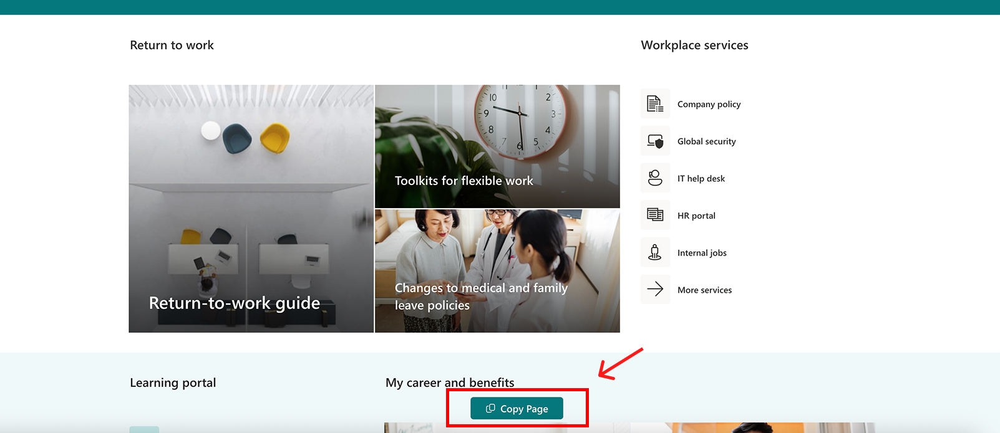
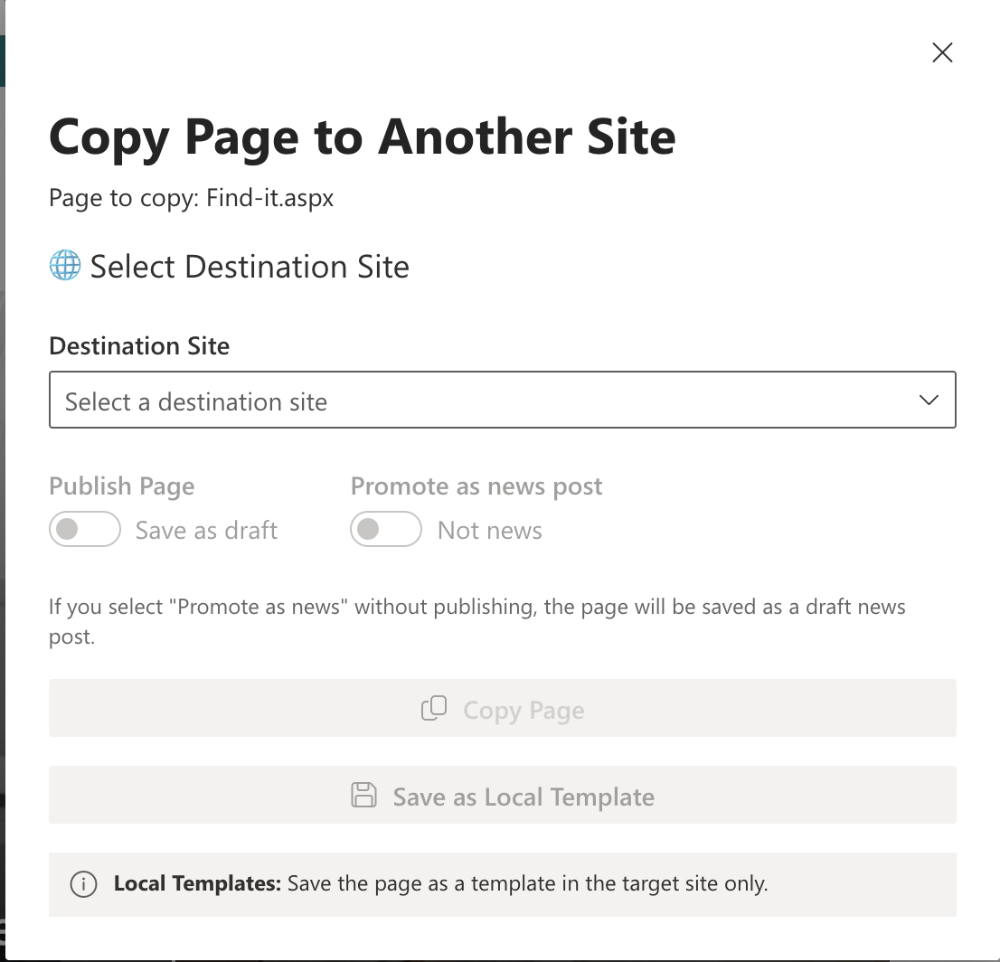
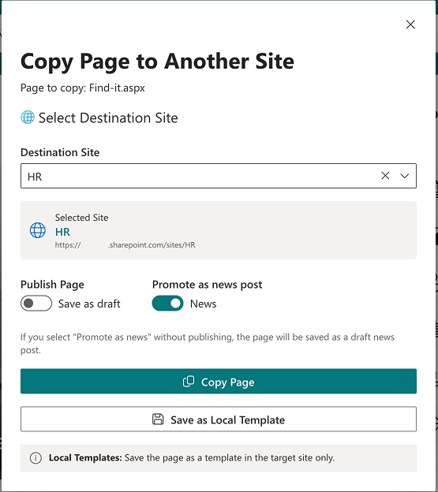
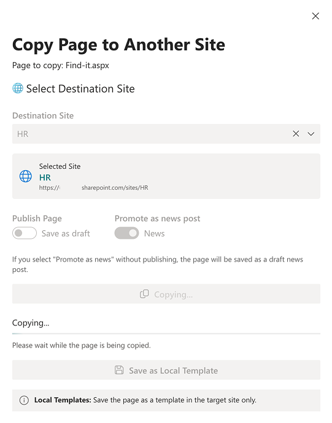

# Copy Page SPFx Application Customizer

## Summary

This SPFx Application Customizer empowers content authors to **copy modern site pages** across sites with full control over:

- **Publishing State**: Choose between `Published` or `Draft`.
- **Promotion as News Post**: Optionally promote the page as a news post.
- **Local Page Templates**: Save the page as a local template for reuse.







## Features

- Copy modern site pages across SharePoint sites.
- Control publishing state (`Published` or `Draft`).
- Promote pages as news posts.
- Save pages as local templates in the target site.
- Fully integrated with SharePoint Framework (SPFx).

## Used SharePoint Framework Version


## Applies to

- [SharePoint Framework](https://aka.ms/spfx)
- [Microsoft 365 tenant](https://docs.microsoft.com/en-us/sharepoint/dev/spfx/set-up-your-developer-tenant)

> Get your own free development tenant by subscribing to [Microsoft 365 developer program](http://aka.ms/o365devprogram)

## Prerequisites

- The source and destination sites must use modern pages and have the **Site Pages** library.
- User must have contribute permissions on the destination site.

## Contributors

- [Ahmad Jad Alhak](https://github.com/ahmad-jad-alhak)

## Version history

| Version | Date           | Comments                   |
|---------|----------------|----------------------------|
| 1.0     | Initial release| Basic copy page and template |

## Disclaimer

**THIS CODE IS PROVIDED _AS IS_ WITHOUT WARRANTY OF ANY KIND, EITHER EXPRESS OR IMPLIED.**

---

## Minimal Path to Awesome

```bash
git clone https://github.com/ahmad-jad-alhak/React-Application-Copy-Page.git
cd react-application-copy-page
npm install
gulp serve
```

---

## Deployment Instructions

To deploy this SPFx Application Customizer, follow these steps:

1. **Build the solution**:
  ```bash
  gulp build
  gulp bundle --ship
  gulp package-solution --ship
  ```

2. **Upload the package**:
  - Navigate to your SharePoint tenant's App Catalog.
  - Upload the `.sppkg` file generated in the `sharepoint/solution` folder.

3. **Deploy the package**:
  - Select the uploaded package in the App Catalog.
  - Click **Deploy** to make the solution available across your tenant.

4. **Enable the extension**:
  - Add the Application Customizer to your site using the following PowerShell command or manually via site settings:
    ```powershell
    Set-PnPWeb -WebPart -ClientSideComponentId <ComponentId>
    ```

5. **Verify functionality**:
  - Navigate to a modern page in your site.
  - Ensure the copy page functionality is available and working as expected.
  ### Deployment via UI

  To deploy this SPFx Application Customizer using the SharePoint UI:

  1. **Upload the package**:
    - Navigate to your SharePoint tenant's App Catalog.
    - Upload the `.sppkg` file generated in the `sharepoint/solution` folder.

  2. **Deploy the package**:
    - Select the uploaded package in the App Catalog.
    - Click **Deploy** to make the solution available across your tenant.

  3. **Enable the extension**:
    - Navigate to the site where you want to enable the extension.
    - Click the **Settings wheel** in the top-right corner of the site.
    - Select **Add an app**.
    - Locate the Application Customizer in the list of available apps and add it to your site.

  4. **Verify functionality**:
    - Navigate to a modern page in your site.
    - Ensure the copy page functionality is available and working as expected.


## Features


This SPFx Application Customizer demonstrates:

- Copying client-side pages across site collections
- Toggling **Publish Page**: determines whether the page is immediately published or saved as draft
- Toggling **Promote as news post**: marks the page for news rollups (uses `PromotedState`)
- Support for all 4 SharePoint page promotion states:
  - Draft (not promoted)
  - Draft news (`PromotedState = 1`)
  - Published page
  - Published news (`PromotedState = 2`)
- Optionally saving a page as a **local template**
- 
- ### Explanation

- **NotPromoted (`0`)**: Default state for pages. The page remains unpromoted.
- **PromoteOnPublish (`1`)**: The page is marked for promotion but will only be promoted when published.
- **Promoted (`2`)**: The page is already promoted and treated as a news post.

## Feedback and Contributions

We welcome feedback and contributions! Feel free to submit issues or pull requests to improve this solution.


## References

- [Getting started with SharePoint Framework](https://docs.microsoft.com/en-us/sharepoint/dev/spfx/set-up-your-developer-tenant)
- [SharePoint client-side pages API](https://pnp.github.io/pnpjs/sp/clientside-pages/)
- [PnPjs Documentation](https://pnp.github.io/pnpjs/)
- [Microsoft 365 Patterns and Practices](https://aka.ms/m365pnp)


