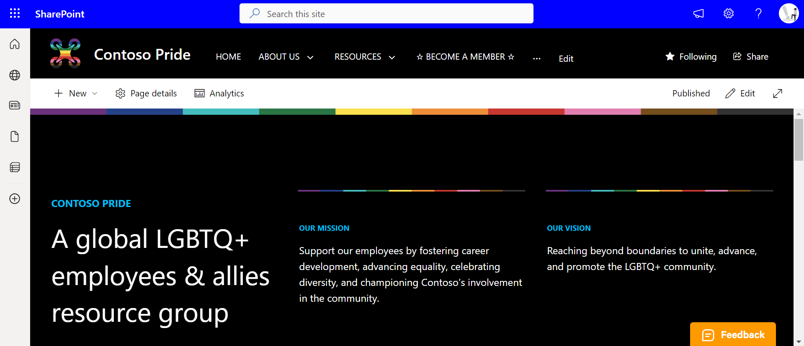
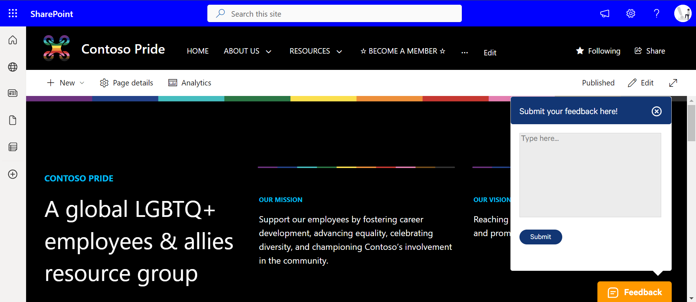
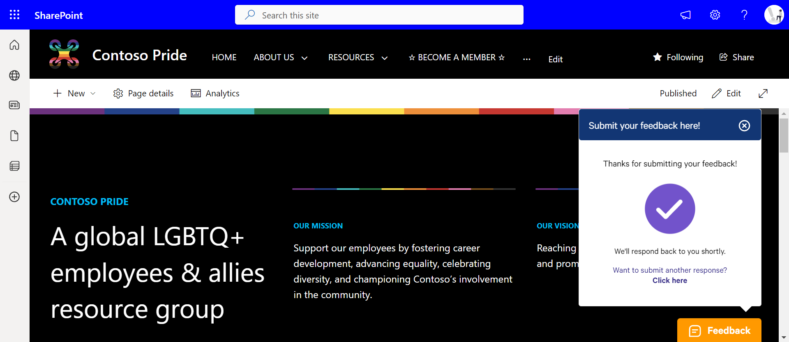

# Sticky Feedback Widget Application Customizer

## Summary

An SPFx Application Customizer Extension placed in the bottom placeholder which allows users to input their feedbacks without scrolling down to the end of the page.





## Compatibility

| :warning: Important          |
|:---------------------------|
| Every SPFx version is optimally compatible with specific versions of Node.js. In order to be able to build this sample, you need to ensure that the version of Node on your workstation matches one of the versions listed in this section. This sample will not work on a different version of Node.|
|Refer to <https://aka.ms/spfx-matrix> for more information on SPFx compatibility.   |

## Used SharePoint Framework Version

This sample is optimally compatible with the following environment configuration:


-Incompatible-red.svg "SharePoint Server 2016 Feature Pack 2 requires SPFx 1.1")


Tested using Node.js v18.18.2

## Applies to

- [SharePoint Framework](https://aka.ms/spfx)
- [Microsoft 365 tenant](https://docs.microsoft.com/sharepoint/dev/spfx/set-up-your-developer-tenant)

> Get your own free development tenant by subscribing to [Microsoft 365 developer program](https://aka.ms/m365devprogram)

## Prerequisites

Create a SharePoint custom list Feedbacks in the SPO site where this application customizer will be added, with below columns

| Column Name  | Comments |
| ------- | --------------- |
| Employee_MailId | Text |
| Employee_Name | Text |
| Comment | Multi-line Text |

> Note: Enable Ratings column for the list.

> **Optional:** Unhide the default column `Created` to capture the submitted date.

## Contributors🧑‍💻

- [Sandeep P S](https://github.com/Sandeep-FED)

## Version history

| Version | Date             | Comments        |
| ------- | ---------------- | --------------- |
| 1.0     | July 02, 2023   | Initial release  |
| 1.1     | April 10, 2025   | Version upgrade to SPFx 1.20.0 & other improvements  |
| 1.2     | May 23, 2025   | Implement Ratings & change position of widget based on property configuration |

## Minimal Path to Awesome⚡

- Clone this repository
- Ensure that you are at the solution folder
- in the command-line run:
  - `npm install`
  - `gulp serve`

## Debug URL for Testing

```javascript
?debugManifestsFile=https%3A%2F%2Flocalhost%3A4321%2Ftemp%2Fmanifests.js&loadSPFX=true&customActions=%7B"33ce42af-1748-4989-ab97-a8d9f782b886"%3A%7B"location"%3A"ClientSideExtension.ApplicationCustomizer"%2C"properties"%3A%7B"title"%3A"Submit+your+feedbacks+%26+ideas"%2C"position"%3A"rightBottom"%7D%7D%7D
```

## Deploy Package Solution 
- Ensure that you are at the solution folder
- in the command-line run:
  - `gulp build --ship`
  - `gulp bundle --ship`
  - `gulp package-solution --ship`
- Upload package to AppCatalog & add it to the SharePoint site.

## Features💡

Key features demonstrated by this solution:

- React functional components & hooks
- PnPjs usage in the solution
- Passing data between components using props
- Basic field validation
- Lottie-react library usage for animation

## References

- [Microsoft 365 Patterns and Practices](https://aka.ms/m365pnp) - Guidance, tooling, samples and open-source controls for your Microsoft 365 development.
- [SharePoint Framework](https://docs.microsoft.com/sharepoint/dev/spfx/set-up-your-developer-tenant)
- [PnP JS](https://pnp.github.io/pnpjs/)
- [Lottie React](https://lottiereact.com/)
- [React Docs](https://react.dev/learn)

## Help

We do not support samples, but we this community is always willing to help, and we want to improve these samples. We use GitHub to track issues, which makes it easy for  community members to volunteer their time and help resolve issues.

If you're having issues building the solution, please run [spfx doctor](https://pnp.github.io/cli-microsoft365/cmd/spfx/spfx-doctor/) from within the solution folder to diagnose incompatibility issues with your environment.

If you encounter any issues while using this sample, [create a new issue](https://github.com/pnp/sp-dev-fx-webparts/issues/new?assignees=&labels=Needs%3A+Triage+%3Amag%3A%2Ctype%3Abug-suspected%2Csample%3A%20react-feedback-widget&template=bug-report.yml&sample=react-feedback-widget&authors=@Sandeep-FED&title=react-feedback-widget%20-%20).

For questions regarding this sample, [create a new question](https://github.com/pnp/sp-dev-fx-webparts/issues/new?assignees=&labels=Needs%3A+Triage+%3Amag%3A%2Ctype%3Aquestion%2Csample%3A%20react-feedback-widget&template=question.yml&sample=react-feedback-widget&authors=@Sandeep-FED&title=react-feedback-widget%20-%20).

Finally, if you have an idea for improvement, [make a suggestion](https://github.com/pnp/sp-dev-fx-webparts/issues/new?assignees=&labels=Needs%3A+Triage+%3Amag%3A%2Ctype%3Aenhancement%2Csample%3A%20react-feedback-widget&template=question.yml&sample=react-feedback-widget&authors=@Sandeep-FED&title=react-feedback-widget%20-%20).

## Disclaimer

**THIS CODE IS PROVIDED _AS IS_ WITHOUT WARRANTY OF ANY KIND, EITHER EXPRESS OR IMPLIED, INCLUDING ANY IMPLIED WARRANTIES OF FITNESS FOR A PARTICULAR PURPOSE, MERCHANTABILITY, OR NON-INFRINGEMENT.**


