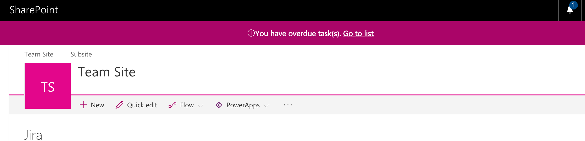

# React Overdue Tasks Application Customizer

## Summary
The sample illustrates how to display a warning message that current user has overdue tasks.



## Used SharePoint Framework Version 
SPFx Extensions (1.4.0)

## Applies to

* [SharePoint Framework](http://dev.office.com/sharepoint/docs/spfx/sharepoint-framework-overview)

Solution|Author(s)
--------|---------
react-application-duetasks | Alex Terentiev ([Sharepointalist Inc.](http://www.sharepointalist.com), [AJIXuMuK](https://github.com/AJIXuMuK))

## Version history

Version|Date|Comments
-------|----|--------
1.0|July 5, 2017|Initial release
1.1|August 29, 2017|Update to RC0
1.2|October 10, 2017|$schema properties in config files, Feature Framework
1.4|December 26, 2017|Updated to SharePoint Framework v 1.4

## Disclaimer
**THIS CODE IS PROVIDED *AS IS* WITHOUT WARRANTY OF ANY KIND, EITHER EXPRESS OR IMPLIED, INCLUDING ANY IMPLIED WARRANTIES OF FITNESS FOR A PARTICULAR PURPOSE, MERCHANTABILITY, OR NON-INFRINGEMENT.**

## Features
This project contains SharePoint Framework extensions that illustrates next features:
* application customizer
* usage of Page Placeholders
* usage of SP PnP JS

## Building and debugging the code

```bash
git clone the repo
npm i
npm i -g gulp
gulp serve --nobrowser
```

This package produces the following:

* lib/* - intermediate-stage commonjs build artifacts
* dist/* - the bundled script, along with other resources
* deploy/* - all resources which should be uploaded to a CDN.

On your SharePoint tenant:

* create Tasks list
* go to any modern page or modern list/document library and add next query string to the url:
```
?loadSPFX=true&debugManifestsFile=https://localhost:4321/temp/manifests.js&customActions={"771b53cc-ee49-4f06-903e-3ce4eb4bc313":{"location":"ClientSideExtension.ApplicationCustomizer","properties":{"tasksListTitle":"Tasks"}}}
```
where ```"tasksListTitle"``` value should contain a title of Tasks list.


