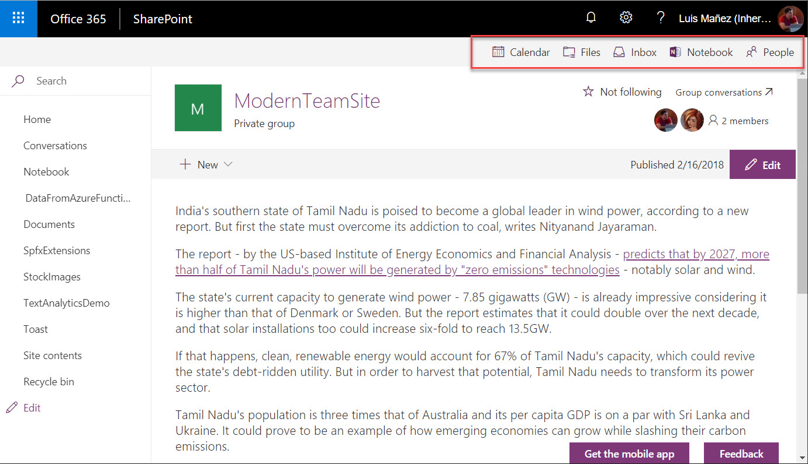

# Spfx Applications Customizer Groups external links

## Summary

This sample shows how to render a header navbar with some external links related to the Group the site is in, i.e: Group calendar, Notebook, Inbox, People...

## Used SharePoint Framework Version

## Applies to

* [SharePoint Framework Extensions](https://dev.office.com/sharepoint/docs/spfx/extensions/overview-extensions)
* [Office 365 developer tenant](http://dev.office.com/sharepoint/docs/spfx/set-up-your-developer-tenant)

## Solution

Solution|Author(s)
--------|---------
react-application-grouplinks|Luis Mañez (MVP, [ClearPeople](http://www.clearpeople.com), @luismanez)

## Version history

Version|Date|Comments
-------|----|--------
1.0.0|Feb 16, 2018|Initial release

## Disclaimer

**THIS CODE IS PROVIDED *AS IS* WITHOUT WARRANTY OF ANY KIND, EITHER EXPRESS OR IMPLIED, INCLUDING ANY IMPLIED WARRANTIES OF FITNESS FOR A PARTICULAR PURPOSE, MERCHANTABILITY, OR NON-INFRINGEMENT.**

---

## Minimal Path to Awesome

* clone repo
* update _serve.json_ pointing to your site collection home page
* run _gulp serve_

## Features

Sample SharePoint Framework application customizer rendering a header nav bar with some external links related to the site group.

This sample illustrates the following concepts on top of the SharePoint Framework:

* Header customizer with React components
* Using SP.Directory.DirectorySession api to get info about the current Group
* Using async / await for the async calls
* Office UI fabric ActionLinks

