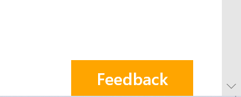

# SPFx Applications Customiser CSS Injection

## Summary

This sample shows how to inject a custom Cascading Style Sheet (CSS) on modern pages.


> **Note**: This code is provided as a sample only. Keep in mind that Microsoft may change page elements and styles at any time, rendering your custom CSS useless. It is preferrable to use well-known HTML element placeholders.

When you need to make minor cosmetic changes to modern pages (e.g.:  match your corporate branding guidelines) and cannot use placeholders,you can create a custom CSS and inject on every modern page.

In this example, we deploy the CSS in a shared location; this allows us to change the CSS file at any time without re-deploying or re-configuring the application customizer.

You can deploy the application customizer with different settings to point to different CSS files.

Please refrain from making drastic changes that may negatively impact your users' experience. If you experience issues with modern pages, please try disabling the extension before calling Microsoft Support to ensure that the issue isn't caused by your custom CSS.

## Used SharePoint Framework Version


## Applies to

* [SharePoint Framework Extensions](https://dev.office.com/sharepoint/docs/spfx/extensions/overview-extensions)
* [Office 365 developer tenant](http://dev.office.com/sharepoint/docs/spfx/set-up-your-developer-tenant)

## Solution

Solution|Author(s)
--------|---------
react-application-injectcss|Hugo Bernier ([Tahoe Ninjas](http://tahoeninjas.blog), @bernierh)

## Version history

Version|Date|Comments
-------|----|--------
1.0.0|07 May, 2018|Initial release
1.1.0|18 October, 2018|Updated to SPFx 1.6
1.2.0|28 March, 2018|Updated to SPFx 1.8

## Disclaimer

**THIS CODE IS PROVIDED *AS IS* WITHOUT WARRANTY OF ANY KIND, EITHER EXPRESS OR IMPLIED, INCLUDING ANY IMPLIED WARRANTIES OF FITNESS FOR A PARTICULAR PURPOSE, MERCHANTABILITY, OR NON-INFRINGEMENT.**

---

## Minimal Path to Awesome

### Prepare the assets

1. create a custom CSS file that meets your needs. For example, this CSS will change the feedback button's background color to orange.

```CSS
.sitePage-uservoice-button {
  background-color: orange;
 }
```

2. Upload the CSS file as `custom.css` to your `Styles Library` of the root site collection (i.e.: `https://<yourtenant>.sharepoint.com/Style%20Library/Forms/AllItems.aspx`).
3. Navigate to your site. Your custom CSS should be applied.

For example, the CSS provided above will make the feedback button appear as follows:


### Build the solution

1. clone repo
2. Ryn `npm install`
3. Run `gulp bundle --ship`
4. Run `gulp package-solution --ship`

### Manual deployment

1. Upload the `react-application-injectcss.sppkg` from the `sharepoint` folder to your App catalog.
2. When prompted to deploy to all sites, choose the option that suits your needs.

### Automated deployment

1. If you have not done so already, install the [PnP PowerShell Cmdlets](https://aka.ms/sppnp-powershell)
2. Edit the `DeployApplicationCustomizer.ps1` file and change the `$tenantUrl` variable to point to your tenant.
3. From a PowerShell console, run the `DeployApplicationCustomizer.ps1` script to automatically deploy to all sites.
4. You will be prompted to enter your credentials.
5. After providing your credentials, the extension will be deployed

## Changing the CSS location

To simplify deployment, the extension looks for a `custom.css` in your tenant's root `Style Library`. If you wish to use a different CSS name and location, use one of the following approaches:

### In the solution

This approach will change the default css location in the solution so that it will automatically load your custom CSS when the extension is deployed.

Note that if you intend to deploy this extension tenant-wide, your custom CSS URL should be an absolute URL or a server-relative URL.

1. Locate the `elements.xml` file, in the `sharepoint` > `assets` folder
2. Change the `ClientSideComponentProperties` to point to your custom CSS URL.
3. Run `gulp bundle --ship`
4. Run `gulp package-solution --ship`
5. Upload the `react-application-injectcss.sppkg` from the `sharepoint` folder to your App catalog.
6. When prompted to deploy to all sites, choose the option that suits your needs.

### Using automated deployment

This approach allows you to override the CSS location by configuring the extension properties as the extension is activated.

1. Edit the `EnableApplicationCustomizer.ps1` file and change the `$tenantUrl` variable to point to your tenant.
2. In the same file, change the `$customCSSUrl` variable to point to your custom CSS URL.
3. From a PowerShell console, run the `EnableApplicationCustomizer.ps1` script to automatically deploy to all sites.
4. You will be prompted to enter your credentials.
5. After providing your credentials, the extension will be deployed using your custom CSS URL.

## Disabling the extension

1. Edit the `DisableApplicationCustomizer.ps1` file and change the `$tenantUrl` variable to point to your tenant.
2. From a PowerShell console, run the `DisableApplicationCustomizer.ps1` script to automatically deploy to all sites.
3. You will be prompted to enter your credentials.
4. If prompted to remove the application, choose Yes.
5. The extension will be removed.

If you wish to do so, you can remove the solution package from your tenant's app catalog after the extension has been de-activated.

## Features

Sample SharePoint Framework Application Customiser which injects a custom CSS in the HTML header.

This sample illustrates the following concepts on top of the SharePoint Framework:

* HTML manipulation


