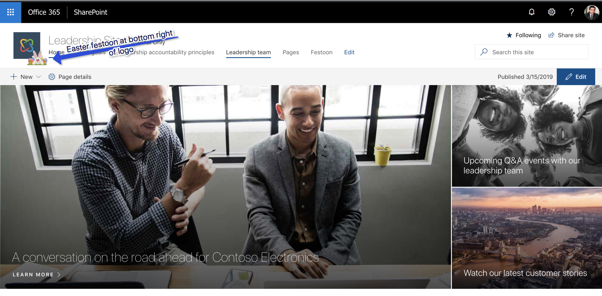
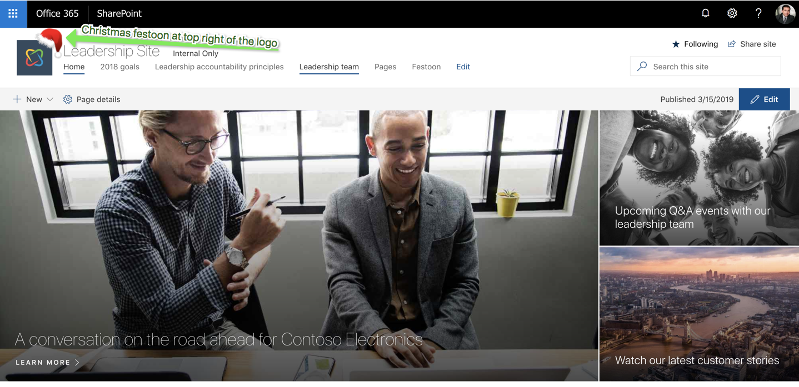
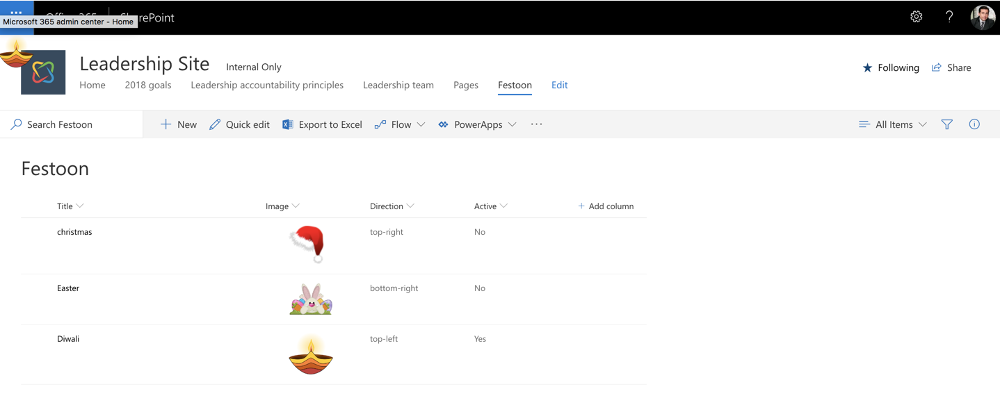

# react-application-logo-festoon

## Summary
This simple SPFx extension can be used to decorate you SPO site logo with a festoon image of your choice. Keep users engaged by adding a personal touch to your site.




## Used SharePoint Framework Version 


## Applies to

* [SharePoint Framework](https:/dev.office.com/sharepoint)
* [SharePoint Framework Extensions](https://dev.office.com/sharepoint/docs/spfx/extensions/overview-extensions)

## Prerequisites
 
Create a SharePoint custom list `Festoon` in the SPO site where this application customizer will be added, with below columns

Column Name|Type
--------|---------
Image|Picture
Direction|Choice {top-right,top-left,bottom-right,bottom-left}
Active|Yes/No



## Solution

Solution|Author(s)
--------|---------
react-application-logo-festoon|Rabia Williams

## Version history

Version|Date|Comments
-------|----|--------
1.0|March 17, 2019|Initial release

## Disclaimer
**THIS CODE IS PROVIDED *AS IS* WITHOUT WARRANTY OF ANY KIND, EITHER EXPRESS OR IMPLIED, INCLUDING ANY IMPLIED WARRANTIES OF FITNESS FOR A PARTICULAR PURPOSE, MERCHANTABILITY, OR NON-INFRINGEMENT.**

---

## Minimal Path to Awesome

- Clone this repository
- Add the SharePoint custom list `Festoon` as mentioned in the prerequisites
- Update the pageUrl properties in the `config/serve.json` file
- The pageUrl should be a modern page
- This property is only used during development in conjunction with the gulp serve command

## Debug URL for testing
Here's a debug querystring for testing this sample:

```
?loadSPFX=true&debugManifestsFile=https://localhost:4321/temp/manifests.js&customActions={"1e3d3ef7-0983-4d40-9dbb-9c6d4539639a":{"location":"ClientSideExtension.ApplicationCustomizer","properties":{"testMessage":"Hello world"}}}
```

## Features
This simple and super fun SPFx application customizer adds an image on top of the logo in your SPO site, in a position around the logo that you choose.
You can make your festoon active and inactive so it is easy to switch on and off.
The possible directions you can choose are:

* top-right
* top-left
* bottom-right
* bottom-left

You can use any transparent image as the festoon.

