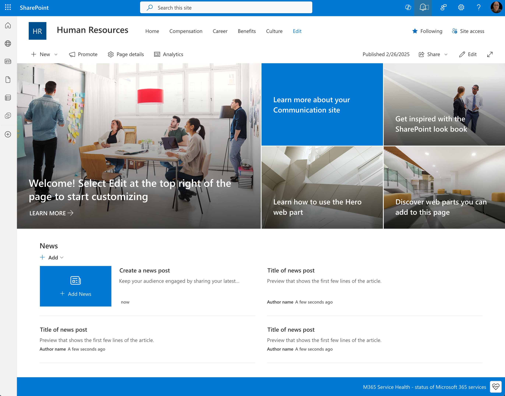
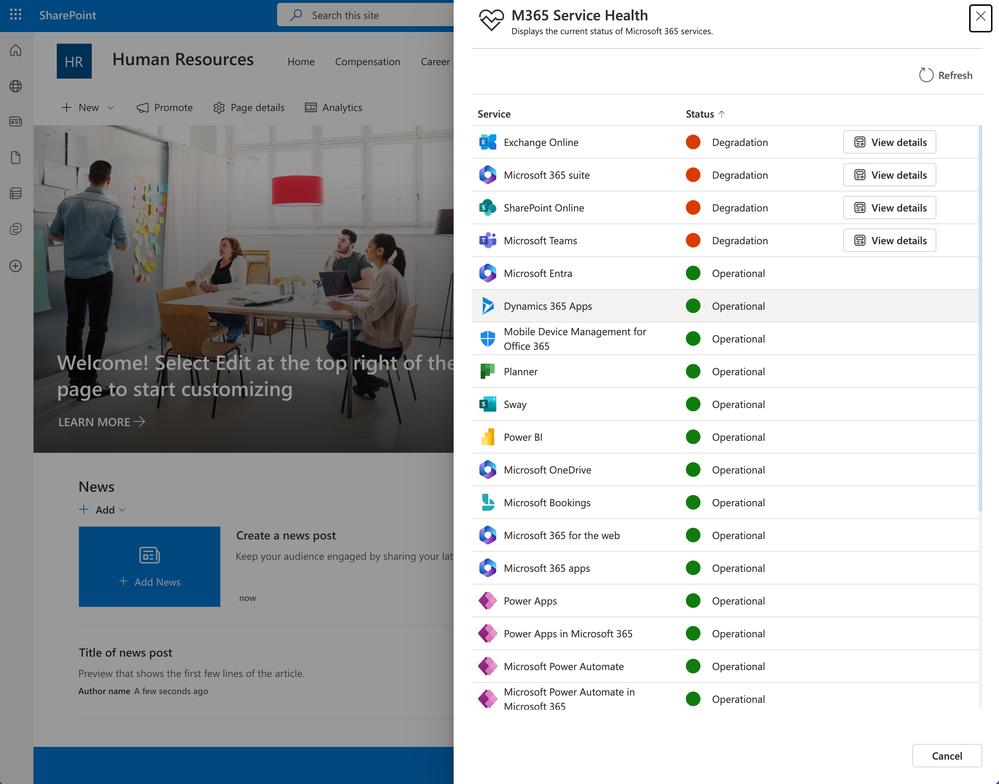

# Microsoft 365 Service Health Extension

## Summary

This extension provides real-time monitoring of Microsoft 365 service health directly within your SharePoint environment. It enables users to quickly check the availability status of core M365 services, helping organizations stay informed about outages or incidents.

The extension create a bottom on the footer of the SharePoint site, which when clicked, opens a dialog showing the service health status. The extension can be configured to show service health information to either tenant administrators only or to all users in the tenant.





### Key Features

- **Service Health Monitoring:** Displays up-to-date status for Microsoft 365 services such as Exchange, SharePoint, Teams, and more.
- **Configurable Scope:**  
  - **Admins Only:** Restrict visibility so only tenant administrators can view service health information.
  - **All Users:** Allow all users to access service health data.  
  > **Note:** When the scope is set to "All", an Azure Function must be deployed and online to securely provide service health data to non-admin users.

### Technologies Used

- **SharePoint Framework (SPFx):** For seamless integration with SharePoint Online.
- **Microsoft Graph API:** To retrieve service health status from Microsoft 365.
- **Azure Functions:** Required when exposing service health to all users.

### Configuration

- **Scope Property:**  
  - Set the `scope` property to either `Admin` or `All` based on your organization's requirements.
  - If `All` is selected, ensure the associated Azure Function is deployed and operational.

### Example Usage

- **Admin Scope:**  
  Only SharePoint admins will see the service health extension on their sites.
- **All Scope:**  
  All users in the tenant can view service health, (nned to deploy an Azure Function).

[picture of the solution in action, if possible]

## Used SharePoint Framework Version


## Applies to

- [SharePoint Framework](https://aka.ms/spfx)
- [Microsoft 365 tenant](https://docs.microsoft.com/en-us/sharepoint/dev/spfx/set-up-your-developer-tenant)

> Get your own free development tenant by subscribing to [Microsoft 365 developer program](http://aka.ms/o365devprogram)

## Prerequisites

 If you want to use the solution with the `All` scope, you need to deploy an Azure Function that will provide the service health data to non-admin users. The Azure Function should be configured to call the Microsoft Graph API and return the service health information securely. You can find the project for the Azure Function in the [Azure Function project](react-application-service-health-azfn.zip).

## Contributors

- [João Mendes](https://github.com/joaojmendes)

## Version history

| Version | Date             | Comments        |
| ------- | ---------------- | --------------- |
| 1.0     | May 24, 2025 | Initial release |


## Disclaimer

**THIS CODE IS PROVIDED _AS IS_ WITHOUT WARRANTY OF ANY KIND, EITHER EXPRESS OR IMPLIED, INCLUDING ANY IMPLIED WARRANTIES OF FITNESS FOR A PARTICULAR PURPOSE, MERCHANTABILITY, OR NON-INFRINGEMENT.**

---

## requirements

This required the Microsoft Graph API permissions to access service health data. The following permissions are needed:

- `ServiceHealth.Read.All` - Allows reading service health information for all services in the tenant. for Admin scope.

If Scope is set to `All`, the Azure Function must be configured  and a Application must be created with the necessary Application permissions to access service health data. Please see the project to configure the Azure Function and the required permissions.

## Solution Deployment

Recreate Package and deploy the solution to your SharePoint Online App catalog and approve the Microsoft Graph permissions on the API Access:

```bash
# Build the solution
gulp build
## Bundle the solution
gulp bundle --ship
# Package the solution
gulp package-solution


# Upload the package to your SharePoint Online App Catalog
```

## References

- [Getting started with SharePoint Framework](https://docs.microsoft.com/en-us/sharepoint/dev/spfx/set-up-your-developer-tenant)
- [Building for Microsoft teams](https://docs.microsoft.com/en-us/sharepoint/dev/spfx/build-for-teams-overview)
- [Use Microsoft Graph in your solution](https://docs.microsoft.com/en-us/sharepoint/dev/spfx/web-parts/get-started/using-microsoft-graph-apis)
- [Publish SharePoint Framework applications to the Marketplace](https://docs.microsoft.com/en-us/sharepoint/dev/spfx/publish-to-marketplace-overview)
- [Microsoft 365 Patterns and Practices](https://aka.ms/m365pnp) - Guidance, tooling, samples and open-source controls for your Microsoft 365 development
