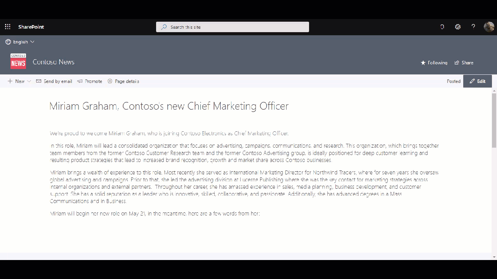

# Machine Translations Extension

## Summary
This application customizer lets you translate the text on a SharePoint page using the [Translator Text API](https://azure.microsoft.com/en-us/services/cognitive-services/translator-text-api/) of Microsoft Azure. 

The extension will determine the language of the page using the page description. A drop-down is provided with available languages (that are configurable). All content inside Text Web parts will be translated to the specified language



## Used SharePoint Framework Version 


## Applies to

* [SharePoint Framework](https://dev.office.com/sharepoint)
* [Office 365 tenant](https://dev.office.com/sharepoint/docs/spfx/set-up-your-development-environment)


## Prerequisites

To make this sample work, you will need a valid API key for the Translator Text API. [These](https://docs.microsoft.com/en-us/azure/cognitive-services/translator/translator-text-how-to-signup) instructions can help to set-up the Azure resource and obtain the API key. Each subscription has 1 free tier available which lets you translate 2M characters per month.

## Solution

Solution|Author(s)
--------|---------
react-application-machine-translations | [Robin Agten](https://twitter.com/AgtenRobin)

## Version history

Version|Date|Comments
-------|----|--------
1.0|March 28, 2020|Initial release

## Disclaimer
**THIS CODE IS PROVIDED *AS IS* WITHOUT WARRANTY OF ANY KIND, EITHER EXPRESS OR IMPLIED, INCLUDING ANY IMPLIED WARRANTIES OF FITNESS FOR A PARTICULAR PURPOSE, MERCHANTABILITY, OR NON-INFRINGEMENT.**

---

## Minimal Path to Awesome

- Clone this repository
- in the command line run:
  - `npm install`
  - `gulp serve --nobrowser`
- Open your SharePoint developer site and append the provided debug url (see later on)


## Features

This extension illustrates the following concepts:

- Configurable available languages
- Uses Microsoft Azure Translator Text API
- Uses [PnPjs V2.0](https://pnp.github.io/pnpjs/) to get page web parts

## Debug URL for testing
Here's a debug URL for testing around this sample. 

```
?debugManifestsFile=https://localhost:4321/temp/manifests.js&loadSPFX=true&customActions={"aa40cc51-6498-4c01-91d4-b5f8d2fe1e8b":{"location":"ClientSideExtension.ApplicationCustomizer","properties":{"supportedLanguages":["en","nl","fr"],"translatorApiKey":"_TRANSLATOR_API_KEY_"}}}
```
 - Replace \_TRANSLATOR_API_KEY_ with your API key
 - Update the supportedLanguages list with languages that you want to expose. A full list of supported languages can be found [here](https://docs.microsoft.com/en-us/azure/cognitive-services/translator/language-support)


