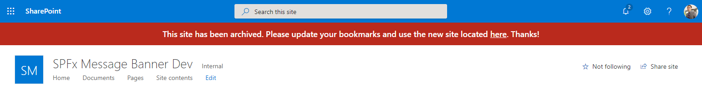
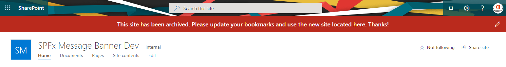
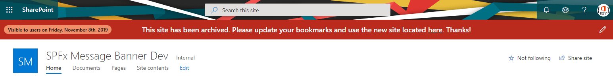
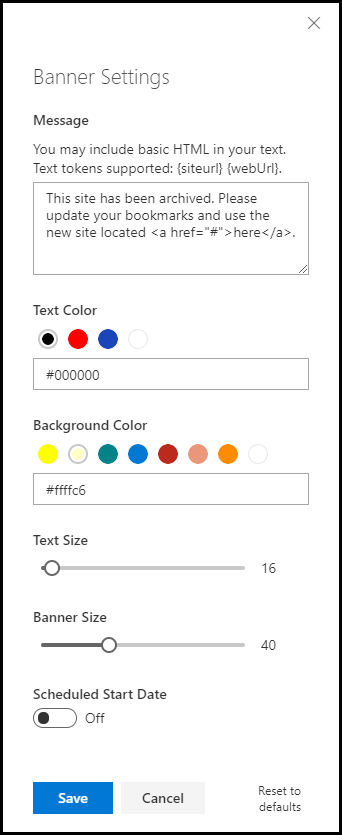

# Custom Message Banner for Modern SharePoint Sites

## Summary

Add a custom banner message to your SharePoint Online modern sites. Allows a site owner to modify the text, font size, colors and height of the banner. Specify a start date to control when the banner is visible to members of a site. Experimental support for setting the custom action host property 'preAllocatedApplicationCustomizerTopHeight' to avoid the page shifting upon load.

Built using a SharePoint Framework Application Customizer Extension with the Top placeholder. Customization settings are saved into the ClientSideComponentProperties of the host custom action. Supports adding at the site-scope or web-scope.

### Screenshots

**View as user**

**View as site admin**

**View as site admin with a scheduled start date**


## Compatibility


-Incompatible-red.svg> "SharePoint Server 2016 Feature Pack 2 requires SPFx 1.1")


## Applies to

- [SharePoint Framework](https://docs.microsoft.com/sharepoint/dev/spfx/sharepoint-framework-overview)
- [Microsoft 365 tenant](https://docs.microsoft.com/sharepoint/dev/spfx/set-up-your-developer-tenant)

## Contributors

- [Brad Schlintz](https://github.com/bschlintz)
- [Paul Matthews](https://github.com/pmatthews05)
- [Sandeep P S](https://github.com/Sandeep-FED)

## Version history

| Version | Date         | Comments                                                                                                               |
| ------- | ------------ | ---------------------------------------------------------------------------------------------------------------------- |
| 1.4.2   | Oct 06, 2024 | Sandeep P S, upgraded to SPFX 1.20.0.                                                                                  |
| 1.4.1   | Feb 10, 2024 | Paul Matthews, upgraded to SPFX 1.18.2.                                                                                |
| 1.4     | Aug 12, 2022 | Paul Matthews, upgraded to SPFX 1.15.2 obtained permission to submit to PNP Samples.                                   |
| 1.0     | Nov 5, 2109  | Initial Commit 1.0 created by Brad Schlintz at [spfx-message-banner](https://github.com/bschlintz/spfx-message-banner) |

## Prerequisites

- App Catalog: Ensure the App Catalog is setup in your SharePoint Online tenant.
- PnP PowerShell or Office 365 CLI: Ensure you have the latest version of the [PnP Powershell](https://pnp.github.io/powershell/) module installed. Alternatively, you can use the [Office 365 CLI](https://pnp.github.io/office365-cli/).

## Minimal Path to Awesome

- Clone this repository
- in the command line run:
  - `npm install`
  - `gulp serve`

## Features

This solution can be deployed by registering a custom action on your site(s) at either site or web scopes.

The banner settings are saved into the ClientSideComponentProperties on the custom action. The [specific configurations](#configurations) are shown below which can be set programmatically using one of installation methods described in the [install section](#install)

### Configurations

| Property Name                  | Default Value                                                                                             | Description                                                                                                                                                                                                                                                                                      |
| ------------------------------ | --------------------------------------------------------------------------------------------------------- | ------------------------------------------------------------------------------------------------------------------------------------------------------------------------------------------------------------------------------------------------------------------------------------------------ |
| message                        | `"This is a sample banner message. Click the edit icon on the right side to update the banner settings."` | Text or HTML. Supports {siteUrl} and {webUrl} tokens.                                                                                                                                                                                                                                            |
| textColor                      | `"#333333"`                                                                                               | Text. Colour shown within the banner.                                                                                                                                                                                                                                                            |
| backgroundColor                | `"#ffffc6"`                                                                                               | Text. Background colour of the banner.                                                                                                                                                                                                                                                           |
| textFontSizePx                 | `14`                                                                                                      | Integer. Font size of the banner text in pixels.                                                                                                                                                                                                                                                 |
| bannerHeightPx                 | `30`                                                                                                      | Integer. Height of the banner in pixels.                                                                                                                                                                                                                                                         |
| visibleStartDate               | `null` or `2023-09-01`                                                                                    | Date String. (Optional). Date at which the banner message should be shown to members and visitors of the site. Message will always be visible to admins.                                                                                                                                         |
| disableSiteAdminUI             | `false`                                                                                                   | Boolean (Optional).To disable the site administrator user interface (edit icon). Additionally, if the `visibleStartDate` property is set to a future date, site administrators will no longer see the banner with the future visibility date badge.                                              |
| enableSetPreAllocatedTopHeight | `false`                                                                                                   | Boolean (Optional). To enable setting the host property 'preAllocatedApplicationCustomizerTopHeight' when saving new banner height within the settings panel. This flag signals SharePoint to pre allocate the banner location height server-side to avoid the page shifting down during render. |

Additionally, if you are a site owner or site collection administrator, you can customize the banner using the 'edit' pencil icon via the browser.



## Debug URL for testing

Here's a debug URL for testing around this sample. _Note: The '#' is encoded in textColor and backgroundColor._

```
?loadSPFX=true&debugManifestsFile=https://localhost:4321/temp/manifests.js&customActions={"1e2688c4-99d8-4897-8871-a9c151ccfc87":{"location":"ClientSideExtension.ApplicationCustomizer","properties":{"message":"This is a sample banner message. Update the 'message' property of the application customizer extension.","textColor":"%23333","backgroundColor":"%23ffffc6","textFontSizePx":14,"bannerHeightPx":30,"visibleStartDate":"2023-09-01","enableSetPreAllocatedTopHeight":false,"disableSiteAdminUI":false}}}
```

## Installing with Script

### Build

```ps1
npm install
gulp clean
gulp build --ship
gulp bundle --ship
gulp package-solution --ship
```

### Upload to App Catalog

#### PowerShell PnP

```ps1
$appCatalogUrl = "https://tenant.sharepoint.com/sites/appcatalog"
Connect-PnPOnline -url:$appCatalogUrl -pnpManagementShell

Add-PnPApp -Path:"<path-to: react-application-messagebanner.sppkg>" `
  -Publish `
  -Overwrite `
  -SkipFeatureDeployment
```

#### M365 Cli

```bash
m365 login
m365 spo app add --filePath <path-to: react-application-messagebanner.sppkg> --overwrite
m365 spo app deploy --name "react-application-messagebanner.sppkg" --skipFeatureDeployment
```

### Register SPFX Extension on your target SharePoint site(s) using one of the methods below.

- Once added to Tenant App Catalog, you can then add to either Site or Web. The following code examples are for PNP PowerShell or M365 Cli.

#### PowerShell PnP

```ps1
Connect-PnPOnline -Url:"https://tenant.sharepoint.com/sites/targetSite"

#Site Collection Scoped
Add-PnPCustomAction `
  -Title "react-application-messagebanner" `
  -Name "react-application-messagebanner" `
  -Location "ClientSideExtension.ApplicationCustomizer" `
  -ClientSideComponentId "1e2688c4-99d8-4897-8871-a9c151ccfc87" `
  -ClientSideComponentProperties "{`"message`":`"PnP Message at Site Scoped`",
                                   `"textColor`":`"#333`",
                                   `"backgroundColor`":`"#ffffc6`",
                                   `"visibleStartDate`":`"2023-09-01`",
                                   `"textFontSizePx`":20,
                                   `"bannerHeightPx`":34 }" `
  -Scope Site

#Web Scoped
Add-PnPCustomAction `
  -Title "react-application-messagebanner" `
  -Name "react-application-messagebanner" `
  -Location "ClientSideExtension.ApplicationCustomizer" `
  -ClientSideComponentId "1e2688c4-99d8-4897-8871-a9c151ccfc87" `
  -ClientSideComponentProperties "{`"message`":`"PnP Message at Web Scoped`",
                                   `"textColor`":`"#333`",
                                   `"backgroundColor`":`"#ffffc6`",
                                   `"visibleStartDate`":`"2023-09-01`",
                                   `"textFontSizePx`":20,
                                   `"bannerHeightPx`":34 }" `
  -Scope Web
```

#### M365 Cli

```bash
m365 login

# Site Collection Scoped
m365 spo customaction add --url "https://tenant.sharepoint.com/sites/targetSite" \
--title "react-application-messagebanner" \
--name "react-application-messagebanner" \
--location "ClientSideExtension.ApplicationCustomizer" \
--clientSideComponentId "1e2688c4-99d8-4897-8871-a9c151ccfc87" \
--clientSideComponentProperties '{"message":"M365 Cli Message at Site Scoped",
                                  "textColor":"#333",
                                  "backgroundColor":"#ffffc6",
                                  "visibleStartDate":"2023-09-01",
                                  "textFontSizePx":20,
                                  "bannerHeightPx":34 }' \
--scope Site

# Web Scoped
m365 spo customaction add --url "https://tenant.sharepoint.com/sites/targetSite" \
--title "react-application-messagebanner" \
--name "react-application-messagebanner" \
--location "ClientSideExtension.ApplicationCustomizer" \
--clientSideComponentId "1e2688c4-99d8-4897-8871-a9c151ccfc87" \
--clientSideComponentProperties '{"message":"M365 Cli Message at Web Scoped",
                                  "textColor":"#333",
                                  "backgroundColor":"#ffffc6",
                                  "visibleStartDate":"2023-09-01",
                                  "textFontSizePx":20,
                                  "bannerHeightPx":34 }' \
--scope Web
```

### Remove SPFX Extension on your target SharePoint site(s) using one of the methods below.

#### PowerShell PnP

```ps1
Connect-PnPOnline -Url:"https://tenant.sharepoint.com/sites/targetSite"

# Site Collection Scope
Get-PnPCustomAction -Scope Site | Where-Object {$_.ClientSideComponentId -eq "1e2688c4-99d8-4897-8871-a9c151ccfc87" } | Remove-PnPCustomAction -Force

# Web Scope
Get-PnPCustomAction -Scope Web | Where-Object {$_.ClientSideComponentId -eq "1e2688c4-99d8-4897-8871-a9c151ccfc87" } | Remove-PnPCustomAction -Force
```

#### M365 Cli

```bash
m365 login
# Site Collection Scope
m365 spo customaction remove --url "https://tenant.sharepoint.com/sites/targetSite" \
--title "react-application-messagebanner" \
--scope Site \
--confirm

# Web Scope
m365 spo customaction remove --url "https://tenant.sharepoint.com/sites/targetSite" \
--title "react-application-messagebanner" \
--scope Web \
--confirm
```

## Disclaimer

**THIS CODE IS PROVIDED _AS IS_ WITHOUT WARRANTY OF ANY KIND, EITHER EXPRESS OR IMPLIED, INCLUDING ANY IMPLIED WARRANTIES OF FITNESS FOR A PARTICULAR PURPOSE, MERCHANTABILITY, OR NON-INFRINGEMENT.**

## Help

We do not support samples, but we this community is always willing to help, and we want to improve these samples. We use GitHub to track issues, which makes it easy for community members to volunteer their time and help resolve issues.

You can try looking at [issues related to this sample](https://github.com/pnp/sp-dev-fx-extensions/issues?q=label%3Areact-application-messagebanner) to see if anybody else is having the same issues.

You can also try looking at [discussions related to this sample](https://github.com/pnp/sp-dev-fx-extensions/discussions?discussions_q=label%3Areact-application-messagebanner) and see what the community is saying.

If you encounter any issues while using this sample, [create a new issue](https://github.com/pnp/sp-dev-fx-extensions/issues/new?assignees=&labels=Needs%3A+Triage+%3Amag%3A%2Ctype%3Abug-suspected&template=bug-report.yml&sample=react-application-messagebanner&authors=@pmatthews05&title=react-application-messagebanner%20-%20).

For questions regarding this sample, [create a new question](https://github.com/pnp/sp-dev-fx-extensions/issues/new?assignees=&labels=Needs%3A+Triage+%3Amag%3A%2Ctype%3Abug-suspected&template=question.yml&sample=react-application-messagebanner&authors=@pmatthews05&title=react-application-messagebanner%20-%20).

Finally, if you have an idea for improvement, [make a suggestion](https://github.com/pnp/sp-dev-fx-extensions/issues/new?assignees=&labels=Needs%3A+Triage+%3Amag%3A%2Ctype%3Abug-suspected&template=suggestion.yml&sample=react-application-messagebanner&authors=@pmatthews05&title=react-application-messagebanner%20-%20).


