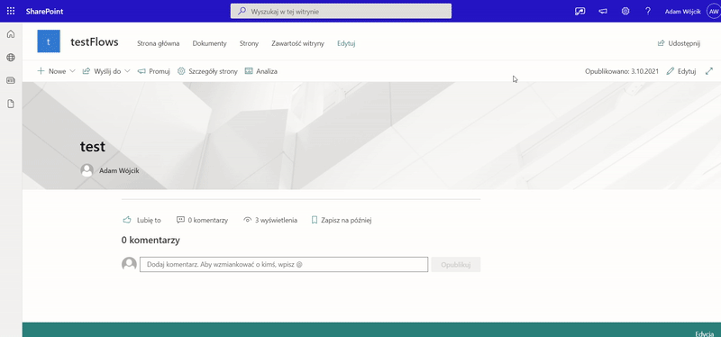
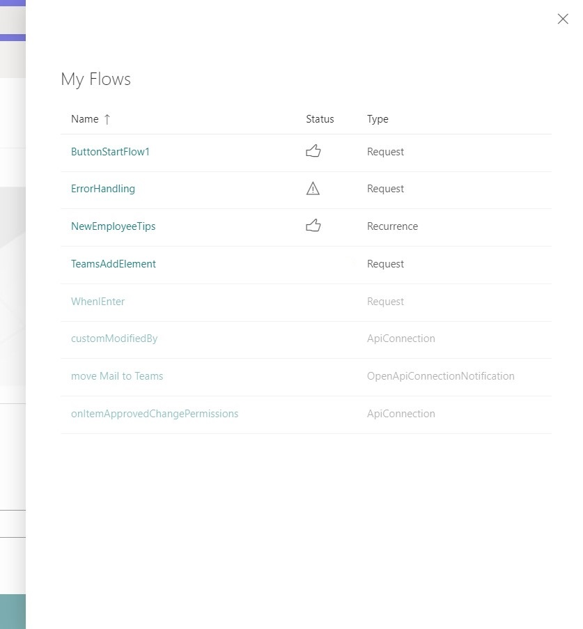
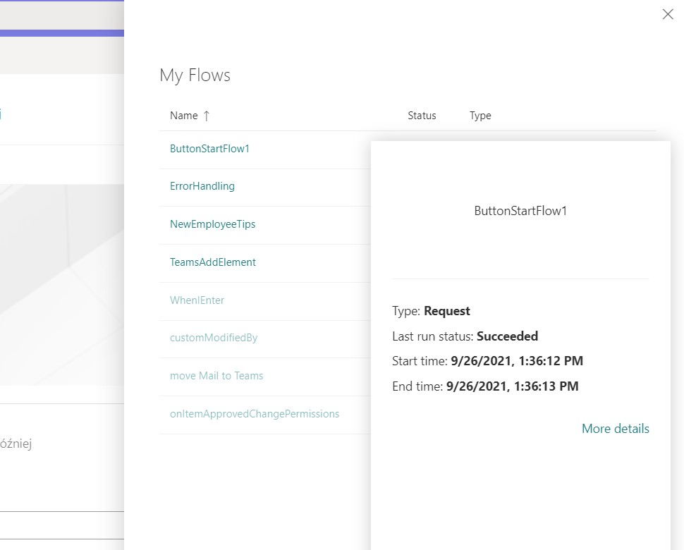
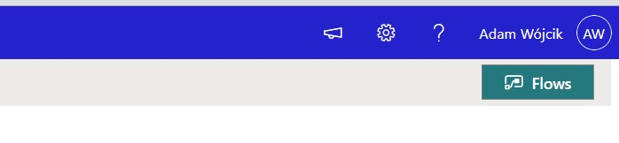
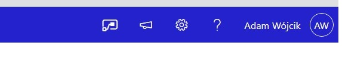

# react-application-my-flows-list

## Summary

This application extension allows the user to check list of flows and their current status and details.

The application button may be added in two locations. The first one (default) uses standard spfx PlaceholderName.Top region. 

The second one (not recommended approach as it uses HTML as API) presents the flow icon in the Suite Navigation Placeholder (in order to change the mode set headerButtonRegion to true).

## Used SharePoint Framework Version

## Applies to

- [SharePoint Framework](https://aka.ms/spfx)
- [Microsoft 365 tenant](https://docs.microsoft.com/en-us/sharepoint/dev/spfx/set-up-your-developer-tenant)

> Get your own free development tenant by subscribing to [Microsoft 365 developer program](http://aka.ms/o365devprogram)

## Prerequisites

This extensions uses power automate API which needs additional permissions to be added (and approved) for the Extensibility Web Application in AAD. In Order to add that please fallow those steps:
1. Go to the portal.azure.com -> App registrations,
2. Open the "SharePoint Online Client Extensibility Web Application Principal" app 
3. select API permissions,
4. Add new permission and switch tab to "APIs my organization uses",
5. Find "Microsoft Flow Service",
6. Add Flows.Read.All
7. Grant admin consent and you are ready to go.

## Solution

Solution|Author(s)
--------|---------
react-application-my-flows-list | [Adam Wójcik](https://github.com/Adam-it)

## Version history

Version|Date|Comments
-------|----|--------
1.0|October 3, 2021|Initial release

## Minimal Path to Awesome

- Clone this repository
- Ensure that you are at the solution folder
- in the command-line run:
  - **npm install**
  - **gulp serve**

## Features

Description of the extension that expands upon high-level summary above.

This extension illustrates the following concepts:

- use power automate (flow) api in spfx extension
- use office-ui-fabric-react controls when possible

## Disclaimer

**THIS CODE IS PROVIDED *AS IS* WITHOUT WARRANTY OF ANY KIND, EITHER EXPRESS OR IMPLIED, INCLUDING ANY IMPLIED WARRANTIES OF FITNESS FOR A PARTICULAR PURPOSE, MERCHANTABILITY, OR NON-INFRINGEMENT.**

---