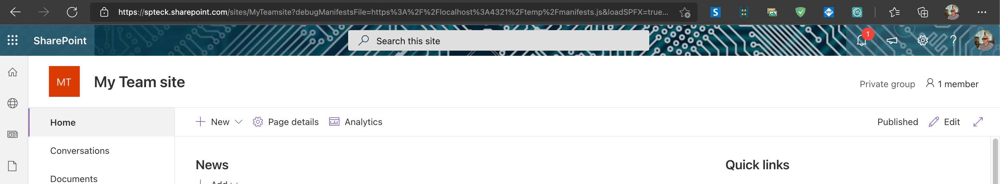
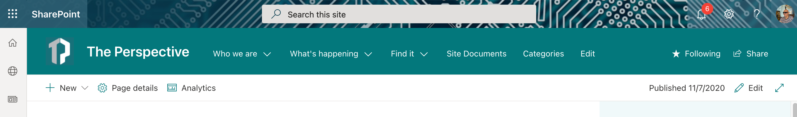
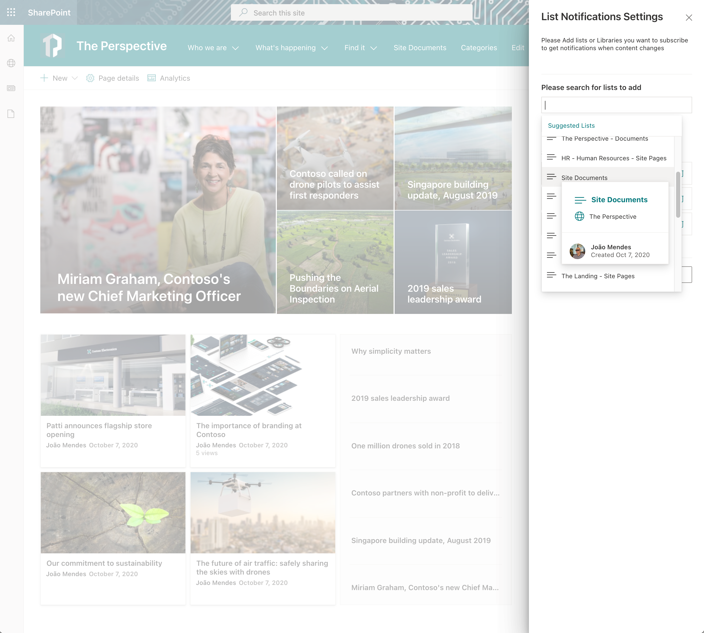

# My Lists Notifications

## Summary

This application extension alow user receive notifications from selected lists or libraries


<br/>

 
 <br/>
  
<br/>

  
  <br/>

  
  <br/>
  
  
## Used SharePoint Framework Version


## Applies to

- [SharePoint Framework](https://aka.ms/spfx)
- [Microsoft 365 tenant](https://docs.microsoft.com/en-us/sharepoint/dev/spfx/set-up-your-developer-tenant)

> Get your own free development tenant by subscribing to [Microsoft 365 developer program](http://aka.ms/o365devprogram)
      

## Solution

Solution|Author(s)
--------|---------
react-application-my-lists-notifications | [João Mendes](https://github.com/joaojmendes) ([@joaojmendes](https://twitter.com/joaojmendes))

## Version history

Version|Date|Comments
-------|----|--------
1.0|July 8, 2021|Initial release

## Pre-requisites

Microsoft Graph permissions required:

```json
  {
    "resource": "Microsoft Graph", 
    "scope": "Sites.ReadWrite.All"
  }      
```

After deployed to the AppCatalog this permissions need to be approved in SharePoint Central Admin.


## Minimal Path to Awesome

- Clone this repository
- Ensure that you are at the solution folder
- in the command-line run:
  - **npm install**
  - **gulp serve**


## Features

Description of the extension that expands upon high-level summary above.

This extension illustrates the following concepts:

- Use Microsoft Graph API's to get activities from lists / Library
- Use Microsoft Graph Search to search lists / Library
- Save custom settings on Apps OnDrive folder
- Use SocketIO server of lists to get real time notifications

## References

- [Getting started with SharePoint Framework](https://docs.microsoft.com/en-us/sharepoint/dev/spfx/set-up-your-developer-tenant)
- [Building for Microsoft teams](https://docs.microsoft.com/en-us/sharepoint/dev/spfx/build-for-teams-overview)
- [Use Microsoft Graph in your solution](https://docs.microsoft.com/en-us/sharepoint/dev/spfx/web-parts/get-started/using-microsoft-graph-apis)
- [Publish SharePoint Framework applications to the Marketplace](https://docs.microsoft.com/en-us/sharepoint/dev/spfx/publish-to-marketplace-overview)
- [Microsoft 365 Patterns and Practices](https://aka.ms/m365pnp) - Guidance, tooling, samples and open-source controls for your Microsoft 365 development

## Disclaimer

**THIS CODE IS PROVIDED *AS IS* WITHOUT WARRANTY OF ANY KIND, EITHER EXPRESS OR IMPLIED, INCLUDING ANY IMPLIED WARRANTIES OF FITNESS FOR A PARTICULAR PURPOSE, MERCHANTABILITY, OR NON-INFRINGEMENT.**


## Help

We do not support samples, but we this community is always willing to help, and we want to improve these samples. We use GitHub to track issues, which makes it easy for  community members to volunteer their time and help resolve issues.

If you encounter any issues while using this sample, [create a new issue](https://github.com/pnp/sp-dev-fx-extensions/issues/new?assignees=&labels=Needs%3A+Triage+%3Amag%3A%2Ctype%3Abug-suspected&template=bug-report.yml&sample=react-application-my-lists-notifications&authors=@joaojmendes&title=react-application-my-lists-notifications%20-%20).

For questions regarding this sample, [create a new question](https://github.com/pnp/sp-dev-fx-extensions/issues/new?assignees=&labels=Needs%3A+Triage+%3Amag%3A%2Ctype%3Abug-suspected&template=question.yml&sample=react-application-my-lists-notifications&authors=@joaojmendes&title=react-application-my-lists-notifications%20-%20).

Finally, if you have an idea for improvement, [make a suggestion](https://github.com/pnp/sp-dev-fx-extensions/issues/new?assignees=&labels=Needs%3A+Triage+%3Amag%3A%2Ctype%3Abug-suspected&template=suggestion.yml&sample=react-application-my-lists-notifications&authors=@joaojmendes&title=react-application-my-lists-notifications%20-%20).


