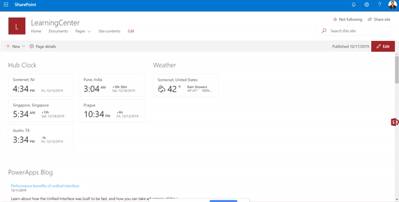

# My Followed Sites Application Customizer

## Summary
Sample SharePoint Framework application customizer extension that shows current user followed sites across tenant using office ui fabric panel. Fabric UI React components used include - panel, shimmer, Link and Icon. This sample uses SharePoint Social REST API call with help of PnPjs.




## Used SharePoint Framework Version 


## Applies to

* [SharePoint Framework Extensions](https://dev.office.com/sharepoint/docs/spfx/extensions/overview-extensions)

## Solution

Solution|Author(s)
--------|---------
react-application-myfollowedsites | Rahul Suryawanshi ([@rahulsuryawanshi](https://twitter.com/rahulsuryawansh))

## Version history

Version|Date|Comments
-------|----|--------
1.0|December 02, 2019|Initial release
2.0|June 12, 2020|Updated to SharePoint Framework V1.10.0
## Disclaimer
**THIS CODE IS PROVIDED *AS IS* WITHOUT WARRANTY OF ANY KIND, EITHER EXPRESS OR IMPLIED, INCLUDING ANY IMPLIED WARRANTIES OF FITNESS FOR A PARTICULAR PURPOSE, MERCHANTABILITY, OR NON-INFRINGEMENT.**

---

## Minimal Path to Awesome

- Clone this repository
- Update the `pageUrl` properties in the **config/serve.json** file
  - The `pageUrl` should be a modern page
  - This property is only used during development in conjunction with the `gulp serve` command
- In the command line navigate to **samples/ react-application-myfollowedsites** and run:
  - `npm install`
  - `gulp serve`
- In a web browser
  - Choose **Load Debug Scripts** when prompted
  - Hope that you will see 'Sites' office-ui-fabirc-icon middle right of the page.
  - Click on icon to view the sites you following.
- Deploy
  - In the command line navigate to **samples/ react-application-myfollowedsites** and run:
   - `gulp clean`
   - `gulp bundle --ship`
   - `gulp package-solution --ship`
  - Upload 'react-application-myfollowedsites.sppkg' from **sharepoint\solutions** folder to site collection or tenant app catalog.
  - Trust web part.
  - Click on site Settings `*` and **add an app**.
  - Find extension with title **react-application-myfollowedsites** and add.
  - Wait for extension to be added on site.
  - Extension displays React sites logo in middle-right of all modern pages.

## Features

This extension illustrates the following concepts:

- Using **React** for building SharePoint Framework client-side solutions.
- Using **@PnPjs** JavaScript library with **SharePoint Social API**
- Using **Office UI Fabric React** styles for building user experience consistent with SharePoint and Office.
- Adapting **Office UI Fabric styles**
- Caching data using **sessionstorage**
- Refresh button to freshly load all user followed sites from server.
- Display site logo associated with each site. 
- Hides sites which user followed earlier but have no more access permissions.


## Debug URL for testing
Here's a debug querystring for testing this sample:

```
?loadSPFX=true&debugManifestsFile=https://localhost:4321/temp/manifests.js&customActions={"bee2c587-d4e2-4c74-b337-aa2b9a2116eb":{"location":"ClientSideExtension.ApplicationCustomizer","properties":{}}}
```

Your URL will look similar to the following (replace with your domain and site address):
```
https://yourtenant.sharepoint.com/sites/yoursite?loadSPFX=true&debugManifestsFile=https://localhost:4321/temp/manifests.js&customActions={"bee2c587-d4e2-4c74-b337-aa2b9a2116eb":{"location":"ClientSideExtension.ApplicationCustomizer","properties":{}}}
```

#### Prerequisites

None


