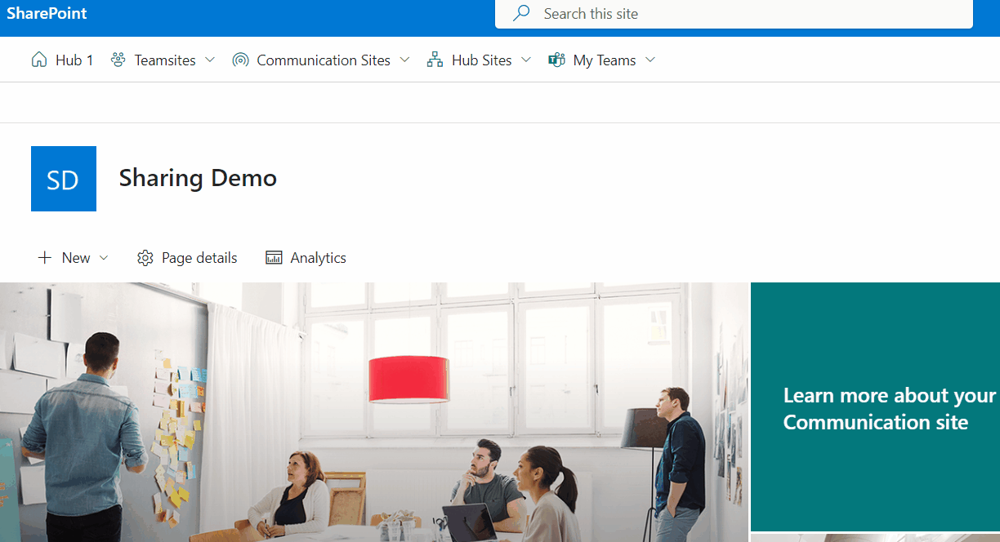
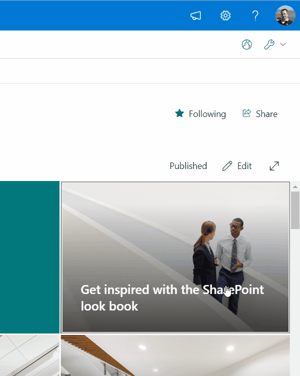
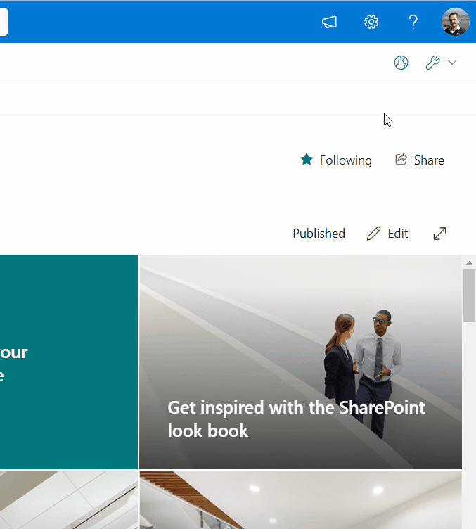

# Application Top Placeholder Navigation

## Summary

This is an SPFx extension acting as a Top placeholder. It uses a FluentUi CommandBar to display a search-driven navigation and diverse permission settings of artefacts in the current side on the right. It furthermore notifies if current site is enabled for external sharing or not.

Menu live in action inside a Communication site



Site and list permissions in right-side panel live in action



External Sharing and Sharing Links in right-side panel live in action



For further details see the author's [blog series](https://mmsharepoint.wordpress.com/2023/07/27/a-search-driven-navigation-with-sharepoint-framework-spfx-extension-and-fluentui/)

## Compatibility


-Incompatible-red.svg "SharePoint Server 2016 Feature Pack 2 requires SPFx 1.1")


Tested with Node version:v18.20.2

## Applies to

- [SharePoint Framework](https://aka.ms/spfx)
- [Microsoft 365 tenant](https://docs.microsoft.com/en-us/sharepoint/dev/spfx/set-up-your-developer-tenant)

> Get your own free development tenant by subscribing to [Microsoft 365 developer program](http://aka.ms/o365devprogram)

## Contributors

* [Markus Moeller]([https://g](https://github.com/mmsharepoint))
* [Dinesh Girase](https://github.com/dgirase)

## Version history

Version|Date|Author|Comments
-------|----|----|--------
0.1|Jul 27, 2023|[Markus Moeller](https://twitter.com/moeller2_0)|Initial release
1.0|Aug 11, 2023|[Markus Moeller](https://twitter.com/moeller2_0)|Public release
1.1|Jan 20, 2024|[Markus Moeller](https://twitter.com/moeller2_0)|Upgraded to SPFx 1.18.2
1.2|Oct 23, 2024|[Dinesh Girase](https://github.com/dgirase)|Upgraded to SPFx 1.20.0


## Minimal Path to Awesome

- Clone this repository
- Ensure that you are at the solution folder
- in the command-line run:
  - `npm install`
  - `gulp serve --nobrowser`

- To grant necessary MS Graph permissions for some functionality
  - Either grant them manually (see package-solution.json which ones)
  - Grant them via Admin center
  - in the command-line run:
  - `gulp bundle --ship`
  - `gulp package-solution --ship`
  - Upload app to app catalog
  - Enable
  - Grant requested permissions via API access as suggested
- Open a SharePoint site of your choice
- Attach the following to your site URL:
  ```
  ?loadSPFX=true&debugManifestsFile=https://localhost:4321/temp/manifests.js&customActions={"315298b1-ad03-4730-8423-0a07941a96d9":{"location":"ClientSideExtension.ApplicationCustomizer","properties":{"useTeamsites":true,"useCommsites": true,"useHubsites": true,"useTeams": true,"useGraph": true}}}
  ```
- Confirm 'Load Debug Scripts'
- Play around with the properties in above's URL

## Features

* [Create a SharePoint framework extension application placeholder](https://learn.microsoft.com/en-us/sharepoint/dev/spfx/extensions/get-started/using-page-placeholder-with-extensions?WT.mc_id=M365-MVP-5004617)
* [Use the MSGraphClientV3 to connect to Microsoft Graph](https://learn.microsoft.com/en-us/sharepoint/dev/spfx/use-msgraph?WT.mc_id=M365-MVP-5004617)
  * [Use the Microsoft Search API to query data](https://learn.microsoft.com/en-us/graph/api/resources/search-api-overview?view=graph-rest-1.0&WT.mc_id=M365-MVP-5004617)
  * [Use Microsoft Graph API to handle sharing links](https://learn.microsoft.com/en-us/graph/api/shares-get?view=graph-rest-1.0&tabs=http&WT.mc_id=M365-MVP-5004617)
* [Use FluentUI CommandBar, ContextualMenu, Dialog, List, Panel, PersonaInitialsColor, Pivot, TextField (incl 'Clear' icon)](https://developer.microsoft.com/en-us/fluentui#/?WT.mc_id=M365-MVP-5004617)
* [Use SharePoint Rest API to work with permissions](https://learn.microsoft.com/en-us/sharepoint/dev/sp-add-ins/set-custom-permissions-on-a-list-by-using-the-rest-interface?WT.mc_id=M365-MVP-5004617)

## References

- [Getting started with SharePoint Framework](https://docs.microsoft.com/en-us/sharepoint/dev/spfx/set-up-your-developer-tenant)
- [Building for Microsoft teams](https://docs.microsoft.com/en-us/sharepoint/dev/spfx/build-for-teams-overview)
- [Use Microsoft Graph in your solution](https://docs.microsoft.com/en-us/sharepoint/dev/spfx/web-parts/get-started/using-microsoft-graph-apis)
- [Publish SharePoint Framework applications to the Marketplace](https://docs.microsoft.com/en-us/sharepoint/dev/spfx/publish-to-marketplace-overview)
- [Microsoft 365 Patterns and Practices](https://aka.ms/m365pnp) - Guidance, tooling, samples and open-source controls for your Microsoft 365 development

