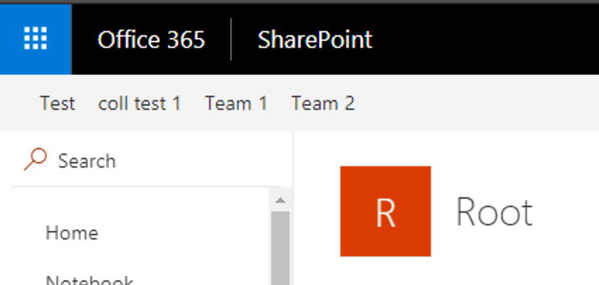

# Modern Team Sites (Office Groups) Navigation Application Customizer

## Summary
The sample illustrates how to use AadHttpClient to request Groups information from Microsoft Graph



## Used SharePoint Framework Version 
SPFx Extensions (1.4.1)

## Applies to

* [SharePoint Framework](http://dev.office.com/sharepoint/docs/spfx/sharepoint-framework-overview)

Solution|Author(s)
--------|---------
office-groups-nav-client-side-solution | Alex Terentiev ([Sharepointalist Inc.](http://www.sharepointalist.com), [AJIXuMuK](https://github.com/AJIXuMuK))

## Version history

Version|Date|Comments
-------|----|--------
1.0|February 17, 2018|Initial release


## Disclaimer
**THIS CODE IS PROVIDED *AS IS* WITHOUT WARRANTY OF ANY KIND, EITHER EXPRESS OR IMPLIED, INCLUDING ANY IMPLIED WARRANTIES OF FITNESS FOR A PARTICULAR PURPOSE, MERCHANTABILITY, OR NON-INFRINGEMENT.**

## Features
This project contains SharePoint Framework Application Customizer extension that illustrates next features:
* application customizer
* usage of Page Placeholders
* usage of `AadHttpClient`
* usage of Microsoft Graph
* usage of Office UI Fabric `CommandBar` component

## Requested MS Graph Permissions
```json
"webApiPermissionRequests": [{
    "resource": "Microsoft Graph",
    "scope": "Directory.Read.All"
}, {
    "resource": "Microsoft Graph",
    "scope": "Group.Read.All"
}]
```

## Building and debugging the code

```bash
git clone the repo
npm i
npm i -g gulp
gulp serve --nobrowser
```

On your SharePoint tenant:
* go to **MODERN** SharePoint Admin Center, Select **API Management** and approve requested permissions
* go to any modern page or modern list/document library and add next query string to the url:
```
?loadSPFX=true&debugManifestsFile=https://localhost:4321/temp/manifests.js&customActions={"42b231f6-931e-43e1-9391-6bac1ee4dcb6":{"location":"ClientSideExtension.ApplicationCustomizer","properties":{}}}
```
