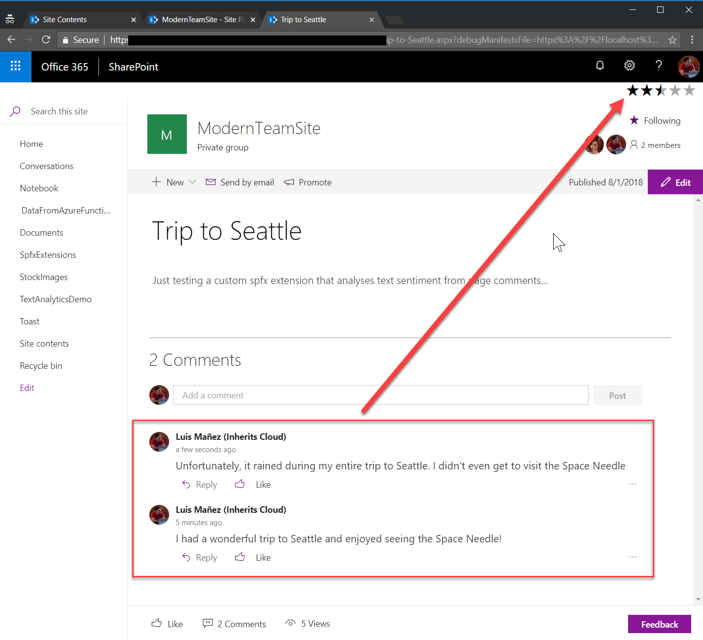

# Spfx Application Customiser sample using Text Analytics API

## Summary
This sample shows how to use the Text Analytics API (Cognitive Services) to render a rating icon based on the different comments in page.

## Used SharePoint Framework Version

## Applies to

* [SharePoint Framework Extensions Developer Preview](https://dev.office.com/sharepoint/docs/spfx/extensions/overview-extensions)
* [Office 365 developer tenant](http://dev.office.com/sharepoint/docs/spfx/set-up-your-developer-tenant)

## Solution

Solution|Author(s)
--------|---------
react-application-page-comments-sentiment|Luis Mañez (MVP, [ClearPeople](http://www.clearpeople.com), @luismanez)

## Version history

Version|Date|Comments
-------|----|--------
1.0.0|August 1, 2018|Initial release

## Disclaimer

**THIS CODE IS PROVIDED *AS IS* WITHOUT WARRANTY OF ANY KIND, EITHER EXPRESS OR IMPLIED, INCLUDING ANY IMPLIED WARRANTIES OF FITNESS FOR A PARTICULAR PURPOSE, MERCHANTABILITY, OR NON-INFRINGEMENT.**

---

## Prerequisites

* Cognitive Services Text Analytics API Key (more info [https://azure.microsoft.com/en-us/services/cognitive-services/](https://azure.microsoft.com/en-us/services/cognitive-services/))

## Minimal Path to Awesome

* register a Cognitive Services Vision API in your Azure subscription
* clone repo
* add a content page in a Modern site with a couple of comments (only the 1st 3 comments are processed)
* update serve.json pointing to your content page
* run _gulp serve --configuration=pageSentiment_

## Features

Sample SharePoint Framework application customiser calling the Cognitive Services Text Analytics API and showing the _sentiment_ based on the top 3 page comments.
The sentiment is rendered using a rating component.

This sample illustrates the following concepts on top of the SharePoint Framework:

* using REST API and spHttpClient to get page top 3 comments
* using Text Analytics API to get the sentiment score from a given Text
* using async / await for the async calls
* using Rating office fabric UI component

## Interesting links

* [How to detect sentiment in Text Analytics](https://docs.microsoft.com/en-us/azure/cognitive-services/text-analytics/how-tos/text-analytics-how-to-sentiment-analysis)
* [Testing Text API website](https://westus.dev.cognitive.microsoft.com/docs/services/TextAnalytics.V2.0/operations/56f30ceeeda5650db055a3c7)
