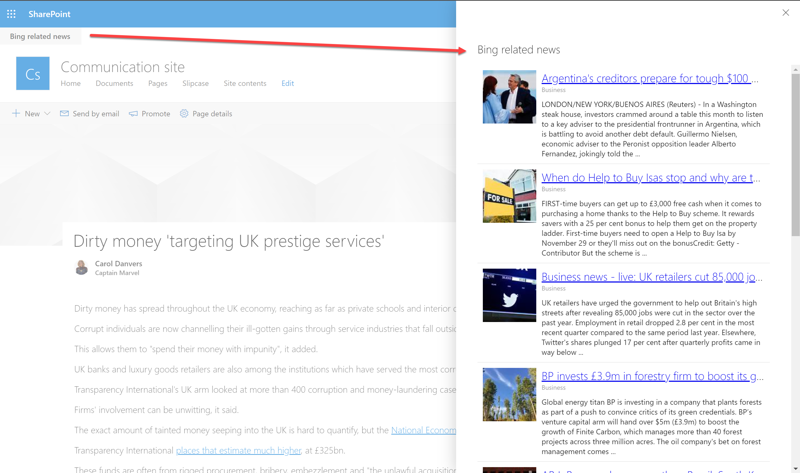

# Spfx Application Customiser sample using Bing Search API

## Summary
This sample shows how to use the Bing Search API (Cognitive Services) to get news article related with the current page. That relation is set using the value of a specific Managed metadata field in the page. We are searching news articles in the UK market, so the possible _category_ values are listed here:
  * Business
  * Entertainment
  * Health
  * Politics
  * ScienceAndTechnology
  * Sports
  * UK
  * World

You can find the supported categories per market in this link: [https://docs.microsoft.com/en-us/rest/api/cognitiveservices-bingsearch/bing-news-api-v7-reference#news-categories-by-market](https://docs.microsoft.com/en-us/rest/api/cognitiveservices-bingsearch/bing-news-api-v7-reference#news-categories-by-market)

## Used SharePoint Framework Version

## Applies to

* [SharePoint Framework Extensions](https://dev.office.com/sharepoint/docs/spfx/extensions/overview-extensions)
* [Office 365 developer tenant](http://dev.office.com/sharepoint/docs/spfx/set-up-your-developer-tenant)

## Solution

Solution|Author(s)
--------|---------
react-application-page-related-bing-news|Luis Mañez (MVP, [ClearPeople](http://www.clearpeople.com), @luismanez)

## Version history

Version|Date|Comments
-------|----|--------
1.0.0|October 25, 2019|Initial release

## Disclaimer

**THIS CODE IS PROVIDED *AS IS* WITHOUT WARRANTY OF ANY KIND, EITHER EXPRESS OR IMPLIED, INCLUDING ANY IMPLIED WARRANTIES OF FITNESS FOR A PARTICULAR PURPOSE, MERCHANTABILITY, OR NON-INFRINGEMENT.**

---

## Prerequisites

* Cognitive Services Bing Search API Key (more info [https://docs.microsoft.com/en-us/azure/cognitive-services/bing-news-search/search-the-web](https://docs.microsoft.com/en-us/azure/cognitive-services/bing-news-search/search-the-web))

## Minimal Path to Awesome

* register a Cognitive Services Bing Search API in your Azure subscription
* clone repo
* create a new TermSet with the following terms:
  * Business
  * Entertainment
  * Health
  * Politics
  * ScienceAndTechnology
  * Sports
  * UK
  * World
* add a new Managed Metadata column called _CategoryNews_ to the Pages library
* create a new page, setting the _CategoryNews_ field
* update serve.json pointing to your content page and Bing API Key
* run _gulp serve

## Features

Sample SharePoint Framework application customiser calling the Cognitive Services Bing Search API and bringing back related news articles based in a value in a page field.

This sample illustrates the following concepts on top of the SharePoint Framework:

* using REST API and spHttpClient to get a field of the current page
* using Bing News Search API to get news articles for a specific market and category
* using async / await for the async calls
* using different office fabric UI components like Panel or ProgressBar

## Roadmap
* refactoring in more small components
* for demo purposes, currently is calling the API when the page is loaded. Future versions will call the API only when the button is pressed
