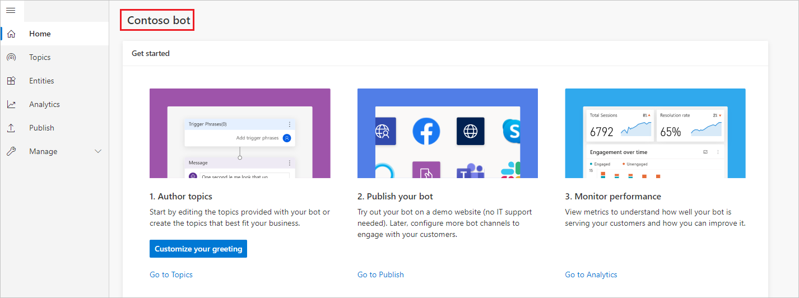
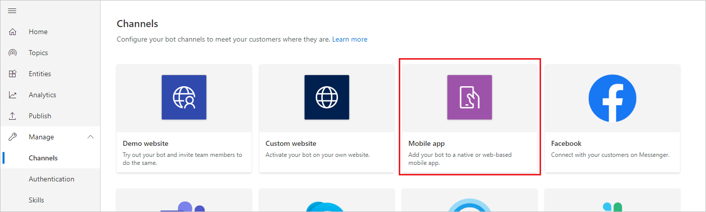
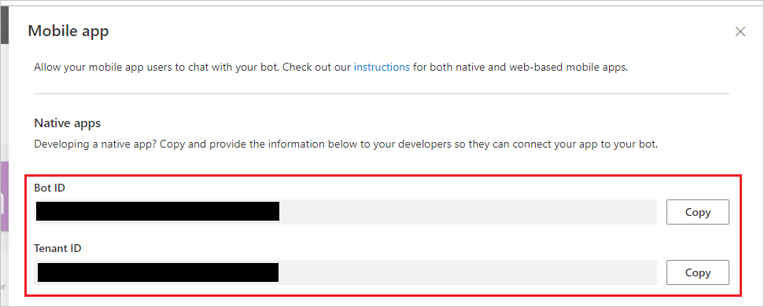
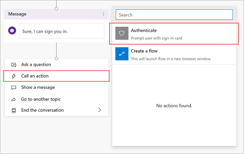
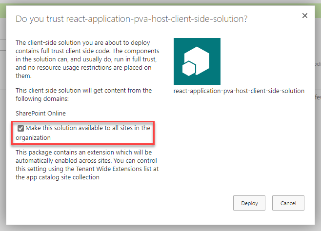
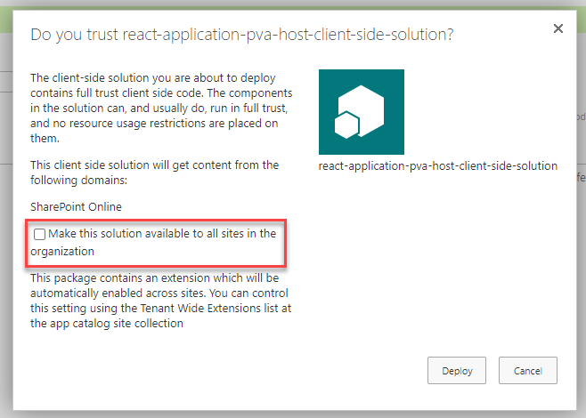
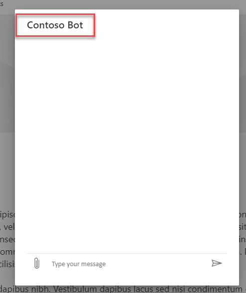
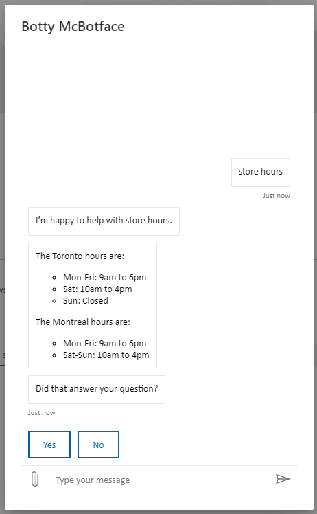
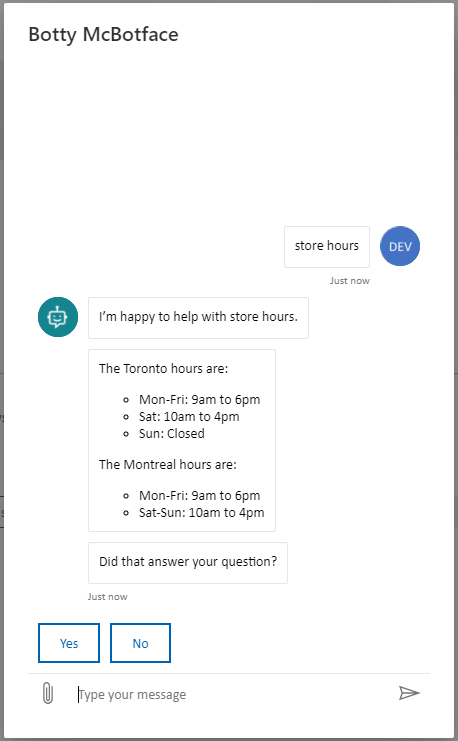

# Power Virtual Agents Bot Host

## Summary

Adds footer to launch a Power Virtual Agents chatbot window from any page.


This sample is inspired by the work of [Renato Romão](https://github.com/renatoromao) and re-uses techniques from the [Bot framework SSO sample](https://github.com/pnp/sp-dev-fx-extensions/tree/main/samples/react-bot-framework-sso).


## Compatibility

 
 


## Applies to

* [SharePoint Framework](https://docs.microsoft.com/sharepoint/dev/spfx/sharepoint-framework-overview)
* [Microsoft 365 tenant](https://docs.microsoft.com/sharepoint/dev/spfx/set-up-your-developer-tenant)
* [Microsoft Power Virtual Agents](https://powervirtualagents.microsoft.com/)

## Solution

Solution|Author(s)
--------|---------
react-application-pva-bot | [Hugo Bernier](https://github.com/hugoabernier) ([@bernierh](https://twitter.com/bernierh)), Microsoft
react-application-pva-bot | [Dmitry Vorobyov](https://github.com/DmitryVorobyov) ([@dmitryvorobyov](https://twitter.com/dmitryvrbyov)), Microsoft
spfx-powervirtualagents|[Renato Romão](https://github.com/renatoromao) ([@renatooromao](@https://twitter.com/renatooromao))

## Version history

Version|Date|Comments
-------|----|--------
1.0|June 5, 2021|Initial release


## Prerequisites

In order to use this extension, you'll need to create a Power Virtual Agent chatbot first. If you have not created one yet, create one following [these instructions](https://docs.microsoft.com/power-virtual-agents/authoring-first-bot).


### Retrieve your Power Virtual Agents bot parameters
To connect the extension to the bot you have built with Power Virtual Agents, you will need to retrieve your bot's name, bot ID and tenant ID to identify it.

1. Copy your bot's name in Power Virtual Agents.

    

1. Select **Manage** on the side navigation pane, and then go to the **Channels** tab.

1. Select **Mobile app**.

    

1. Copy and save the *Bot ID* and *Tenant ID* value by clicking **Copy**. You will need these in the [Configure Application Extension](#configure-application-extension) step.

    

For more information and updated instructions, please visit [Add bot to mobile and custom apps](https://docs.microsoft.com/en-us/power-virtual-agents/publication-connect-bot-to-custom-application)

### Adding Authentication Support

For security and privacy reasons, all chatbot conversations initiated from this extension begin as anonymous conversations. 

However, you can configure single sign-on with Azure Active Directory. When your chat topics contain an authentication node template, users will be prompted to log in.


To do so, follow these steps:

1. [Create an app registration in Azure AD](https://docs.microsoft.com/power-virtual-agents/configure-sso#create-an-app-registration-in-azure-ad-for-your-custom-canvas).
2. [Define a custom scope for your bot](https://docs.microsoft.com/power-virtual-agents/configure-sso#define-a-custom-scope-for-your-bot). 
3. [Configure authentication in Power Virtual Agents to enable single sign-on](https://docs.microsoft.com/power-virtual-agents/configure-sso#configure-authentication-in-power-virtual-agents-to-enable-single-sign-on)
4. For any topics that require authentication, [add the authentication node template](https://docs.microsoft.com/power-virtual-agents/advanced-end-user-authentication#add-user-authentication-to-a-topic)


**NOTE:** On the above instructions, you do can skip the last section -- titled *Configure your custom canvas HTML code to enable single sign-on* -- as this extension already takes care of this step for you.

For more information and updated instructions, please visit [Configure single sign-on with Azure Active Directory in Power Virtual Agents](https://docs.microsoft.com/power-virtual-agents/configure-sso).

## Minimal Path to Awesome

- Clone this repository
- in the command line run:
  - `npm install`
  - `gulp serve`

### To deploy to all site collections

  - In the command line, run:
    - `gulp dist`

    > Alternatively, you can use these commands (`gulp dist` is a shortcut that runs all these commands):
    >  - `gulp clean`
    >  - `gulp build`
    >  - `gulp bundle --ship`
    >  - `gulp package-solution --ship`

  - Upload the `.sppkg` file to your tenant's **App Catalog**. The `.sppkg` file will be placed in the `sharepoint\solution` folder.
  - When prompted **Do you trust react-application-pva-bot-client-side-solution?**, select **Make this solution available to all sites in the organization**
  - Select **Deploy**

    
  - From the **App Catalog**, go to **Site contents**
  - Browse to the **Tenant Wide Extensions** library
  - Edit the list item called **PowerVirtualAgentsHost**
  - In the **Component Properties** field, enter a valid JSON configuration (see [configuration](#configuration) below). 

    **NOTE:** If you need to update the extension solution, you don't to select **Make this solution available to all sites in the organization** again -- unless you want another instance of the extension added to all site collections.

    You can use this sample JSON as a template:

    ```json
    {
      "botId": "YOUR-BOT-GUID",
      "botFriendlyName": "Contoso Bot",
      "buttonLabel": "Chat with Contoso Bot",
      "tenantId": "YOUR-TENANT-GUID",
      "botAvatarImage": "https://your-bot-avatar-image-url",
      "botAvatarInitials": "CB",
      "greet": false
    }
    ```
### To deploy to a single site collection

  - Edit the `element.xml` file, located in the `sharepoint\assets` folder
  - Place your desired configuration in the `ClientSideComponentProperties` tag. Note that you'll need to XML encode the string.

    For example, this JSON configuration:

    ```json
    {
      "botId": "YOUR-BOT-GUID",
      "botFriendlyName": "Contoso Bot",
      "buttonLabel": "Chat with Contoso Bot",
      "tenantId": "YOUR-TENANT-GUID",
      "botAvatarImage": "https://your-bot-avatar-image-url",
      "botAvatarInitials": "CB",
      "greet": false
    }
    ```

    Would equal to this XML encoded value in the `elements.xml` file:

    ```xml
    ClientSideComponentProperties="{&quot;botId&quot;: &quot;YOUR-BOT-GUID&quot;,&quot;botFriendlyName&quot;: &quot;Contoso Bot&quot;,&quot;buttonLabel&quot;: &quot;Chat with Contoso Bot&quot;,&quot;tenantId&quot;: &quot;YOUR-TENANT-GUID&quot;,&quot;botAvatarImage&quot;: &quot;https://your-bot-avatar-image-url&quot;,&quot;botAvatarInitials&quot;: &quot;CB&quot;,&quot;greet&quot;: false}"
    ```

  - Build the solution by using the command line and entering the following command:
    - `gulp dist`
  - Upload the `.sppkg` file to your tenant's **App Catalog**. The `.sppkg` file will be placed in the `sharepoint\solution` folder.
  - When prompted **Do you trust react-application-pva-bot-client-side-solution?**, **do not** select **Make this solution available to all sites in the organization**
  
    
  - Select **Deploy**
  - Go to any site collection where you wish to display the extension.
  - Select the gear icon on the top navigation bar on the right, and then select **Add an app**
  - Find the **react-application-pva-bot-client-side-solution** extension from the list of apps to install the extension on the site collection. 
  - When the installation is completed, refresh the page or use <kbd>F5</kbd>.


## Features

This extension illustrates the following concepts using Power Virtual Agents:

- Launching single sign-on authentication
- Displaying user profile image and bot avatar
- Greeting user when launching chat bot

### Configuration

This extension supports multiple configuration which can change how the chatbot works.

The following is a list of configuration settings:

| Property | Type | Required | Description |
|--|---|---|---|
| `botId` | string (GUID) | Yes | The bot id GUID |
| `tenantId` | string (GUID) | Yes | The tenant id GUID |
| `botFriendlyName` | string  | No | The bot's friendly name. This is what will show up in the dialog box |
| `buttonLabel` | string  | No | The label that you want to show on the button to launch the bot dialog |
| `botAvatarImage` | string (URL) | No | The URL to the image you wish to display as the bot's avatar. Must be used with `botAvatarInitials` |
| `botAvatarInitials` | string | No | The initials you wish to display as the bot's avatar. Must be used with `botAvatarImage` |
| `greet` | boolean | No | `true` will automatically greet the user when they launch the chatbot by launching the `Greeting` system topic.  |




**`botFriendlyName` attribute**


**`buttonLabel` attribute**

Note that if you set the `botAvatarInitials`, you also need to specify `botAvatarImage`; Doing so will cause the chat dialog to display the user's profile image as well.



**Without `botAvatarInitials` and `botAvatarImage`**



**With `botAvatarInitials` and `botAvatarImage` values**


**With `greeting` set to `true`**


## Debug URL for testing
Here's a debug URL for testing around this sample. 

```
?loadSPFX=true&debugManifestsFile=https://localhost:4321/temp/manifests.js&customActions={"361d8846-81a4-490b-8cc9-ff67d211faaa":{"location":"ClientSideExtension.ApplicationCustomizer","properties":{"botId":"YOUR-BOT-GUID", "tenantId": "YOUR-TENANT-ID"}}}
```

## References

- [Create and delete Power Virtual Agents bots](https://docs.microsoft.com/power-virtual-agents/authoring-first-bot)
- [Configure single sign-on with Azure Active Directory in Power Virtual Agents](https://docs.microsoft.com/power-virtual-agents/configure-sso)
- [Add bot to mobile and custom apps](https://docs.microsoft.com/power-virtual-agents/publication-connect-bot-to-custom-application)


## Disclaimer
**THIS CODE IS PROVIDED *AS IS* WITHOUT WARRANTY OF ANY KIND, EITHER EXPRESS OR IMPLIED, INCLUDING ANY IMPLIED WARRANTIES OF FITNESS FOR A PARTICULAR PURPOSE, MERCHANTABILITY, OR NON-INFRINGEMENT.**

## Help

We do not support samples, but we this community is always willing to help, and we want to improve these samples. We use GitHub to track issues, which makes it easy for  community members to volunteer their time and help resolve issues.

If you encounter any issues while using this sample, [create a new issue](https://github.com/pnp/sp-dev-fx-extensions/issues/new?assignees=&labels=Needs%3A+Triage+%3Amag%3A%2Ctype%3Abug-suspected&template=bug-report.yml&sample=react-application-pva-bot&authors=@bernierh%20@dmitryvorobyov%20@renatooromao&title=react-application-pva-bot%20-%20).

For questions regarding this sample, [create a new question](https://github.com/pnp/sp-dev-fx-extensions/issues/new?assignees=&labels=Needs%3A+Triage+%3Amag%3A%2Ctype%3Abug-suspected&template=question.yml&sample=react-application-pva-bot&authors=@bernierh%20@dmitryvorobyov%20@renatooromao&title=react-application-pva-bot%20-%20).

Finally, if you have an idea for improvement, [make a suggestion](https://github.com/pnp/sp-dev-fx-extensions/issues/new?assignees=&labels=Needs%3A+Triage+%3Amag%3A%2Ctype%3Abug-suspected&template=suggestion.yml&sample=react-application-pva-bot&authors=@bernierh%20@dmitryvorobyov%20@renatooromao&title=react-application-pva-bot%20-%20).


