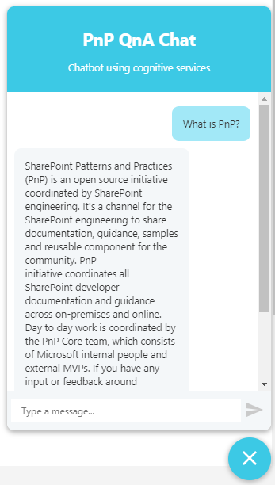

# QnA Chatbot 

## Summary
SPFx application extension that uses Azure QnA cognitive services to efficiently answer FAQs. 



## Used SharePoint Framework Version


## Applies to

* [SharePoint Framework Extensions](https://dev.office.com/sharepoint/docs/spfx/extensions/overview-extensions)

## Solution

Solution|Author(s)
--------|---------
react-application-qna-chat|Rodrigo Silva, @RodResendeSilva)

## Version history

Version|Date|Comments
-------|----|--------
1.0.0|February 23, 2017|Initial release

## Disclaimer

**THIS CODE IS PROVIDED *AS IS* WITHOUT WARRANTY OF ANY KIND, EITHER EXPRESS OR IMPLIED, INCLUDING ANY IMPLIED WARRANTIES OF FITNESS FOR A PARTICULAR PURPOSE, MERCHANTABILITY, OR NON-INFRINGEMENT.**

---

## Prerequisites

* Office 365 Developer tenant with a modern site collection 
* Cognitive Services QnA API Key and Knowledge Base ID 
(more info [https://docs.microsoft.com/en-us/azure/cognitive-services/qnamaker/home](https://docs.microsoft.com/en-us/azure/cognitive-services/qnamaker/home))
(quick start video [https://qnamaker.ai/Documentation/quickstart](https://qnamaker.ai/Documentation/quickstart)))

## Minimal Path to Awesome

* clone this repo
* edit "cognitiveservices.ts" file to set your Cognitive Services API Key and Knowledge Base ID:

```ts
private qnamakerSubscriptionKey: string = "[INSERT KEY HERE]";
private knowledgebaseId: string = "[INSERT KB ID HERE]";
```

* in the command line run
  * `npm i`
  * `gulp serve-info --nobrowser`

```
?loadSPFX=true&debugManifestsFile=https://localhost:4321/temp/manifests.js&customActions={"1b3557f3-315d-4187-8d58-60e88e93d654":{"location":"ClientSideExtension.ApplicationCustomizer"}}
```

## Features

Sample SharePoint Framework application extension.

This sample illustrates the following concepts on top of the SharePoint Framework:

* using QnA Cognitive Services API 
* how to improve your employees FAQ experience
* using async / await for the async calls
* how to take advantage of existing react npm packages

