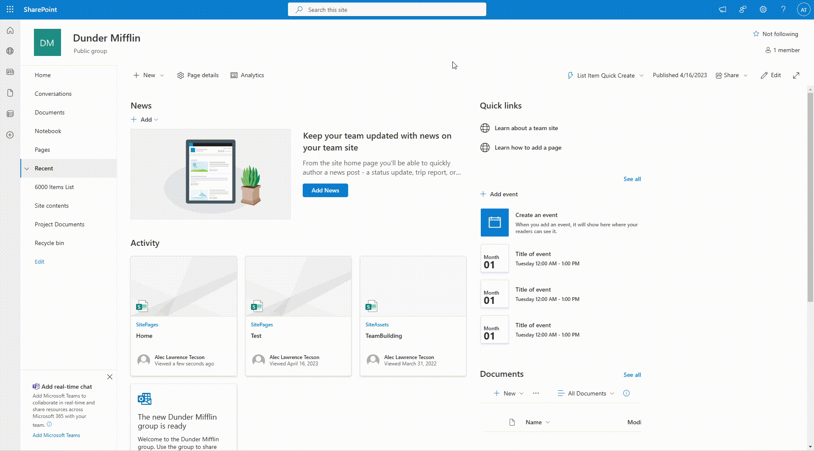

# Application Customizer Quick Create

## Summary

SharePoint Framework Application Customizer that injects a button to the command bar which shows all the lists in the site and have the ability to quickly create an item by showing the NewForm.aspx inside a panel. Inspired by Quick Create functionality by popular CRMs.




## Compatibility


-Incompatible-red.svg "SharePoint Server 2016 Feature Pack 2 requires SPFx 1.1")


## Applies to

* [SharePoint Framework](https://docs.microsoft.com/sharepoint/dev/spfx/sharepoint-framework-overview)
* [Microsoft 365 tenant](https://docs.microsoft.com/sharepoint/dev/spfx/set-up-your-developer-tenant)

> Get your own free development tenant by subscribing to [Microsoft 365 developer program](http://aka.ms/m365devprogram)

## Contributors
<!--
We use this section to recognize and promote your contributions. Please provide one author per line -- even if you worked together on it.

We'll only use the info you provided here. Make sure to include your full name, not just your GitHub username.

Provide a link to your GitHub profile to help others find more cool things you have done.

If you provide a link to your Twitter profile, we'll promote your contribution on social media.

If you do not update this information, you will not be listed 😞
-->

* [Alec Tecson](https://github.com/alecwantstobattle)

## Version history

Version|Date|Comments
-------|----|--------
1.0|September 30, 2024|Initial release


## Minimal Path to Awesome

<!-- 
PRO TIP:

For commands, use the `code syntax`

For button labels, page names, dialog names, etc. as they appear on the screen, use **Bold**

Don't use "click", use "select" or "use"

As tempting as it may be, don't just use images to describe the steps. Let's be as inclusive as possible and think about accessibility.

-->

* Clone this repository (or [download this solution as a .ZIP file](https://pnp.github.io/download-partial/?url=https://github.com/pnp/sp-dev-fx-extensions/tree/main/samples/react-application-quick-create) then unzip it)
* in the command line run:
  * `npm install`
  * `gulp serve`
* In a web browser
  * Choose **Load Debug Scripts** when prompted


## Features

This extension illustrates the following concepts:

* React functional components & hooks
* PnPjs usage in the solution
* Fluent UI React CommandButton and Panel components
* Styling components using `module.scss` and `styles.ts`

## Debug URL for testing

Here's a debug URL for testing around this sample.

```
?debugManifestsFile=https://localhost:4321/temp/manifests.js&loadSPFX=true&customActions={"029cc025-df6a-415b-9a05-988e1710992b":{"location":"ClientSideExtension.ApplicationCustomizer"}}
```


## Disclaimer

**THIS CODE IS PROVIDED *AS IS* WITHOUT WARRANTY OF ANY KIND, EITHER EXPRESS OR IMPLIED, INCLUDING ANY IMPLIED WARRANTIES OF FITNESS FOR A PARTICULAR PURPOSE, MERCHANTABILITY, OR NON-INFRINGEMENT.**

## Help

<!--
You can just search and replace this page with the following values:

Search for:
YOUR-SOLUTION-NAME

Replace with your sample folder name. E.g.: react-my-cool-sample

Search for:
@YOURGITHUBUSERNAME

Replace with your GitHub username, prefixed with an "@". If you have more than one author, use %20 to separate them, making sure to prefix everyone's username individually with an "@".

Example:
@hugoabernier

Or:
@hugoabernier%20@VesaJuvonen%20@PopWarner
-->

We do not support samples, but we this community is always willing to help, and we want to improve these samples. We use GitHub to track issues, which makes it easy for  community members to volunteer their time and help resolve issues.

You can try looking at [issues related to this sample](https://github.com/pnp/sp-dev-fx-extensions/issues?q=label%3AYOUR-SOLUTION-NAME) to see if anybody else is having the same issues.

You can also try looking at [discussions related to this sample](https://github.com/pnp/sp-dev-fx-extensions/discussions?discussions_q=label%3AYOUR-SOLUTION-NAME) and see what the community is saying.

If you encounter any issues while using this sample, [create a new issue](https://github.com/pnp/sp-dev-fx-extensions/issues/new?assignees=&labels=Needs%3A+Triage+%3Amag%3A%2Ctype%3Abug-suspected&template=bug-report.yml&sample=YOUR-SOLUTION-NAME&authors=@YOURGITHUBUSERNAME&title=YOUR-SOLUTION-NAME%20-%20).

For questions regarding this sample, [create a new question](https://github.com/pnp/sp-dev-fx-extensions/issues/new?assignees=&labels=Needs%3A+Triage+%3Amag%3A%2Ctype%3Abug-suspected&template=question.yml&sample=YOUR-SOLUTION-NAME&authors=@YOURGITHUBUSERNAME&title=YOUR-SOLUTION-NAME%20-%20).

Finally, if you have an idea for improvement, [make a suggestion](https://github.com/pnp/sp-dev-fx-extensions/issues/new?assignees=&labels=Needs%3A+Triage+%3Amag%3A%2Ctype%3Abug-suspected&template=suggestion.yml&sample=YOUR-SOLUTION-NAME&authors=@YOURGITHUBUSERNAME&title=YOUR-SOLUTION-NAME%20-%20).

