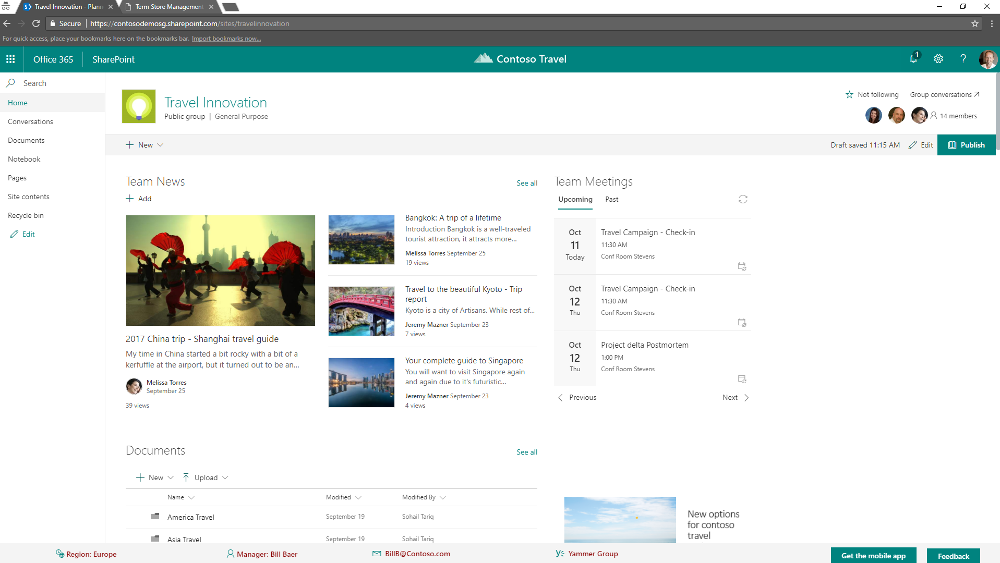
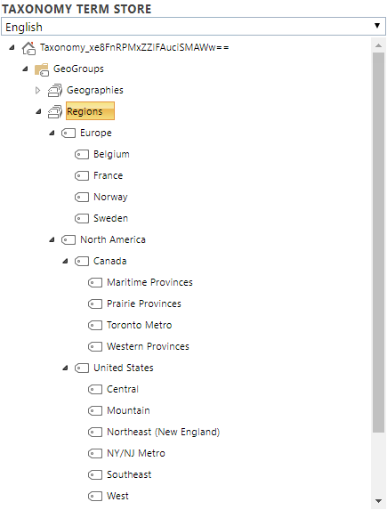
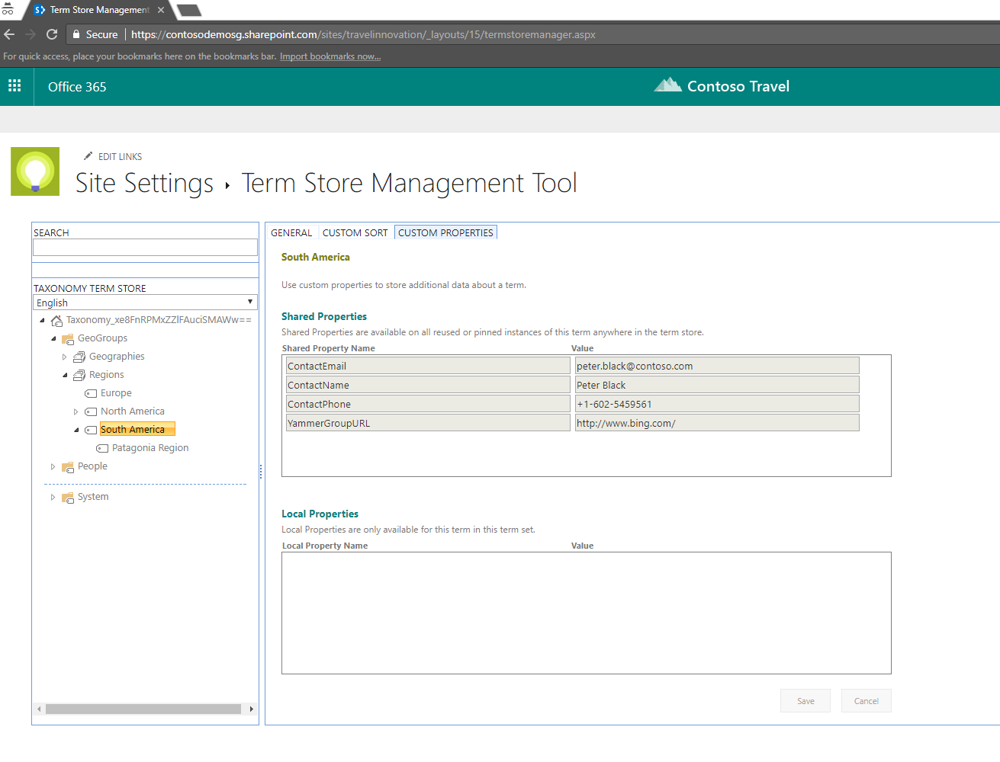
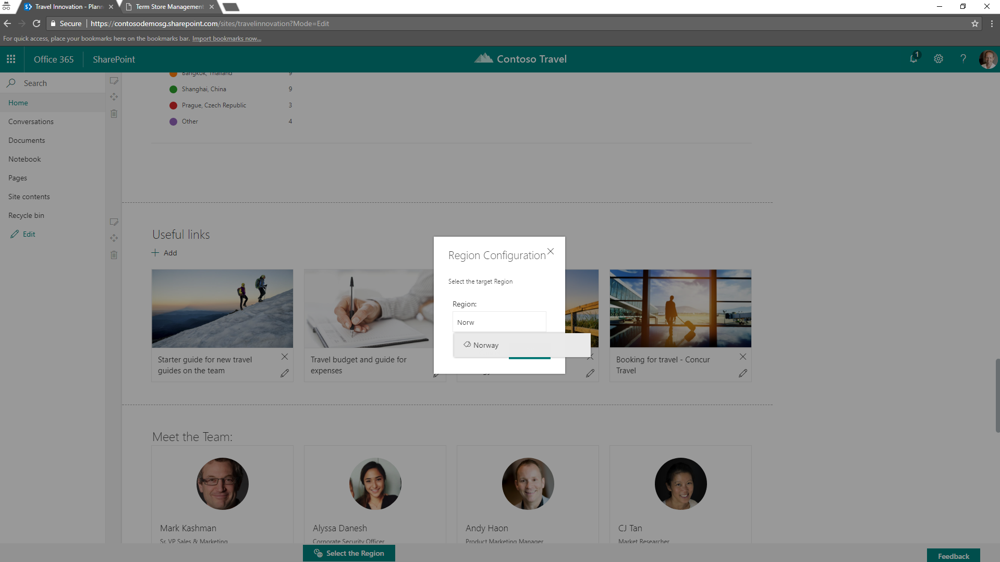

# Regions Footer Application Customizer

## Summary

Sample SharePoint Framework application customizer showing how to create a custom footer for modern pages, in order to show data about an area manager for a specific region.



## Used SharePoint Framework Version


## Applies to

* [SharePoint Framework Extensions Developer](https://dev.office.com/sharepoint/docs/spfx/extensions/overview-extensions)
* [Office 365 developer tenant](http://dev.office.com/sharepoint/docs/spfx/set-up-your-developer-tenant)

## Solution

Solution|Author(s)
--------|---------
react-application-regions-footer|Paolo Pialorsi (MCM, MVP, [PiaSys.com](https://piasys.com), [@PaoloPia](https://twitter.com/PaoloPia))

## Version history

Version|Date|Comments
-------|----|--------
1.0.0|September 28, 2017|Initial release

## Disclaimer

**THIS CODE IS PROVIDED *AS IS* WITHOUT WARRANTY OF ANY KIND, EITHER EXPRESS OR IMPLIED, INCLUDING ANY IMPLIED WARRANTIES OF FITNESS FOR A PARTICULAR PURPOSE, MERCHANTABILITY, OR NON-INFRINGEMENT.**

---

## Prerequisites

* Office 365 Developer tenant with a modern site collection and a document library

## Minimal Path to Awesome

* clone this repo
* in the command line run
  * `npm i`
  * `gulp serve --nobrowser`
* open a modern site
* go to the "Term Store Management" page of the site settings and create a new Term Group, or at least a new Term Set
  * Call it with whatever name you like (for example Regions) - You can use the following PnP Provisioning Template ([GeoGroups.xml](./GeoGroups.xml)) to create such a Term Group. In order to import the XML file, use the following command:
    * `Connect-PnPOnline "https://<your-tenant>.sharepoint.com`
    * `Import-PnPTermGroupFromXml -Path .\GeoGroups.xml`
  * Or you can manually load/Configure a hierarchy of terms like in the following figure

  

  * If you manually load the terms, please notice that the top level terms of the hierarchy (i.e. the regions) need to have configured the following custom properties, like in the following figure
    * ContactEmail
    * ContactName
    * ContactPhone
    * YammerGroupURL

  

* append the following query string parameters to the home page URL

```text
?loadSPFX=true&debugManifestsFile=https://localhost:4321/temp/manifests.js&customActions={"67fd1d01-84e8-4fbf-85bd-4b80768c6080":{"location":"ClientSideExtension.ApplicationCustomizer","properties":{"SourceTermSetName":"Regions"}}}
```

## Deployment

In order to deploy the sample solution in a real environment, or at least in order to skip using the debug mode, you need to execute the following steps:
* publish the solution on any hosting environment or CDN and update the _cdnBasePath_ property in the write-manifests.json file with the base URL of your hosting environment
* bundle and package the solution by executing the following commands in the command line:
  * `gulp bundle --ship`
  * `gulp package-solution --ship`
* upload the content of the ./temp/deploy subfolder of the sample root folder into the target hosting environment
* add to the "Apps for SharePoint" library of the AppCatalog in your tenant the react-application-regions footer.spppkg file that you will find under the ./sharepoint/solution subfolder of the sample root folder
* the sample is tenant-wide available, so you don't need to install it to every single target site, you simply need to bind the application customizer to the target site. In order to do that, you can use the PowerShell script [RegionsFooterProvisionCustomizer.ps1](./RegionsFooterProvisionCustomizer.ps1)

## Features

This project contains sample SharePoint Framework application customizer extension built using React and Office UI Fabric React. The application customizer renders a footer with four information about the manager of the region selected in the UI. Here you can see the UI to select a target country,
which implies a container region.



It is interesting to notice that the application customizer monitors the status of the page, and when the page is in Edit mode, it renders an editing/configuration UI, while if the page is in Display mode, it renders the footer.
So far, the monitor of the page status is provided by using a _setTimeout_ function and monitoring the query string of the page (if it contains the _mode=edit_ parameter, we are in Edit mode). In the future this capability will be native in SPFx, so far this a "trick" for the sake of making the demo fully functional.

Moreover, the footer right now - for the sake of demo purposes - stores the selected country in the session local storage of the browser, at the site collection level. Thus, whenever you start the application customizer in a new browsing session, you will have to configure the target country. You can update this demo behavior storing the currently selected country in a local repository for the site, or overriding the properties of the application customizer.

Lastly, the application customizer renders in pages only, and not in lists and libraries. This result is achieved by monitoring the property _this.context.pageContext.listItem_ . If the _listItem_ property is _NULL_, it means we are in a page, and the footer will be visible, otherwise we are in a list or library view, and the footer will not be visible.

This sample illustrates the following concepts on top of the SharePoint Framework:

* using Office UI Fabric React to build SharePoint Framework application customizers that seamlessly integrate with SharePoint
* using React to build SharePoint Framework application customizers
* logging information to console using a custom SharePoint Framework log handler
* using the SPFx Dialog Framework
* consuming the SharePoint Online taxonomy service using REST requests against the _client.svc/ProcessQuery_ service of CSOM


