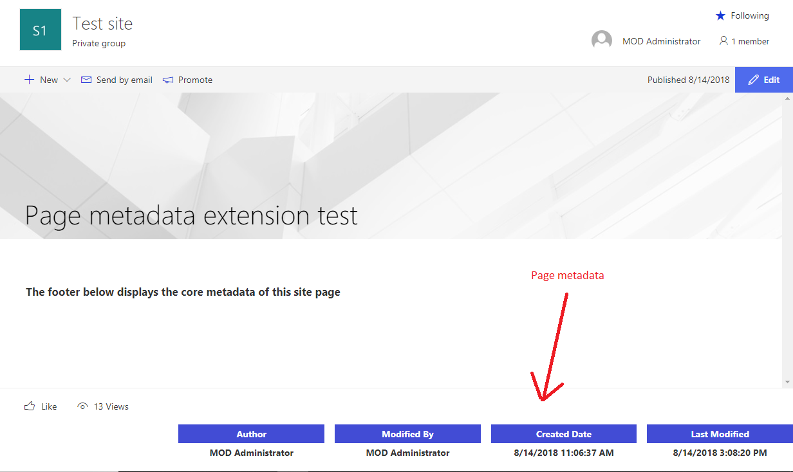

# Site Page Core Metadata Application Customizer

## Summary

Sample SharePoint Framework application customizer to display the core metadata of a Site Page such as Author,Editor, Created date and Modified date in the footer of the page.

Support for the page metadata was announced recently for the SharePoint modern pages. With this, a "Page Properties" webpart was also released that can be used to display the metadata of the site page on the page itself. [More details](https://support.office.com/en-us/article/use-the-page-properties-web-part-1a99cb9c-a5f1-441b-8e5d-643b0f0ff736?ui=en-US&rs=en-US&ad=US). However, at the time of writing this sample, the core metadata of the page such as Author, Created Date, Modified Date, Edited by etc is not available in the webpart.

This sample extension renders only on the site pages and displays this core metadata in the footer section of the page.

Please refer to the Features and Notes in the bottom section of the page for more details.



## Used SharePoint Framework Version


## Applies to

* [SharePoint Framework Extensions Developer](https://dev.office.com/sharepoint/docs/spfx/extensions/overview-extensions)
* [Office 365 developer tenant](http://dev.office.com/sharepoint/docs/spfx/set-up-your-developer-tenant)

## Solution

Solution|Author(s)
--------|---------
react-application-sitepagecoremetadata|Vipul Kelkar ([@vipulkelkar](https://twitter.com/VipulKelkar))

## Version history

Version|Date|Comments
-------|----|--------
1.0.0|August 15, 2018|Initial release

## Disclaimer

**THIS CODE IS PROVIDED *AS IS* WITHOUT WARRANTY OF ANY KIND, EITHER EXPRESS OR IMPLIED, INCLUDING ANY IMPLIED WARRANTIES OF FITNESS FOR A PARTICULAR PURPOSE, MERCHANTABILITY, OR NON-INFRINGEMENT.**

---

## Prerequisites

* Office 365 tenant with a modern site collection and site pages library.

## Minimal Path to Awesome

* clone this repo
* in the command line run
  * `npm i`
  * `gulp serve --nobrowser`
* open a modern site
* Navigate to a site pages library. Create a new site page.
* Navigate to this new page.
* append the following query string parameters to the home page URL

```text
?loadSPFX=true&debugManifestsFile=https://localhost:4321/temp/manifests.js&customActions={"099dcddc-cb87-434a-8c92-4e900c81f70f":{"location":"ClientSideExtension.ApplicationCustomizer","properties":{}}}
```

## Deployment

To deploy the extension to the tenant : 

* Update the _cdnBasePath_ property in the write-manifests.json file with the base URL of your hosting location
* Bundle and package the solution by executing the following commands in the command line:
  * `gulp bundle --ship`
  * `gulp package-solution --ship`
* Upload the content of the ./temp/deploy subfolder of the sample root folder into the target hosting environment
* Add to the "Apps for SharePoint" library of the AppCatalog in your tenant the "site-page-metadata-extension.sppkg" file that you will find under the ./sharepoint/solution subfolder of the sample root folder
* The sample is tenant-wide available, so you don't need to install it to every single target site, you simply need to bind the application customizer to the target site. In order to do that, you can use the PowerShell script [Install-SitePageMetadataExtension.ps1](./Install-SitePageMetadataExtension.ps1) by modifying the Site collection URL and the Component ID as desired.

## Features

This application customizer extension is built using React and Office UI Fabric React. The application customizer renders the core metadata of the site page in the footer of the page.

Notes : 

* The sample contains CSS to hide the "Feedback" link from the footer of the site page. Reference : 
[https://n8d.at/blog/remove-feedback-buttons-from-sharepoint-footer-through-application-customizer/](https://n8d.at/blog/remove-feedback-buttons-from-sharepoint-footer-through-application-customizer/)

* This extension renders only on the Site Pages and not on the document libraries/lists etc.

* The code can be easily extended to render the extension for site pages of a specific content type.


