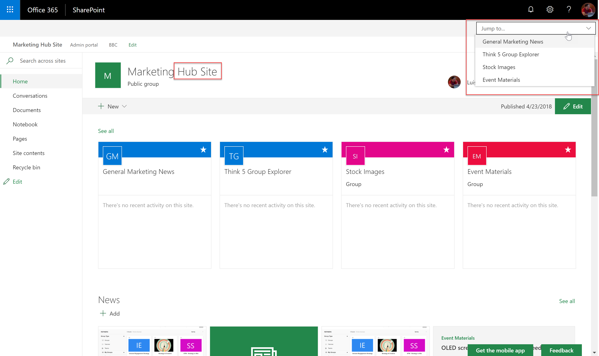

# Spfx Applications Customiser Sites in Hub site switcher

## Summary
This sample shows how to get the sites that are part of a Hub Site, and renders a drop down to jump directly into a site. The customiser only 
renders if the site is a Hub site.

__Note__: The interesting part is that Microsoft is offering an API to get information about the sites that are part of the HubSite, but that API is out of SharePoint (_westeurope3-sphomep.svc.ms/api/v1/sites/hub_). 

To consume that API we need a different Token (_spHttpClient_ is not working with that API), that can be obtained calling another API that is part of SharePoint:
_sphomeservice/context_

## Used SharePoint Framework Version

## Applies to

* [SharePoint Framework Extensions](https://dev.office.com/sharepoint/docs/spfx/extensions/overview-extensions)
* [Office 365 developer tenant](http://dev.office.com/sharepoint/docs/spfx/set-up-your-developer-tenant)

## Solution

Solution|Author(s)
--------|---------
react-application-sites-hubsite-switcher|Luis Mañez (MVP, [ClearPeople](http://www.clearpeople.com), @luismanez)

## Version history

Version|Date|Comments
-------|----|--------
1.0.0|24 April, 2018|Initial release

## Disclaimer

**THIS CODE IS PROVIDED *AS IS* WITHOUT WARRANTY OF ANY KIND, EITHER EXPRESS OR IMPLIED, INCLUDING ANY IMPLIED WARRANTIES OF FITNESS FOR A PARTICULAR PURPOSE, MERCHANTABILITY, OR NON-INFRINGEMENT.**

---

## Minimal Path to Awesome

* clone repo
* update _serve.json_ pointing to your site collection home page
* run _gulp serve_

## Features

Sample SharePoint Framework application customiser rendering a drop down in header showing the sites in the Hub site, and a direct link to jump into them.

This sample illustrates the following concepts on top of the SharePoint Framework:

* Header customiser with React components
* Using _sphomeservice/context_ api to get a valid Bearer token for the Hub Api
* Using the Hub Api that is out of SharePoint (_{locaiton}-sphomep.svc.ms/api/v1/sites/hub_)
* Using async / await for the async calls
* Office UI fabric ActionLinks
